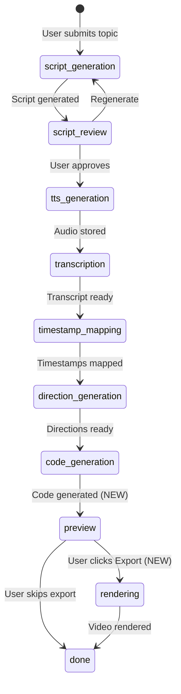
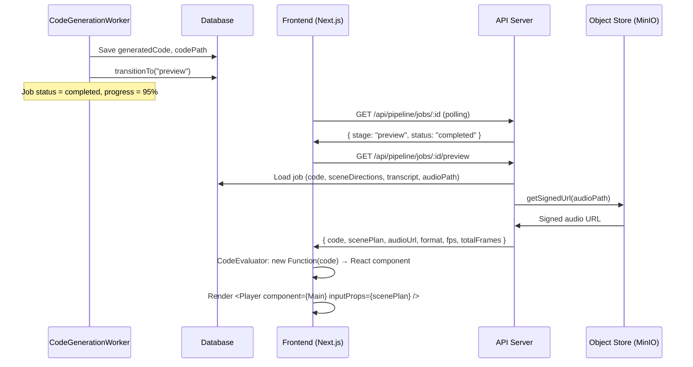
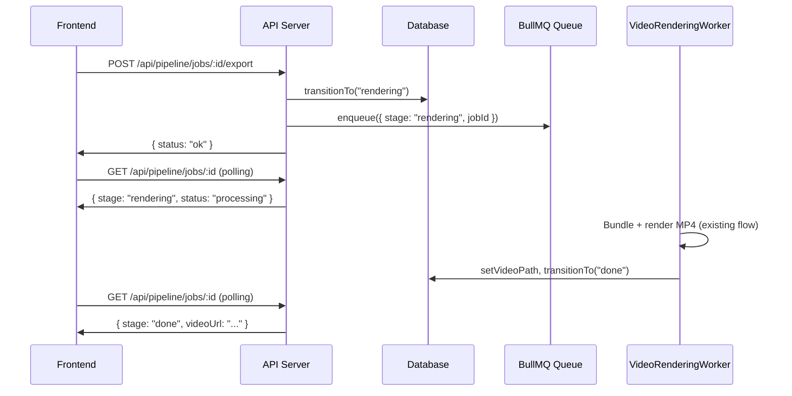

# Design Document: Client-Side Remotion Preview

## Overview

This feature replaces the automatic server-side Remotion rendering step with a client-side preview using `@remotion/player`. After code generation completes, the pipeline transitions to a new `preview` stage instead of `rendering`. The frontend fetches the generated component code, scene plan, and audio signed URL, then evaluates the code in-browser and plays it via `@remotion/player`. Server-side MP4 rendering is deferred to an explicit "Export" action triggered by the user.

### Key Design Decisions

1. **New `preview` pipeline stage**: Inserted between `code_generation` and `rendering`. The code generation worker transitions to `preview` instead of `rendering`, marking the job as `completed` at 95% progress. This lets the frontend immediately show the animation without waiting for a render.
2. **`new Function()` for code evaluation**: The AI-generated component code is evaluated client-side using `new Function()` with an explicit allow-list of globals (React, Remotion primitives). This avoids `eval()` and `<script>` injection while keeping the sandbox minimal.
3. **Dedicated preview data endpoint**: A new `GET /api/pipeline/jobs/:id/preview` endpoint returns the code string, reconstructed scene plan, audio signed URL, and video metadata. This keeps the existing `GET /jobs/:id` response lean and avoids sending large code blobs on every poll.
4. **Export as explicit user action**: The "Export" button triggers a `POST /api/pipeline/jobs/:id/export` endpoint that transitions `preview → rendering` and enqueues the rendering job. The existing `VideoRenderingWorker` and `RemotionVideoRenderer` are reused unchanged.
5. **`@remotion/player` for browser playback**: The Player component handles frame-accurate playback, seeking, and controls. Audio sync is achieved by passing the voiceover as an `<Audio>` component inside the composition wrapper.

## Architecture

### Updated Pipeline Flow



### Data Flow for Client-Side Preview



### Export Flow



## Components and Interfaces

### Backend Changes

#### 1. PipelineStage Value Object Updates

```typescript
// packages/shared/src/types/pipeline.types.ts
export type PipelineStage =
  | "script_generation"
  | "script_review"
  | "tts_generation"
  | "transcription"
  | "timestamp_mapping"
  | "direction_generation"
  | "code_generation"
  | "preview"        // NEW
  | "rendering"
  | "done";
```

```typescript
// apps/api/src/pipeline/domain/value-objects/pipeline-stage.ts
const STAGES_IN_ORDER: readonly PipelineStageType[] = [
  "script_generation",
  "script_review",
  "tts_generation",
  "transcription",
  "timestamp_mapping",
  "direction_generation",
  "code_generation",
  "preview",          // NEW — between code_generation and rendering
  "rendering",
  "done",
] as const;

const VALID_TRANSITIONS: ReadonlyMap<PipelineStageType, readonly PipelineStageType[]> =
  new Map([
    ["script_generation", ["script_review"]],
    ["script_review", ["tts_generation", "script_generation"]],
    ["tts_generation", ["transcription"]],
    ["transcription", ["timestamp_mapping"]],
    ["timestamp_mapping", ["direction_generation"]],
    ["direction_generation", ["code_generation"]],
    ["code_generation", ["preview"]],           // CHANGED: was ["rendering"]
    ["preview", ["rendering", "done"]],         // NEW: export or skip
    ["rendering", ["done"]],
    ["done", []],
  ]);
```

#### 2. PipelineJob Entity Updates

```typescript
// STAGE_TO_STATUS — add preview mapping
const STAGE_TO_STATUS: Record<PipelineStageType, PipelineStatus> = {
  // ... existing entries ...
  preview: PipelineStatus.completed(),  // NEW — preview is a "completed" state for the user
};

// STAGE_TO_PROGRESS — add preview mapping
const STAGE_TO_PROGRESS: Record<PipelineStageType, number> = {
  // ... existing entries ...
  code_generation: 80,
  preview: 95,       // NEW
  rendering: 90,     // Drops back during export render
  done: 100,
};
```

#### 3. CodeGenerationWorker Change

The worker transitions to `"preview"` instead of `"rendering"` and does NOT enqueue a rendering job:

```typescript
// code-generation.worker.ts — key change
// BEFORE:
// pipelineJob.transitionTo("rendering");
// await this.queueService.enqueue({ stage: "rendering", jobId });

// AFTER:
pipelineJob.transitionTo("preview");
await this.jobRepository.save(pipelineJob);
// No enqueue — the frontend takes over for preview
```

#### 4. Preview Data Endpoint (New)

```typescript
// GET /api/pipeline/jobs/:id/preview
interface PreviewDataResponse {
  code: string;                    // Raw component code string
  scenePlan: ScenePlan;            // Reconstructed ScenePlan JSON
  audioUrl: string | null;         // Signed URL for voiceover audio
  audioError: boolean;             // True if signed URL generation failed
  format: VideoFormat;             // "reel" | "short" | "longform"
  fps: number;                     // Always 30
  totalFrames: number;             // Computed from transcript duration
  compositionWidth: number;        // From FORMAT_RESOLUTIONS
  compositionHeight: number;       // From FORMAT_RESOLUTIONS
}
```

New use case: `GetPreviewDataUseCase`
- Loads the job, validates it's in `preview` stage (or `rendering`/`done` for continued preview during export)
- Reconstructs the `ScenePlan` from `sceneDirections`, `transcript`, `topic`, and `themeId` (same logic as in `VideoRenderingWorker`)
- Generates a signed URL for the audio file
- Returns the response DTO

#### 5. Export Endpoint (New)

```typescript
// POST /api/pipeline/jobs/:id/export
// Request: empty body
// Response: { status: "ok" }
```

New use case: `ExportVideoUseCase`
- Loads the job, validates it's in `preview` stage
- Calls `pipelineJob.transitionTo("rendering")`
- Saves the job
- Enqueues `{ stage: "rendering", jobId }`

#### 6. New REST Endpoints

| Method | Path | Description |
|--------|------|-------------|
| `GET` | `/api/pipeline/jobs/:id/preview` | Get preview data (code, scene plan, audio URL, format metadata) |
| `POST` | `/api/pipeline/jobs/:id/export` | Trigger server-side MP4 rendering |

### Frontend Changes

#### 1. CodeEvaluator Module (New)

```typescript
// apps/web/src/features/pipeline/utils/code-evaluator.ts

interface EvaluationResult {
  component: React.ComponentType<{ scenePlan: ScenePlan }> | null;
  error: string | null;
}

function evaluateComponentCode(code: string): EvaluationResult
```

Implementation approach:
- Uses `new Function()` with named parameters for each allowed global
- Allow-list: `React`, `useState`, `useEffect`, `useMemo`, `useCallback`, `AbsoluteFill`, `Sequence`, `useCurrentFrame`, `useVideoConfig`, `interpolate`, `spring`, `Easing`
- The function body wraps the code and returns the `Main` reference
- Catches `SyntaxError` and extracts line/column from the error message
- Validates that the returned value is a function (the `Main` component)

```typescript
// Pseudocode for the evaluation mechanism
const allowedGlobals = {
  React,
  useState: React.useState,
  useEffect: React.useEffect,
  useMemo: React.useMemo,
  useCallback: React.useCallback,
  AbsoluteFill,
  Sequence,
  useCurrentFrame,
  useVideoConfig,
  interpolate,
  spring,
  Easing,
};

const paramNames = Object.keys(allowedGlobals);
const paramValues = Object.values(allowedGlobals);

const factory = new Function(
  ...paramNames,
  `${code}\nreturn typeof Main === 'function' ? Main : undefined;`
);

const Main = factory(...paramValues);
```

#### 2. usePreviewData Hook (New)

```typescript
// apps/web/src/features/pipeline/hooks/use-preview-data.ts

interface UsePreviewDataResult {
  previewData: PreviewDataResponse | null;
  evaluatedComponent: React.ComponentType<{ scenePlan: ScenePlan }> | null;
  isLoading: boolean;
  error: string | null;
  refetch: () => void;
}

function usePreviewData(params: { jobId: string; stage: PipelineStage }): UsePreviewDataResult
```

- Fetches from `GET /api/pipeline/jobs/:id/preview` when stage is `preview`, `rendering`, or `done`
- Runs `evaluateComponentCode()` on the returned code
- Caches the evaluated component to avoid re-evaluation on re-renders
- Returns loading/error states for the UI

#### 3. RemotionPreviewPlayer Component (New)

```typescript
// apps/web/src/features/pipeline/components/remotion-preview-player.tsx

interface RemotionPreviewPlayerProps {
  component: React.ComponentType<{ scenePlan: ScenePlan }>;
  scenePlan: ScenePlan;
  audioUrl: string | null;
  fps: number;
  totalFrames: number;
  compositionWidth: number;
  compositionHeight: number;
}
```

- Wraps `@remotion/player`'s `Player` component
- Creates a composition wrapper that renders the evaluated `Main` component and an `<Audio>` tag for the voiceover
- Passes `durationInFrames`, `fps`, `compositionWidth`, `compositionHeight` from the preview data
- Provides play/pause, seek bar, and time display via Player's built-in controls

#### 4. VideoPreviewPage Updates

The existing `VideoPreviewPage` component is updated to:
- Detect when the job is in `preview` stage
- Use `usePreviewData` to fetch and evaluate the component code
- Render `RemotionPreviewPlayer` instead of the `<video>` element
- Show an "Export" button when in `preview` stage
- Show rendering progress alongside the Player when in `rendering` stage (after export)
- Show a download link when in `done` stage with a `videoUrl`

#### 5. Stage Display Map Update

```typescript
// Add to STAGE_DISPLAY_MAP
preview: {
  stage: "preview",
  label: "Preview",
  description: "Animation ready for preview",
  icon: Play,  // from lucide-react
},
```

#### 6. Stage Timeline Update

```typescript
// Update TIMELINE_STAGES to include preview
const TIMELINE_STAGES: PipelineStage[] = [
  "tts_generation",
  "transcription",
  "timestamp_mapping",
  "direction_generation",
  "code_generation",
  "preview",      // NEW — between code_generation and rendering
  "rendering",
  "done",
];
```

## Data Models

### PreviewDataResponse (New DTO)

```typescript
// packages/shared/src/types/pipeline.types.ts — add to exports
interface PreviewDataResponse {
  code: string;
  scenePlan: ScenePlan;
  audioUrl: string | null;
  audioError: boolean;
  format: VideoFormat;
  fps: number;
  totalFrames: number;
  compositionWidth: number;
  compositionHeight: number;
}
```

### PipelineJobDto Update

No changes needed to `PipelineJobDto` — the existing DTO already supports the `preview` stage through the `PipelineStage` type union update. The preview-specific data (code, scene plan, audio URL) is served through the dedicated preview endpoint, not the job status endpoint.

### Prisma Schema Update

```prisma
enum PipelineStage {
  script_generation
  script_review
  tts_generation
  transcription
  timestamp_mapping
  direction_generation
  code_generation
  preview          // NEW
  rendering
  done
}
```

A migration is needed to add `preview` to the `PipelineStage` enum.

## Correctness Properties

*A property is a characteristic or behavior that should hold true across all valid executions of a system — essentially, a formal statement about what the system should do. Properties serve as the bridge between human-readable specifications and machine-verifiable correctness guarantees.*

### Property 1: Pipeline transition to preview sets correct state

*For any* PipelineJob that has completed code generation (stage = `code_generation` with `generatedCode` and `codePath` set), transitioning to the next stage SHALL produce a job with stage = `preview`, status = `completed`, and progress = 95%.

**Validates: Requirements 1.1, 1.2**

### Property 2: Preview stage data invariant

*For any* PipelineJob in the `preview` stage, the fields `generatedCode`, `codePath`, `sceneDirections`, `audioPath`, and `transcript` SHALL all be non-null.

**Validates: Requirements 1.4**

### Property 3: Code evaluator produces valid component from valid code

*For any* syntactically valid JavaScript string that defines a `function Main({ scenePlan })` and references any subset of the allowed globals (React, AbsoluteFill, Sequence, useCurrentFrame, useVideoConfig, interpolate, spring, Easing, useState, useEffect, useMemo, useCallback), the CodeEvaluator SHALL return a non-null component function and a null error.

**Validates: Requirements 3.1, 3.2, 3.3**

### Property 4: Code evaluator rejects syntax errors with descriptive message

*For any* string containing JavaScript syntax errors, the CodeEvaluator SHALL return a null component and a non-empty error string that includes a description of the syntax problem.

**Validates: Requirements 3.4**

### Property 5: Code evaluator rejects code without Main function

*For any* syntactically valid JavaScript string that does not define a function named `Main`, the CodeEvaluator SHALL return a null component and an error message indicating the missing `Main` component.

**Validates: Requirements 3.5**

### Property 6: Code evaluator sandboxes disallowed globals

*For any* code string that attempts to access identifiers outside the explicit allow-list (e.g., `window`, `document`, `process`, `require`, `fetch`, `globalThis`), those identifiers SHALL be `undefined` within the evaluated code — the evaluator SHALL NOT expose the host environment.

**Validates: Requirements 3.6**

### Property 7: Stage transition validity for preview

*For any* PipelineStage value object, `canTransitionTo("preview")` SHALL return `true` only when the current stage is `code_generation`. From the `preview` stage, `canTransitionTo` SHALL return `true` for `rendering` and `done`, and `false` for all other stages.

**Validates: Requirements 1.3, 8.2**

## Error Handling

### Backend Errors

| Scenario | Handling |
|----------|----------|
| Preview endpoint called for non-preview job | Return 404 with `{ error: "NOT_FOUND", message: "Preview data not available for this job stage" }` |
| Audio signed URL generation fails | Return preview data with `audioUrl: null` and `audioError: true` — graceful degradation |
| Export called for non-preview job | Return 400 with `{ error: "INVALID_TRANSITION", message: "Job must be in preview stage to export" }` |
| Export rendering fails | Existing `VideoRenderingWorker` error handling applies — job marked as `failed` with error code `rendering_failed` |
| Theme not found during preview data reconstruction | Return 500 — this indicates data corruption since the theme was valid at job creation |

### Frontend Errors

| Scenario | Handling |
|----------|----------|
| Preview data fetch fails (network) | Show error banner with "Retry" button, keep polling for job status |
| Code evaluation syntax error | Show error message with code snippet context, "Retry" button re-fetches preview data |
| Code evaluation missing Main | Show specific error: "Generated code is missing the Main component", "Retry" button |
| Code evaluation runtime error | Catch in React error boundary wrapping the Player, show error with "Retry" |
| Audio URL is null (audioError) | Render the animation without audio, show a subtle warning: "Audio unavailable" |
| Export request fails | Show error toast, keep the preview functional, allow retry |

## Testing Strategy

### Property-Based Tests (fast-check)

Property-based testing applies to this feature for the CodeEvaluator (pure function with clear input/output) and the PipelineStage transition logic (deterministic state machine).

- Library: `fast-check` (already available in the project's test setup with Jest)
- Minimum 100 iterations per property test
- Each test tagged with: `Feature: client-side-remotion-preview, Property {N}: {title}`

Property tests to implement:
1. **Property 1**: Generate random PipelineJob at `code_generation` stage → transition → verify state
2. **Property 2**: Generate random jobs at `preview` stage → verify all artifact fields non-null
3. **Property 3**: Generate random valid `function Main({ scenePlan }) { ... }` code strings → evaluate → verify component returned
4. **Property 4**: Generate random strings with deliberate syntax errors → evaluate → verify error returned
5. **Property 5**: Generate random valid JS functions with names ≠ Main → evaluate → verify missing-Main error
6. **Property 6**: Generate code accessing random disallowed global names → evaluate → verify undefined
7. **Property 7**: Test all stage transitions involving `preview` → verify canTransitionTo correctness

### Unit Tests (Jest)

- `GetPreviewDataUseCase`: mock repository and object store, test happy path and error cases
- `ExportVideoUseCase`: mock repository and queue, test transition and enqueue
- `PipelineController` preview/export handlers: test request validation and response shapes
- `usePreviewData` hook: test fetch, evaluation, caching, and error states
- `RemotionPreviewPlayer`: test that Player receives correct props
- `StageDisplayMap`: test preview entry exists with correct values
- `StageTimeline`: test preview appears in correct position

### Integration Tests

- Preview endpoint returns correct data for a job in preview stage
- Preview endpoint returns 404 for jobs not in preview stage
- Export endpoint transitions job and enqueues rendering
- Full export flow: preview → rendering → done with valid videoPath
