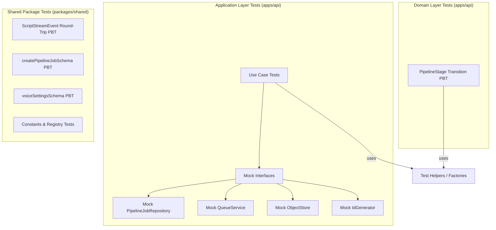

# Design Document: Comprehensive Test Coverage

## Overview

This design covers the test architecture for closing the highest-impact testing gaps across the video-ai monorepo. The scope includes:

- **7 application use case test suites** (CreatePipelineJob, ApproveScript, GetJobStatus, RegenerateScript, RetryJob, ExportVideo, ListPipelineJobs, GetPreviewData)
- **3 property-based test suites** (ScriptStreamEvent round-trip, PipelineStage transitions, Zod schema validation)
- **1 shared package test suite** (voice registry, format config, SFX library, voiceSettingsSchema)

All tests follow existing patterns established in `list-voices.use-case.test.ts` (use case mocking), `ai-script-tweaker.test.ts` (property-based testing with fast-check), and `pipeline-job.test.ts` (domain entity testing with factory functions).

## Architecture

The test architecture mirrors the application's Clean Architecture layers:



### Test File Organization

All test files are co-located with their source files, following the existing convention:

| Source File | Test File |
|---|---|
| `apps/api/src/pipeline/application/use-cases/create-pipeline-job.use-case.ts` | `create-pipeline-job.use-case.test.ts` |
| `apps/api/src/pipeline/application/use-cases/approve-script.use-case.ts` | `approve-script.use-case.test.ts` |
| `apps/api/src/pipeline/application/use-cases/get-job-status.use-case.ts` | `get-job-status.use-case.test.ts` |
| `apps/api/src/pipeline/application/use-cases/regenerate-script.use-case.ts` | `regenerate-script.use-case.test.ts` |
| `apps/api/src/pipeline/application/use-cases/retry-job.use-case.ts` | `retry-job.use-case.test.ts` |
| `apps/api/src/pipeline/application/use-cases/export-video.use-case.ts` | `export-video.use-case.test.ts` |
| `apps/api/src/pipeline/application/use-cases/list-pipeline-jobs.use-case.ts` | `list-pipeline-jobs.use-case.test.ts` |
| `apps/api/src/pipeline/application/use-cases/get-preview-data.use-case.ts` | `get-preview-data.use-case.test.ts` |
| `apps/api/src/pipeline/domain/value-objects/pipeline-stage.test.ts` | `pipeline-stage.property.test.ts` |
| `packages/shared/src/schemas/script-stream-event.schema.test.ts` | (new) |
| `packages/shared/src/schemas/pipeline.schema.test.ts` | (new) |
| `packages/shared/src/shared-exports.test.ts` | (new) |

## Components and Interfaces

### Mock Implementations

All use cases use constructor injection. Tests create lightweight mock objects implementing the same interfaces:

#### Mock PipelineJobRepository

```typescript
function createMockRepository(): jest.Mocked<PipelineJobRepository> {
  return {
    save: jest.fn<PipelineJobRepository["save"]>().mockResolvedValue(undefined),
    findById: jest.fn<PipelineJobRepository["findById"]>().mockResolvedValue(null),
    findAll: jest.fn<PipelineJobRepository["findAll"]>().mockResolvedValue([]),
    count: jest.fn<PipelineJobRepository["count"]>().mockResolvedValue(0),
    findAllCompleted: jest.fn().mockResolvedValue([]),
    countCompleted: jest.fn().mockResolvedValue(0),
  };
}
```

#### Mock QueueService

```typescript
function createMockQueueService(): jest.Mocked<QueueService> {
  return {
    enqueue: jest.fn<QueueService["enqueue"]>().mockResolvedValue(Result.ok(undefined)),
  };
}
```

#### Mock ObjectStore

```typescript
function createMockObjectStore(): jest.Mocked<ObjectStore> {
  return {
    getSignedUrl: jest.fn().mockResolvedValue(Result.ok("https://signed-url.example.com/file")),
    upload: jest.fn().mockResolvedValue(Result.ok("key")),
    getObject: jest.fn().mockResolvedValue(Result.ok({ data: Buffer.from(""), contentType: "application/octet-stream", contentLength: 0 })),
  };
}
```

#### Mock IdGenerator

```typescript
function createMockIdGenerator(id: string = "generated-id"): IdGenerator {
  return { generate: () => id };
}
```

### Test Factory Functions

Shared factory functions create domain entities in specific states for testing:

```typescript
function makeJob(overrides?: Partial<{ id: string; browserId: string; topic: string }>): PipelineJob {
  return PipelineJob.create({
    id: overrides?.id ?? "job-1",
    browserId: overrides?.browserId ?? "browser-1",
    topic: overrides?.topic ?? "How databases work",
    format: VideoFormat.create("short").getValue(),
    themeId: AnimationThemeId.create("studio").getValue(),
  });
}

function makeJobAtStage(stage: PipelineStageType): PipelineJob {
  // Walks the job through the transition graph to reach the target stage
}

function makeSceneBoundary(overrides?: Partial<SceneBoundary>): SceneBoundary {
  return {
    id: 1, name: "Hook", type: "Hook",
    startTime: 0, endTime: 5, text: "Hello world",
    ...overrides,
  };
}

function makeSceneDirection(overrides?: Partial<SceneDirection>): SceneDirection {
  // Returns a complete SceneDirection with sensible defaults
}

function makeWordTimestamp(overrides?: Partial<WordTimestamp>): WordTimestamp {
  return { word: "Hello", start: 0, end: 0.5, ...overrides };
}
```

### fast-check Arbitraries

Custom arbitraries for property-based tests:

#### ScriptStreamEvent Arbitrary

```typescript
const sceneTypeArb = fc.constantFrom("Hook", "Analogy", "Bridge", "Architecture", "Spotlight", "Comparison", "Power", "CTA");

const chunkEventArb = fc.record({
  type: fc.constant("chunk" as const),
  seq: fc.nat(),
  data: fc.record({ text: fc.string() }),
});

const statusEventArb = fc.record({
  type: fc.constant("status" as const),
  seq: fc.nat(),
  data: fc.record({ message: fc.string() }),
});

const sceneEventArb = fc.record({
  type: fc.constant("scene" as const),
  seq: fc.nat(),
  data: fc.record({
    id: fc.integer({ min: 1 }),
    name: fc.string({ minLength: 1 }),
    type: sceneTypeArb,
    text: fc.string({ minLength: 1 }),
  }),
});

const doneEventArb = fc.record({
  type: fc.constant("done" as const),
  seq: fc.nat(),
  data: fc.record({
    script: fc.string(),
    scenes: fc.array(fc.record({
      id: fc.integer({ min: 1 }),
      name: fc.string({ minLength: 1 }),
      type: sceneTypeArb,
      text: fc.string({ minLength: 1 }),
    })),
  }),
});

const errorEventArb = fc.record({
  type: fc.constant("error" as const),
  seq: fc.nat(),
  data: fc.record({ code: fc.string(), message: fc.string() }),
});

const scriptStreamEventArb = fc.oneof(
  chunkEventArb, statusEventArb, sceneEventArb, doneEventArb, errorEventArb
);
```

#### PipelineStage Arbitrary

```typescript
const pipelineStageArb = fc.constantFrom(
  "script_generation", "script_review", "tts_generation", "transcription",
  "timestamp_mapping", "direction_generation", "code_generation",
  "preview", "rendering", "done"
);

const stagePairArb = fc.tuple(pipelineStageArb, pipelineStageArb);
```

#### createPipelineJobSchema Arbitraries

```typescript
const validTopicArb = fc.string({ minLength: 3, maxLength: 500 }).filter(s => s.trim().length >= 3);
const validFormatArb = fc.constantFrom("reel", "short", "longform");
const validThemeIdArb = fc.string({ minLength: 1 }).filter(s => s.trim().length > 0);

const validCreateJobInputArb = fc.record({
  topic: validTopicArb,
  format: validFormatArb,
  themeId: validThemeIdArb,
});

const shortTopicArb = fc.string({ minLength: 0, maxLength: 2 });
const invalidFormatArb = fc.string().filter(s => !["reel", "short", "longform"].includes(s));
```

## Data Models

No new data models are introduced. Tests operate on existing domain entities and value objects:

- **PipelineJob** — root aggregate with stage transitions and artifact setters
- **PipelineStage** — value object with 10 ordered stages and a transition graph
- **PipelineStatus** — value object with 5 statuses (pending, processing, awaiting_script_review, completed, failed)
- **VideoFormat** — value object wrapping "reel" | "short" | "longform"
- **AnimationThemeId** — value object wrapping a non-empty theme identifier
- **Result<T, E>** — discriminated union for success/failure
- **ValidationError** — error type with `message` and `code` fields
- **ScriptStreamEvent** — Zod discriminated union of 5 SSE event types

## Correctness Properties

*A property is a characteristic or behavior that should hold true across all valid executions of a system — essentially, a formal statement about what the system should do. Properties serve as the bridge between human-readable specifications and machine-verifiable correctness guarantees.*

### Property 1: ScriptStreamEvent JSON round-trip preserves data

*For any* valid ScriptStreamEvent object across all 5 variants (chunk, status, scene, done, error), serializing to JSON via `JSON.stringify`, deserializing via `JSON.parse`, and parsing through the Zod `scriptStreamEventSchema` SHALL produce an object deeply equal to the original.

**Validates: Requirements 9.1, 9.2, 9.3**

### Property 2: PipelineStage transition graph correctness

*For any* pair of PipelineStage values (source, target), calling `transitionTo(target)` on a PipelineJob at the source stage SHALL succeed if and only if `PipelineStage.canTransitionTo` returns true for that pair. When the transition succeeds, the job's stage SHALL equal the target. When it fails, the Result SHALL have code "INVALID_TRANSITION". Additionally, *for all* valid stage strings, `PipelineStage.create` SHALL return a non-null instance.

**Validates: Requirements 10.1, 10.2, 10.3**

### Property 3: createPipelineJobSchema accepts all valid inputs

*For any* object with a topic of 3–500 characters, a format in ["reel", "short", "longform"], and a non-empty themeId, the `createPipelineJobSchema.safeParse` SHALL return success with parsed data matching the input fields.

**Validates: Requirements 11.1**

### Property 4: createPipelineJobSchema rejects short topics

*For any* string of 0–2 characters used as the topic field (with valid format and themeId), the `createPipelineJobSchema.safeParse` SHALL return failure.

**Validates: Requirements 11.2**

### Property 5: createPipelineJobSchema rejects invalid formats

*For any* string not in ["reel", "short", "longform"] used as the format field (with valid topic and themeId), the `createPipelineJobSchema.safeParse` SHALL return failure.

**Validates: Requirements 11.3**

### Property 6: voiceSettingsSchema validation boundaries

*For any* object with speed in [0.7, 1.2], stability in [0, 1], similarityBoost in [0, 1], and style in [0, 1], the `voiceSettingsSchema.safeParse` SHALL return success. Conversely, *for any* speed value outside [0.7, 1.2] (with other fields valid), the schema SHALL return failure.

**Validates: Requirements 12.9, 12.10**

## Error Handling

Tests verify error handling at each layer:

### Use Case Error Patterns

Each use case test suite covers these error categories:

1. **Not Found** — `repository.findById` returns `null` → Result.fail with code `"NOT_FOUND"`
2. **Status Conflict** — job is in wrong status for the operation → Result.fail with code `"CONFLICT"`
3. **Validation Failure** — input fails Zod parsing or domain validation → Result.fail with code `"INVALID_INPUT"` or specific codes like `"INVALID_WORD_COUNT"`
4. **Downstream Failure** — `queueService.enqueue` or `objectStore.getSignedUrl` returns Result.fail → error propagated with appropriate code (`"QUEUE_ERROR"`)

### Mock Error Simulation

Downstream failures are simulated by configuring mocks to return `Result.fail(new Error("..."))` or `Promise.reject()`. Tests verify that:
- The use case does not throw — it always returns a `Result`
- Error codes are correctly mapped (e.g., queue failure → `"QUEUE_ERROR"`)
- Partial side effects are handled (e.g., if enqueue fails after save, the error is still returned)

## Testing Strategy

### Test Framework and Libraries

| Package | Framework | PBT Library | Environment |
|---|---|---|---|
| `apps/api` | Jest 29.7 + ts-jest ESM | fast-check 3.22.0 (already installed) | Node |
| `packages/shared` | Jest 29.7 + ts-jest ESM | fast-check 3.22.0 (needs `npm install -D fast-check`) | Node |

### Dual Testing Approach

**Unit tests** (example-based) cover:
- Happy path execution for each use case
- Specific error scenarios (not found, conflict, validation failure, downstream failure)
- Side effect verification (repository.save called, queueService.enqueue called with correct args)
- Edge cases (boundary values for word counts, page/limit validation)

**Property-based tests** cover:
- Universal properties that hold across all valid inputs
- Round-trip invariants (ScriptStreamEvent serialization)
- State machine correctness (PipelineStage transition graph)
- Schema validation boundaries (createPipelineJobSchema, voiceSettingsSchema)

### Property-Based Test Configuration

- Minimum **100 iterations** per property test
- Each property test references its design document property via tag comment
- Tag format: `Feature: comprehensive-test-coverage, Property {N}: {title}`
- PBT library: **fast-check** (already used in the project)
- fast-check needs to be added to `packages/shared/package.json` as a dev dependency

### Test Organization Per Use Case

Each use case test file follows this structure (matching `list-voices.use-case.test.ts`):

```typescript
import { jest } from "@jest/globals";
// ... imports

// Factory functions at top of file
function makeJob() { /* ... */ }

describe("SomeUseCase", () => {
  // Shared mock setup
  let repository: jest.Mocked<PipelineJobRepository>;
  let queueService: jest.Mocked<QueueService>;
  let useCase: SomeUseCase;

  beforeEach(() => {
    repository = createMockRepository();
    queueService = createMockQueueService();
    useCase = new SomeUseCase(repository, queueService);
  });

  it("happy path", async () => { /* ... */ });
  it("returns NOT_FOUND when job does not exist", async () => { /* ... */ });
  it("returns CONFLICT when job is in wrong status", async () => { /* ... */ });
  // ... additional cases
});
```

### Shared Package Tests

The shared package test (`shared-exports.test.ts`) uses simple assertions on exported constants — no mocking needed. The schema property tests use fast-check to generate random inputs.

### Running Tests

```bash
# API tests
cd apps/api && npx jest --run

# Shared package tests
cd packages/shared && npx jest --run

# All tests from monorepo root
npx turbo test
```
