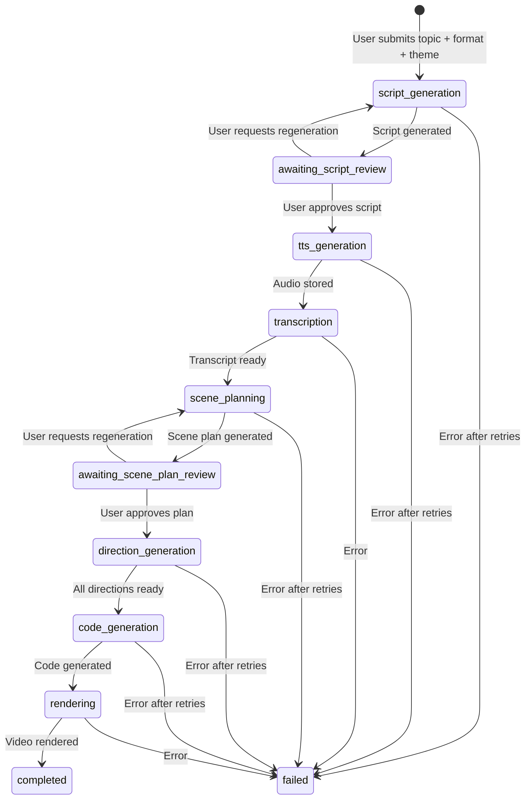

# Design Document: Faceless Video Generation

## Overview

The Faceless Video Generation feature is the core content pipeline for Video AI. It transforms a user-provided topic prompt into a fully rendered educational video — no face cam required. The pipeline is a sequential chain of AI-powered stages orchestrated by BullMQ jobs on the backend, with two human-in-the-loop review checkpoints (script review and scene plan review) surfaced through a wizard-style frontend UI.

The system follows Clean Architecture on both backend (Express 5) and frontend (Next.js 15). All LLM interactions use the Vercel AI SDK (`generateText`, `generateObject`). The frontend uses shadcn/ui components with a professional dark-mode color palette. Animation themes — predefined visual style presets — influence both the AI-generated scene directions and the final Remotion code output.

### Key Design Decisions

1. **Backend-driven pipeline orchestration**: All AI calls (script gen, scene planning, direction gen, code gen) and external service calls (ElevenLabs, Remotion rendering) run on the backend via BullMQ jobs. The frontend is a thin presentation layer that polls for status and renders review UIs.
2. **Stage-based job model**: A single `PipelineJob` record tracks the entire pipeline. Each BullMQ job handles one stage and advances the pipeline record on completion. Review stages pause the queue until user approval.
3. **Animation theme as a first-class input**: The theme is stored on the job record and injected into AI prompts at the direction generation and code generation stages, matching the pattern from the OpenCut reference.
4. **Vercel AI SDK for all LLM calls**: `generateText` for free-form generation (scripts, directions, code), `generateObject` with Zod schemas for structured output (scene planning).
5. **Shared Zod schemas**: Pipeline DTOs and scene plan schemas live in `@video-ai/shared` so both frontend and backend share the same types and validation.

## Architecture

### System Architecture Diagram

```mermaid
graph TB
    subgraph Frontend ["apps/web (Next.js 15 + shadcn/ui)"]
        Wizard["Pipeline Wizard UI"]
        ScriptReview["Script Review Screen"]
        ScenePlanReview["Scene Plan Review Screen"]
        StatusPoller["Job Status Poller"]
    end

    subgraph Backend ["apps/api (Express 5)"]
        API["REST API Controllers"]
        subgraph UseCases ["Application Layer"]
            CreateJob["CreatePipelineJobUseCase"]
            GetJobStatus["GetJobStatusUseCase"]
            ApproveScript["ApproveScriptUseCase"]
            ApproveScenePlan["ApproveScenePlanUseCase"]
            RegenerateScript["RegenerateScriptUseCase"]
            RegenerateScenePlan["RegenerateScenePlanUseCase"]
            ListJobs["ListPipelineJobsUseCase"]
        end
        subgraph Workers ["BullMQ Workers"]
            ScriptGenWorker["ScriptGenerationWorker"]
            TTSWorker["TTSGenerationWorker"]
            TranscriptionWorker["TranscriptionWorker"]
            ScenePlanWorker["ScenePlanningWorker"]
            DirectionWorker["DirectionGenerationWorker"]
            CodeGenWorker["CodeGenerationWorker"]
            RenderWorker["VideoRenderingWorker"]
        end
    end

    subgraph Infrastructure
        DB[(PostgreSQL)]
        Redis[(Redis / BullMQ)]
        S3[(MinIO / S3)]
        ElevenLabs["ElevenLabs API"]
        LLM["LLM Provider (via Vercel AI SDK)"]
        Remotion["Remotion Renderer"]
    end

    Wizard -->|POST /api/pipeline/jobs| API
    ScriptReview -->|POST /api/pipeline/jobs/:id/approve-script| API
    ScenePlanReview -->|POST /api/pipeline/jobs/:id/approve-scene-plan| API
    StatusPoller -->|GET /api/pipeline/jobs/:id| API

    API --> CreateJob
    API --> GetJobStatus
    API --> ApproveScript
    API --> ApproveScenePlan

    CreateJob -->|enqueue| Redis
    ApproveScript -->|enqueue next stage| Redis
    ApproveScenePlan -->|enqueue next stage| Redis

    ScriptGenWorker --> LLM
    TTSWorker --> ElevenLabs
    TTSWorker --> S3
    TranscriptionWorker --> LLM
    ScenePlanWorker --> LLM
    DirectionWorker --> LLM
    CodeGenWorker --> LLM
    RenderWorker --> Remotion
    RenderWorker --> S3

    ScriptGenWorker --> DB
    TTSWorker --> DB
    TranscriptionWorker --> DB
    ScenePlanWorker --> DB
    DirectionWorker --> DB
    CodeGenWorker --> DB
    RenderWorker --> DB
```



### Pipeline Flow



### Backend Architecture (Clean Architecture)

```
apps/api/src/
├── pipeline/
│   ├── domain/
│   │   ├── entities/
│   │   │   └── pipeline-job.ts              # PipelineJob entity with stage transitions
│   │   ├── value-objects/
│   │   │   ├── video-format.ts              # "reel" | "short" | "longform"
│   │   │   ├── pipeline-stage.ts            # Stage enum
│   │   │   ├── pipeline-status.ts           # Status enum
│   │   │   ├── animation-theme.ts           # Theme value object
│   │   │   └── job-error.ts                 # Error code + message
│   │   ├── interfaces/
│   │   │   └── repositories/
│   │   │       └── pipeline-job-repository.ts
│   │   └── errors/
│   │       └── pipeline-errors.ts
│   ├── application/
│   │   ├── use-cases/
│   │   │   ├── create-pipeline-job.use-case.ts
│   │   │   ├── get-job-status.use-case.ts
│   │   │   ├── approve-script.use-case.ts
│   │   │   ├── approve-scene-plan.use-case.ts
│   │   │   ├── regenerate-script.use-case.ts
│   │   │   ├── regenerate-scene-plan.use-case.ts
│   │   │   └── list-pipeline-jobs.use-case.ts
│   │   └── interfaces/
│   │       ├── script-generator.ts          # Port for LLM script generation
│   │       ├── tts-service.ts               # Port for ElevenLabs TTS
│   │       ├── transcription-service.ts     # Port for audio transcription
│   │       ├── scene-planner.ts             # Port for scene boundary detection
│   │       ├── direction-generator.ts       # Port for scene direction generation
│   │       ├── code-generator.ts            # Port for Remotion code generation
│   │       ├── video-renderer.ts            # Port for Remotion rendering
│   │       ├── object-store.ts              # Port for S3/MinIO storage
│   │       └── queue-service.ts             # Port for BullMQ enqueue
│   ├── infrastructure/
│   │   ├── repositories/
│   │   │   └── prisma-pipeline-job.repository.ts
│   │   ├── services/
│   │   │   ├── ai-script-generator.ts       # Vercel AI SDK implementation
│   │   │   ├── elevenlabs-tts-service.ts    # ElevenLabs API client
│   │   │   ├── ai-transcription-service.ts  # Vercel AI SDK transcription
│   │   │   ├── ai-scene-planner.ts          # Vercel AI SDK scene planning
│   │   │   ├── ai-direction-generator.ts    # Vercel AI SDK direction gen
│   │   │   ├── ai-code-generator.ts         # Vercel AI SDK code gen
│   │   │   ├── remotion-video-renderer.ts   # Remotion server-side render
│   │   │   └── minio-object-store.ts        # MinIO/S3 client
│   │   ├── queue/
│   │   │   ├── pipeline-queue.ts            # BullMQ queue definition
│   │   │   └── workers/
│   │   │       ├── script-generation.worker.ts
│   │   │       ├── tts-generation.worker.ts
│   │   │       ├── transcription.worker.ts
│   │   │       ├── scene-planning.worker.ts
│   │   │       ├── direction-generation.worker.ts
│   │   │       ├── code-generation.worker.ts
│   │   │       └── video-rendering.worker.ts
│   │   └── mappers/
│   │       └── pipeline-job.mapper.ts
│   └── presentation/
│       ├── controllers/
│       │   └── pipeline.controller.ts
│       ├── routes/
│       │   └── pipeline.routes.ts
│       ├── dtos/
│       │   ├── create-job.dto.ts
│       │   ├── approve-script.dto.ts
│       │   └── approve-scene-plan.dto.ts
│       └── factories/
│           └── pipeline.factory.ts          # Composition root
└── shared/ (existing)
```

### Frontend Architecture

```
apps/web/src/
├── app/
│   ├── page.tsx                             # Dashboard / job list
│   ├── create/
│   │   └── page.tsx                         # Pipeline creation wizard
│   └── jobs/
│       └── [id]/
│           └── page.tsx                     # Job detail / review page
├── features/
│   └── pipeline/
│       ├── application/
│       │   └── usecases/
│       │       ├── create-pipeline-job.usecase.ts
│       │       ├── get-job-status.usecase.ts
│       │       ├── approve-script.usecase.ts
│       │       ├── approve-scene-plan.usecase.ts
│       │       └── list-pipeline-jobs.usecase.ts
│       ├── components/
│       │   ├── pipeline-wizard.tsx           # Multi-step creation form
│       │   ├── theme-selector.tsx            # Animation theme picker with previews
│       │   ├── format-selector.tsx           # Video format selector
│       │   ├── script-review-editor.tsx      # Editable script review
│       │   ├── scene-plan-timeline.tsx       # Timeline visualization
│       │   ├── scene-plan-card.tsx           # Individual scene card
│       │   ├── job-status-tracker.tsx        # Pipeline progress indicator
│       │   └── job-list-table.tsx            # Paginated job history
│       ├── hooks/
│       │   ├── use-pipeline-job.ts           # Job status polling hook
│       │   └── use-create-pipeline.ts        # Creation form state
│       ├── interfaces/
│       │   └── pipeline-repository.ts
│       ├── repositories/
│       │   └── http-pipeline.repository.ts
│       └── types/
│           └── pipeline.types.ts
└── shared/ (existing)
```


## Components and Interfaces

### Backend Domain Interfaces (Ports)

```typescript
// pipeline/application/interfaces/script-generator.ts
interface ScriptGenerator {
  generate(params: {
    topic: string;
    format: VideoFormat;
  }): Promise<Result<string, PipelineError>>;
}

// pipeline/application/interfaces/tts-service.ts
interface TTSService {
  generateSpeech(params: {
    text: string;
    voiceId: string;
  }): Promise<Result<{ audioPath: string; format: "mp3" }, PipelineError>>;
}

// pipeline/application/interfaces/transcription-service.ts
interface TranscriptionService {
  transcribe(params: {
    audioPath: string;
  }): Promise<Result<WordTimestamp[], PipelineError>>;
}

// pipeline/application/interfaces/scene-planner.ts
interface ScenePlanner {
  planScenes(params: {
    transcript: WordTimestamp[];
    fullText: string;
    totalDuration: number;
  }): Promise<Result<SceneBoundary[], PipelineError>>;
}

// pipeline/application/interfaces/direction-generator.ts
interface DirectionGenerator {
  generateDirection(params: {
    scene: SceneBoundary;
    words: WordTimestamp[];
    theme: AnimationTheme;
    previousDirection?: SceneDirection;
  }): Promise<Result<SceneDirection, PipelineError>>;
}

// pipeline/application/interfaces/code-generator.ts
interface CodeGenerator {
  generateCode(params: {
    scenePlan: ScenePlan;
    theme: AnimationTheme;
  }): Promise<Result<string, PipelineError>>;
}

// pipeline/application/interfaces/video-renderer.ts
interface VideoRenderer {
  render(params: {
    code: string;
    scenePlan: ScenePlan;
    audioPath: string;
    format: VideoFormat;
  }): Promise<Result<{ videoPath: string }, PipelineError>>;
}

// pipeline/application/interfaces/object-store.ts
interface ObjectStore {
  upload(params: {
    key: string;
    data: Buffer | ReadableStream;
    contentType: string;
  }): Promise<Result<string, PipelineError>>;
  getSignedUrl(key: string): Promise<Result<string, PipelineError>>;
}

// pipeline/application/interfaces/queue-service.ts
interface QueueService {
  enqueue(params: {
    stage: PipelineStage;
    jobId: string;
  }): Promise<Result<void, PipelineError>>;
}
```

### Vercel AI SDK Integration Patterns

Each AI-powered service adapter uses the Vercel AI SDK. The pattern is consistent:

```typescript
// Example: ai-script-generator.ts
import { generateText } from "ai";
import { openai } from "@ai-sdk/openai"; // or any provider

class AIScriptGenerator implements ScriptGenerator {
  async generate(params: {
    topic: string;
    format: VideoFormat;
  }): Promise<Result<string, PipelineError>> {
    const wordRange = FORMAT_WORD_RANGES[params.format];
    const { text } = await generateText({
      model: openai("gpt-4o"),
      system: buildScriptSystemPrompt(wordRange),
      prompt: params.topic,
      temperature: 0.7,
    });
    if (!text) return Result.fail(new PipelineError("script_generation_failed", "Empty output"));
    return Result.ok(text);
  }
}

// Example: ai-scene-planner.ts (structured output)
import { generateObject } from "ai";

class AIScenePlanner implements ScenePlanner {
  async planScenes(params): Promise<Result<SceneBoundary[], PipelineError>> {
    const { object } = await generateObject({
      model: openai("gpt-4o"),
      schema: sceneBoundariesSchema,
      system: SCENE_PLANNING_SYSTEM_PROMPT,
      prompt: formatTranscriptForPlanning(params),
      temperature: 0.3,
    });
    return Result.ok(object.boundaries);
  }
}
```

### BullMQ Worker Pattern

Each pipeline stage has a dedicated worker. Workers follow a consistent pattern:

```typescript
// infrastructure/queue/workers/script-generation.worker.ts
class ScriptGenerationWorker {
  constructor(
    private scriptGenerator: ScriptGenerator,
    private jobRepository: PipelineJobRepository,
    private queueService: QueueService,
  ) {}

  async process(bullJob: Job<{ jobId: string }>): Promise<void> {
    const { jobId } = bullJob.data;
    const pipelineJob = await this.jobRepository.findById(jobId);

    const result = await this.scriptGenerator.generate({
      topic: pipelineJob.topic,
      format: pipelineJob.format,
    });

    if (result.isFailure) {
      // Retry logic handled by BullMQ attempts config
      throw result.getError();
    }

    pipelineJob.setScript(result.getValue());
    pipelineJob.transitionTo("awaiting_script_review");
    await this.jobRepository.save(pipelineJob);
    // No enqueue — paused for human review
  }
}
```

### REST API Endpoints

| Method | Path | Description | Request Body | Response |
|--------|------|-------------|-------------|----------|
| `POST` | `/api/pipeline/jobs` | Create new pipeline job | `{ topic, format, themeId }` | `{ jobId, status }` |
| `GET` | `/api/pipeline/jobs/:id` | Get job status & data | — | `{ job }` |
| `GET` | `/api/pipeline/jobs` | List jobs (paginated) | `?page=1&limit=20` | `{ jobs, total, page }` |
| `POST` | `/api/pipeline/jobs/:id/approve-script` | Approve/edit script | `{ script?, action: "approve" }` | `{ status }` |
| `POST` | `/api/pipeline/jobs/:id/regenerate-script` | Regenerate script | — | `{ status }` |
| `POST` | `/api/pipeline/jobs/:id/approve-scene-plan` | Approve scene plan | `{ action: "approve" }` | `{ status }` |
| `POST` | `/api/pipeline/jobs/:id/regenerate-scene-plan` | Regenerate scene plan | — | `{ status }` |
| `GET` | `/api/pipeline/themes` | List available themes | — | `{ themes[] }` |

### Frontend Component Hierarchy

```
PipelineWizard (shadcn Stepper pattern)
├── Step 1: TopicInput
│   ├── Textarea (shadcn) — topic prompt
│   ├── FormatSelector — Card group for reel/short/longform
│   └── ThemeSelector — Grid of theme preview cards
├── Step 2: ScriptReview (appears after script generation)
│   ├── JobStatusTracker — progress bar with stage indicators
│   ├── ScriptReviewEditor — Textarea with word count
│   └── Action buttons: Approve / Regenerate
├── Step 3: ScenePlanReview (appears after scene planning)
│   ├── ScenePlanTimeline — horizontal timeline bar
│   ├── ScenePlanCard[] — scene details
│   └── Action buttons: Approve / Regenerate
└── Step 4: Processing & Result
    ├── JobStatusTracker — real-time progress
    └── VideoPlayer (when complete) — rendered video
```

### Color Palette & Theming System

#### App UI Palette (shadcn/ui + Tailwind CSS 4)

The app itself uses a professional dark-mode palette, defined as CSS custom properties in `globals.css` and consumed by shadcn/ui components:

```css
:root {
  /* Background layers */
  --background: #09090B;        /* zinc-950 — page background */
  --card: #18181B;              /* zinc-900 — card surfaces */
  --popover: #18181B;
  --muted: #27272A;             /* zinc-800 — muted backgrounds */

  /* Foreground */
  --foreground: #FAFAFA;        /* zinc-50 — primary text */
  --card-foreground: #FAFAFA;
  --muted-foreground: #A1A1AA;  /* zinc-400 — secondary text */

  /* Brand accent — teal/cyan for primary actions */
  --primary: #06B6D4;           /* cyan-500 */
  --primary-foreground: #09090B;

  /* Secondary — subtle zinc for secondary actions */
  --secondary: #27272A;
  --secondary-foreground: #FAFAFA;

  /* Semantic colors for pipeline stages */
  --stage-pending: #A1A1AA;     /* zinc-400 */
  --stage-active: #06B6D4;      /* cyan-500 — currently processing */
  --stage-review: #F59E0B;      /* amber-500 — awaiting human review */
  --stage-complete: #10B981;    /* emerald-500 — stage done */
  --stage-failed: #EF4444;      /* red-500 — error */

  /* Borders & rings */
  --border: #27272A;
  --ring: #06B6D4;

  /* Radius */
  --radius: 0.5rem;
}
```

This palette gives us:
- Dark zinc backgrounds for a modern SaaS feel
- Cyan primary accent for interactive elements (buttons, links, active states)
- Amber for review/attention states in the pipeline
- Emerald for success/completion
- Red for errors
- Clear visual hierarchy through zinc shade progression

#### Animation Theme System (for video output)

Animation themes are predefined visual style presets that influence the AI-generated video content — not the app UI. Each theme defines:

```typescript
// @video-ai/shared
interface AnimationTheme {
  id: string;
  name: string;
  description: string;
  background: string;      // Video background color
  surface: string;          // Card surface color
  raised: string;           // Elevated surface color
  textPrimary: string;      // Primary text in video
  textMuted: string;        // Muted text in video
  accents: {
    hookFear: string;       // Red — errors, negatives
    wrongPath: string;      // Amber — warnings, analogies
    techCode: string;       // Blue/teal — tech terms, code
    revelation: string;     // Green — solutions, success
    cta: string;            // Yellow — CTA, highlights
    violet: string;         // Violet — architecture, systems
  };
}
```

Themes are stored in the shared package and seeded in the database. The initial set includes 6 themes adapted from the OpenCut reference: Studio (default), Studio Violet, Neon, Ocean, Daylight, and Clean Slate. The theme is persisted on the job record and injected into the Direction Generator and Code Generator system prompts.


## Data Models

### Prisma Schema

```prisma
// Pipeline job status enum
enum PipelineStatus {
  pending
  processing
  awaiting_script_review
  awaiting_scene_plan_review
  completed
  failed
}

// Pipeline stage enum — tracks which stage is current
enum PipelineStage {
  script_generation
  script_review
  tts_generation
  transcription
  scene_planning
  scene_plan_review
  direction_generation
  code_generation
  rendering
  done
}

// Video format enum
enum VideoFormat {
  reel
  short
  longform
}

model PipelineJob {
  id        String   @id @default(uuid())
  createdAt DateTime @default(now())
  updatedAt DateTime @updatedAt

  // User inputs
  topic     String   @db.VarChar(500)
  format    VideoFormat
  themeId   String              // References AnimationTheme.id

  // Pipeline state
  status    PipelineStatus @default(pending)
  stage     PipelineStage  @default(script_generation)

  // Error tracking
  errorCode    String?
  errorMessage String?

  // Intermediate artifacts
  generatedScript String?  @db.Text    // AI-generated script
  approvedScript  String?  @db.Text    // User-approved (possibly edited) script
  audioPath       String?              // Object store key for TTS audio
  transcript      Json?                // WordTimestamp[] as JSON
  scenePlan       Json?                // SceneBoundary[] as JSON
  sceneDirections Json?                // SceneDirection[] as JSON
  generatedCode   String?  @db.Text    // Remotion component code
  codePath        String?              // Object store key for code file
  videoPath       String?              // Object store key for rendered video

  // Progress tracking
  progressPercent Int @default(0)

  @@index([status])
  @@index([createdAt(sort: Desc)])
}

model AnimationTheme {
  id          String @id
  name        String
  description String
  palette     Json   // Full AnimationTheme object as JSON
  isDefault   Boolean @default(false)
  sortOrder   Int     @default(0)

  @@index([sortOrder])
}
```

### Shared Types (`@video-ai/shared`)

```typescript
// Word-level timestamp from transcription
interface WordTimestamp {
  word: string;
  start: number;  // seconds
  end: number;    // seconds
}

// Scene boundary — output of scene planning
interface SceneBoundary {
  id: number;
  name: string;
  type: "Hook" | "Analogy" | "Bridge" | "Architecture" | "Spotlight" | "Comparison" | "Power" | "CTA";
  startTime: number;
  endTime: number;
  text: string;
}

// Beat within a scene direction
interface SceneBeat {
  id: string;
  timeRange: [number, number];
  frameRange: [number, number];
  spokenText: string;
  visual: string;
  typography: string;
  motion: string;
  sfx: string[];
}

// Full scene direction — output of direction generation
interface SceneDirection {
  id: number;
  name: string;
  type: SceneBoundary["type"];
  description: string;
  startTime: number;
  endTime: number;
  startFrame: number;
  endFrame: number;
  durationFrames: number;
  text: string;
  words: WordTimestamp[];
  animationDirection: {
    colorAccent: string;
    mood: string;
    layout: string;
    beats: SceneBeat[];
  };
}

// Full scene plan — input to code generator
interface ScenePlan {
  title: string;
  totalDuration: number;
  fps: 30;
  totalFrames: number;
  designSystem: {
    background: string;
    surface: string;
    raised: string;
    textPrimary: string;
    textMuted: string;
    accents: AnimationTheme["accents"];
  };
  scenes: SceneDirection[];
}

// Video format word ranges
const FORMAT_WORD_RANGES: Record<VideoFormat, { min: number; max: number }> = {
  reel: { min: 50, max: 150 },
  short: { min: 50, max: 150 },
  longform: { min: 300, max: 2000 },
};

// Video format resolutions
const FORMAT_RESOLUTIONS: Record<VideoFormat, { width: number; height: number }> = {
  reel: { width: 1080, height: 1920 },
  short: { width: 1080, height: 1920 },
  longform: { width: 1920, height: 1080 },
};

// Pipeline error codes
type PipelineErrorCode =
  | "script_generation_failed"
  | "tts_generation_failed"
  | "transcription_failed"
  | "scene_planning_failed"
  | "direction_generation_failed"
  | "code_generation_failed"
  | "rendering_failed";

// Job status response DTO
interface PipelineJobDto {
  id: string;
  topic: string;
  format: VideoFormat;
  themeId: string;
  status: PipelineStatus;
  stage: PipelineStage;
  progressPercent: number;
  errorCode?: string;
  errorMessage?: string;
  generatedScript?: string;
  approvedScript?: string;
  scenePlan?: SceneBoundary[];
  videoUrl?: string;  // Signed URL when completed
  createdAt: string;
  updatedAt: string;
}
```

### Zod Validation Schemas (`@video-ai/shared`)

```typescript
import { z } from "zod";

const createPipelineJobSchema = z.object({
  topic: z.string().min(3).max(500),
  format: z.enum(["reel", "short", "longform"]),
  themeId: z.string().min(1),
});

const approveScriptSchema = z.object({
  script: z.string().optional(),  // If provided, replaces the generated script
  action: z.literal("approve"),
});

const wordTimestampSchema = z.object({
  word: z.string(),
  start: z.number().nonnegative(),
  end: z.number().nonnegative(),
});

const sceneBoundarySchema = z.object({
  id: z.number(),
  name: z.string(),
  type: z.enum(["Hook", "Analogy", "Bridge", "Architecture", "Spotlight", "Comparison", "Power", "CTA"]),
  startTime: z.number().nonnegative(),
  endTime: z.number().positive(),
  text: z.string(),
});

const sceneBoundariesResponseSchema = z.object({
  title: z.string(),
  totalDuration: z.number().positive(),
  fps: z.literal(30),
  boundaries: z.array(sceneBoundarySchema).min(2).max(15),
});
```


## Correctness Properties

*A property is a characteristic or behavior that should hold true across all valid executions of a system — essentially, a formal statement about what the system should do. Properties serve as the bridge between human-readable specifications and machine-verifiable correctness guarantees.*

### Property 1: Job creation round-trip

*For any* valid topic (3–500 characters), video format, and animation theme ID, creating a pipeline job and then reading it back by ID SHALL produce a job record containing the exact same topic, format, and themeId, with status "pending" or "processing", a valid UUID as the job ID, and createdAt/updatedAt timestamps.

**Validates: Requirements 1.1, 1.7, 12.1**

### Property 2: Topic prompt validation

*For any* string, if its trimmed length is between 3 and 500 characters (inclusive), the pipeline SHALL accept it as a valid topic and create a job. If its trimmed length is less than 3 or greater than 500, the pipeline SHALL reject it with a validation error and no job record SHALL be created.

**Validates: Requirements 1.2, 1.3**

### Property 3: Script approval validation

*For any* pipeline job in "awaiting_script_review" status and *for any* edited script string: if the edited script's word count falls within the format's allowed range (≥10 words and within FORMAT_WORD_RANGES), approval SHALL succeed and the job's approvedScript SHALL equal the edited script. If the word count is below 10 or outside the format range, approval SHALL be rejected and the job SHALL remain in "awaiting_script_review" status. If no edited script is provided (approve without edits), the approvedScript SHALL equal the generatedScript.

**Validates: Requirements 3.3, 3.4, 3.5**

### Property 4: Transcript text round-trip

*For any* valid transcript (array of WordTimestamp objects), concatenating all word fields in order with single-space separators SHALL produce text equivalent to the original script text after whitespace normalization.

**Validates: Requirements 5.5**

### Property 5: Scene plan validity

*For any* valid scene plan produced from a transcript: (a) the number of scenes SHALL be between 2 and 15, (b) every scene SHALL have a type from the set {Hook, Analogy, Bridge, Architecture, Spotlight, Comparison, Power, CTA}, (c) scenes SHALL be sorted by startTime with no gaps and no overlaps (each scene's endTime equals the next scene's startTime), (d) the first scene's startTime SHALL be ≤ the first word's start timestamp, and (e) the last scene's endTime SHALL be ≥ the last word's end timestamp.

**Validates: Requirements 6.1, 6.2, 6.3, 6.4, 6.5**

### Property 6: Scene direction validity

*For any* scene direction produced from a scene boundary: (a) the direction SHALL contain colorAccent, mood, layout, and a beats array, (b) the beats array SHALL contain between 2 and 4 beats, (c) each beat SHALL have id, timeRange, frameRange, spokenText, visual, typography, motion, and sfx fields, and (d) beat time ranges SHALL cover the full scene duration with no gaps (first beat starts at scene startTime, last beat ends at scene endTime, consecutive beats are contiguous).

**Validates: Requirements 8.1, 8.3, 8.4**

### Property 7: Pipeline stage sequencing

*For any* pipeline job, the sequence of stage transitions SHALL follow the defined order: script_generation → script_review → tts_generation → transcription → scene_planning → scene_plan_review → direction_generation → code_generation → rendering → done. No stage SHALL be skipped or processed out of order. The only allowed backward transitions are from script_review → script_generation (regeneration) and scene_plan_review → scene_planning (regeneration).

**Validates: Requirements 11.1, 11.7**

### Property 8: Review stage pause

*For any* pipeline job that completes script generation, the job status SHALL transition to "awaiting_script_review" with the generatedScript field populated. *For any* pipeline job that completes scene planning, the job status SHALL transition to "awaiting_scene_plan_review" with the scenePlan field populated. In both cases, no further pipeline stages SHALL execute until the user explicitly approves or requests regeneration.

**Validates: Requirements 3.1, 3.6, 7.1, 7.4, 7.5, 11.3**

### Property 9: Stage completion persistence

*For any* pipeline stage that completes successfully, the job record SHALL be updated with: (a) the new current stage, (b) an updated updatedAt timestamp strictly greater than the previous value, and (c) the corresponding artifact field populated (generatedScript for script_generation, audioPath for tts_generation, transcript for transcription, scenePlan for scene_planning, sceneDirections for direction_generation, generatedCode for code_generation, videoPath for rendering).

**Validates: Requirements 11.2, 12.2**

### Property 10: Terminal state correctness

*For any* pipeline job that reaches "completed" status, the videoPath field SHALL be non-null and non-empty. *For any* pipeline job that reaches "failed" status, the errorCode field SHALL be non-null and match one of the defined PipelineErrorCode values, and the errorMessage field SHALL be non-null and non-empty.

**Validates: Requirements 11.4, 11.5**

### Property 11: Format-to-resolution mapping

*For any* video format, the Video_Renderer SHALL use the resolution defined in FORMAT_RESOLUTIONS: reels and shorts at 1080×1920 (9:16), longform at 1920×1080 (16:9). The mapping SHALL be deterministic — the same format always produces the same resolution.

**Validates: Requirements 10.2**

### Property 12: Job listing pagination order

*For any* set of pipeline jobs, listing jobs with pagination SHALL return results ordered by createdAt descending. For any two consecutive jobs in the response, the first job's createdAt SHALL be greater than or equal to the second job's createdAt. The total count SHALL equal the actual number of jobs, and page boundaries SHALL be respected.

**Validates: Requirements 12.4**


## Error Handling

### Error Strategy

The backend uses the `Result<T, E>` pattern (already in `shared/domain/result.ts`) throughout. No exceptions are thrown for business logic errors — all failures are returned as `Result.fail()` values.

### Pipeline Error Codes

Each pipeline stage has a dedicated error code. When a stage fails after exhausting retries, the job record is updated with:

| Error Code | Stage | Retry Attempts | Description |
|---|---|---|---|
| `script_generation_failed` | Script Generation | 3 | LLM failed to produce a valid script |
| `tts_generation_failed` | TTS Generation | 3 | ElevenLabs API failed (includes ElevenLabs error message) |
| `transcription_failed` | Transcription | 1 | Audio transcription failed |
| `scene_planning_failed` | Scene Planning | 2 | LLM failed to produce valid scene boundaries |
| `direction_generation_failed` | Direction Generation | 2 | LLM failed for a specific scene (includes scene ID) |
| `code_generation_failed` | Code Generation | 2 | LLM failed to produce code with a "Main" component |
| `rendering_failed` | Video Rendering | 1 | Remotion rendering failed (includes Remotion error output) |

### Retry Strategy

Retries are handled at two levels:

1. **BullMQ job-level retries**: Each worker is configured with `attempts` and `backoff` in the queue configuration. This handles transient failures (network errors, rate limits).
2. **Application-level validation retries**: For AI outputs that fail validation (e.g., scene plan with invalid structure, code without "Main"), the worker retries the LLM call within the same job execution before letting BullMQ handle the failure.

```typescript
// BullMQ retry configuration per stage
const STAGE_RETRY_CONFIG: Record<PipelineStage, { attempts: number; backoff: { type: "exponential"; delay: number } }> = {
  script_generation: { attempts: 3, backoff: { type: "exponential", delay: 2000 } },
  tts_generation: { attempts: 3, backoff: { type: "exponential", delay: 3000 } },
  transcription: { attempts: 1, backoff: { type: "exponential", delay: 1000 } },
  scene_planning: { attempts: 2, backoff: { type: "exponential", delay: 2000 } },
  direction_generation: { attempts: 2, backoff: { type: "exponential", delay: 2000 } },
  code_generation: { attempts: 2, backoff: { type: "exponential", delay: 2000 } },
  rendering: { attempts: 1, backoff: { type: "exponential", delay: 1000 } },
};
```

### Validation Errors

Input validation uses Zod schemas. Validation failures return HTTP 400 with a structured error response:

```typescript
interface ValidationErrorResponse {
  error: "validation_error";
  message: string;
  details: Array<{ field: string; message: string }>;
}
```

### API Error Responses

All API errors follow a consistent format:

```typescript
interface ApiErrorResponse {
  error: string;        // Error code
  message: string;      // Human-readable message
  details?: unknown;    // Additional context (validation details, etc.)
}
```

| HTTP Status | Error Code | When |
|---|---|---|
| 400 | `validation_error` | Invalid request body (Zod validation failure) |
| 404 | `job_not_found` | Job ID doesn't exist |
| 409 | `invalid_job_state` | Action not allowed in current job state (e.g., approving a non-review job) |
| 500 | `internal_error` | Unexpected server error |

## Testing Strategy

### Dual Testing Approach

This feature uses both unit tests and property-based tests for comprehensive coverage.

- **Property-based tests** verify the 12 correctness properties defined above using `fast-check` (the standard PBT library for TypeScript/Jest). Each property test runs a minimum of 100 iterations with randomly generated inputs.
- **Unit tests** cover specific examples, edge cases, integration points, and error conditions that aren't well-suited to property-based testing.

### Property-Based Testing Configuration

- **Library**: `fast-check` (npm package `fast-check`)
- **Framework**: Jest (already configured in the project)
- **Minimum iterations**: 100 per property
- **Tag format**: `Feature: faceless-video-generation, Property {number}: {property_text}`

Each property test references its design document property:

```typescript
// Example: Property 2 — Topic prompt validation
// Feature: faceless-video-generation, Property 2: Topic prompt validation
test("for any string, topic validation accepts 3-500 chars and rejects others", () => {
  fc.assert(
    fc.property(fc.string(), (topic) => {
      const trimmed = topic.trim();
      const result = validateTopic(trimmed);
      if (trimmed.length >= 3 && trimmed.length <= 500) {
        expect(result.isSuccess).toBe(true);
      } else {
        expect(result.isFailure).toBe(true);
      }
    }),
    { numRuns: 100 }
  );
});
```

### Test Categories

#### Property-Based Tests (12 properties)

| Property | What It Tests | Key Generators |
|---|---|---|
| P1: Job creation round-trip | Create → read preserves all fields | Random topics (3-500 chars), random formats, random theme IDs |
| P2: Topic validation | Length boundary validation | Random strings (0-1000 chars), whitespace strings |
| P3: Script approval validation | Edit validation + state transition | Random scripts with varying word counts, random formats |
| P4: Transcript round-trip | Word concatenation = original text | Random word arrays with timestamps |
| P5: Scene plan validity | Structure, types, boundaries, coverage | Random transcripts with varying durations and word counts |
| P6: Scene direction validity | Fields, beat count, time coverage | Random scene boundaries with varying durations |
| P7: Stage sequencing | Valid state machine transitions | Random sequences of stage transition events |
| P8: Review stage pause | Correct status + artifact on pause | Random jobs completing script gen or scene planning |
| P9: Stage completion persistence | Artifact + timestamp updates | Random stage completions with artifacts |
| P10: Terminal state correctness | Completed has videoPath, failed has error | Random terminal state transitions |
| P11: Format-to-resolution mapping | Deterministic resolution lookup | All 3 formats (exhaustive) |
| P12: Job listing pagination | Ordering + page boundaries | Random sets of jobs with varying creation times |

#### Unit Tests (Example-Based)

- Pipeline creation with each valid format (reel, short, longform)
- Default theme applied when none selected
- Script regeneration resets to script_generation stage
- Scene plan regeneration resets to scene_planning stage
- Each error code produced by the correct failure scenario
- ElevenLabs retry with exponential backoff (3 attempts)
- Code generator retry when "Main" is missing (2 attempts)
- Pagination edge cases (empty list, single page, exact page boundary)

#### Integration Tests

- Full pipeline happy path (mocked external services): topic → completed video
- ElevenLabs TTS API call with mock server
- Remotion server-side rendering with sample code
- Object store upload/download round-trip
- BullMQ worker processing and stage advancement
- Theme injection into AI prompts (verify prompt contains theme data)

### Test File Organization

Tests are co-located with their implementations per project conventions:

```
apps/api/src/pipeline/
├── domain/entities/
│   └── pipeline-job.test.ts              # Entity state machine tests (P7, P8, P10)
├── application/use-cases/
│   ├── create-pipeline-job.use-case.test.ts  # P1, P2
│   ├── approve-script.use-case.test.ts       # P3
│   ├── list-pipeline-jobs.use-case.test.ts   # P12
│   └── ...
├── infrastructure/
│   ├── services/
│   │   ├── ai-script-generator.test.ts       # Script word count validation
│   │   ├── ai-scene-planner.test.ts          # P5 (scene plan validation)
│   │   └── ai-direction-generator.test.ts    # P6 (direction validation)
│   └── queue/workers/
│       └── *.worker.test.ts                  # P9, stage advancement, retry logic
└── shared/
    └── schemas/
        └── transcript.test.ts                # P4 (round-trip)
```

