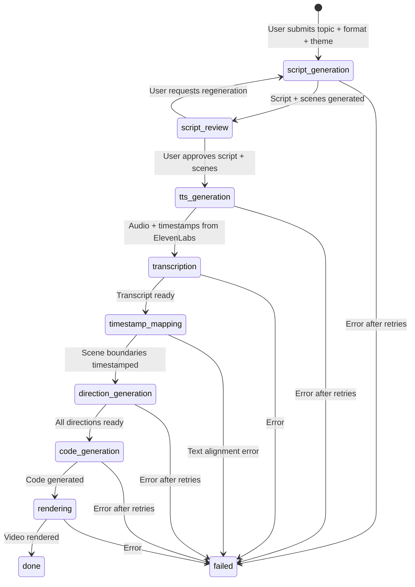

# Design Document: Merge Scene Planning into Script Generation

## Overview

This change restructures the pipeline to generate scene boundaries alongside the script in a single AI call, eliminating the separate `scene_planning` and `scene_plan_review` stages. The user sees scene structure during script review, and a deterministic timestamp mapping step replaces the AI-powered scene planner after TTS.

### Key Design Decisions

1. **Structured script output**: The `ScriptGenerator` returns `{ script: string, scenes: SceneBoundary[] }` instead of just a `string`. Scene boundaries have `startTime: 0` and `endTime: 0` as placeholders — real timestamps come later.
2. **Deterministic timestamp mapping**: After TTS produces word-level timestamps, a non-AI `TimestampMapper` service aligns scene text to transcript words and assigns real `startTime`/`endTime` values. This is a simple sequential text-matching algorithm.
3. **Single review gate**: The `scene_plan_review` stage and `awaiting_scene_plan_review` status are removed. Users review script + scenes together in the existing script review step.
4. **Backward-compatible output**: After timestamp mapping, the `SceneBoundary[]` is identical to what the old `ScenePlanner` produced — downstream stages (direction generation, code generation, rendering) are unaffected.

## Architecture

### New Pipeline Flow

```
script_generation → script_review → tts_generation → transcription → timestamp_mapping → direction_generation → code_generation → rendering → done
```

Compared to the old flow, this removes `scene_planning` and `scene_plan_review` (2 stages) and adds `timestamp_mapping` (1 stage). Net reduction: 1 stage, 1 review gate, 1 AI call.

### Pipeline Flow Diagram



## Components and Interfaces

### Changed: ScriptGenerator Interface

```typescript
// BEFORE
interface ScriptGenerator {
  generate(params: {
    topic: string;
    format: VideoFormat;
  }): Promise<Result<string, PipelineError>>;
}

// AFTER
interface ScriptGenerationResult {
  script: string;
  scenes: SceneBoundary[];  // startTime/endTime are 0 placeholders
}

interface ScriptGenerator {
  generate(params: {
    topic: string;
    format: VideoFormat;
  }): Promise<Result<ScriptGenerationResult, PipelineError>>;
}
```

The AI prompt is updated to produce structured output (using `generateObject` with a Zod schema) that includes both the full script text and an array of scene blocks with names, types, and text. Scene `startTime` and `endTime` are set to `0` since timestamps aren't available yet.

### New: TimestampMapper Interface

```typescript
// pipeline/application/interfaces/timestamp-mapper.ts
interface TimestampMapper {
  mapTimestamps(params: {
    scenes: SceneBoundary[];      // scenes with text but startTime/endTime = 0
    transcript: WordTimestamp[];   // word-level timestamps from TTS
  }): Result<SceneBoundary[], PipelineError>;  // scenes with real timestamps
}
```

This is a **synchronous, deterministic** service — no AI call. The algorithm:

1. Flatten all scene texts into a word sequence
2. Walk through transcript words sequentially
3. For each scene, find the first and last transcript word matching that scene's text
4. Set `startTime` = first word's `start`, `endTime` = last word's `end`
5. Adjust boundaries to be contiguous (each scene's `endTime` = next scene's `startTime`)

### Changed: PipelineJob Entity

```typescript
// New method — stores scene blocks alongside the script
setScript(script: string, scenes: SceneBoundary[]): Result<void, ValidationError>

// New method — stores approved script + scenes
setApprovedScript(script: string, scenes: SceneBoundary[]): Result<void, ValidationError>

// Existing method — now also called during timestamp_mapping stage
setScenePlan(scenePlan: SceneBoundary[]): Result<void, ValidationError>
// Stage guard relaxed: allowed in both "scene_planning" (legacy) and "timestamp_mapping"
```

New entity properties:
- `generatedScenes: SceneBoundary[] | null` — scene blocks from script generation (no timestamps)
- `approvedScenes: SceneBoundary[] | null` — user-approved scene blocks (no timestamps)

### Changed: PipelineStage Value Object

```typescript
// Removed stages
// - "scene_planning"
// - "scene_plan_review"

// Added stage
// - "timestamp_mapping"

// New valid transitions
const VALID_TRANSITIONS = new Map([
  ["script_generation", ["script_review"]],
  ["script_review", ["tts_generation", "script_generation"]],
  ["tts_generation", ["transcription"]],
  ["transcription", ["timestamp_mapping"]],
  ["timestamp_mapping", ["direction_generation"]],
  ["direction_generation", ["code_generation"]],
  ["code_generation", ["rendering"]],
  ["rendering", ["done"]],
  ["done", []],
]);

// New progress percentages
const STAGE_TO_PROGRESS = {
  script_generation: 10,
  script_review: 15,
  tts_generation: 30,
  transcription: 45,
  timestamp_mapping: 55,
  direction_generation: 65,
  code_generation: 80,
  rendering: 90,
  done: 100,
};
```

### Changed: PipelineStatus Value Object

```typescript
// Removed status
// - "awaiting_scene_plan_review"

type PipelineStatus =
  | "pending"
  | "processing"
  | "awaiting_script_review"
  | "completed"
  | "failed";
```

### Changed: Shared Types

```typescript
// PipelineStage — remove scene_planning, scene_plan_review; add timestamp_mapping
type PipelineStage =
  | "script_generation"
  | "script_review"
  | "tts_generation"
  | "transcription"
  | "timestamp_mapping"
  | "direction_generation"
  | "code_generation"
  | "rendering"
  | "done";

// PipelineStatus — remove awaiting_scene_plan_review
type PipelineStatus =
  | "pending"
  | "processing"
  | "awaiting_script_review"
  | "completed"
  | "failed";

// PipelineErrorCode — remove scene_planning_failed; add timestamp_mapping_failed
type PipelineErrorCode =
  | "script_generation_failed"
  | "tts_generation_failed"
  | "transcription_failed"
  | "timestamp_mapping_failed"
  | "direction_generation_failed"
  | "code_generation_failed"
  | "rendering_failed";

// PipelineJobDto — add generatedScenes, approvedScenes
interface PipelineJobDto {
  // ... existing fields ...
  generatedScenes?: SceneBoundary[];   // scenes from script gen (no timestamps)
  approvedScenes?: SceneBoundary[];    // user-approved scenes (no timestamps)
  scenePlan?: SceneBoundary[];         // scenes with timestamps (after mapping)
}
```

### New: TimestampMappingWorker

```typescript
// infrastructure/queue/workers/timestamp-mapping.worker.ts
class TimestampMappingWorker {
  constructor(
    private readonly timestampMapper: TimestampMapper,
    private readonly jobRepository: PipelineJobRepository,
    private readonly queueService: QueueService,
  ) {}

  async process(job: Job<{ jobId: string }>): Promise<void> {
    const pipelineJob = await this.jobRepository.findById(job.data.jobId);

    const scenes = pipelineJob.approvedScenes;  // scenes without timestamps
    const transcript = pipelineJob.transcript;   // word-level timestamps

    const result = this.timestampMapper.mapTimestamps({ scenes, transcript });

    pipelineJob.setScenePlan(result.getValue());  // scenes WITH timestamps
    pipelineJob.transitionTo("direction_generation");
    await this.jobRepository.save(pipelineJob);
    await this.queueService.enqueue({ stage: "direction_generation", jobId });
  }
}
```

### Changed: TTS Generation Worker

The TTS worker currently enqueues `scene_planning` after setting the transcript. It will now enqueue `timestamp_mapping` instead:

```typescript
// BEFORE
await this.queueService.enqueue({ stage: "scene_planning", jobId });

// AFTER
await this.queueService.enqueue({ stage: "timestamp_mapping", jobId });
```

### Changed: Script Generation Worker

```typescript
// BEFORE
const result = await this.scriptGenerator.generate({ topic, format });
pipelineJob.setScript(result.getValue());  // string

// AFTER
const result = await this.scriptGenerator.generate({ topic, format });
const { script, scenes } = result.getValue();
pipelineJob.setScript(script, scenes);  // string + SceneBoundary[]
```

### Changed: ApproveScriptUseCase

```typescript
// BEFORE
pipelineJob.setApprovedScript(scriptToApprove);  // string only

// AFTER
pipelineJob.setApprovedScript(scriptToApprove, scenesToApprove);  // string + scenes
```

The use case now also accepts an optional `scenes` array from the frontend. If the user edited scene text inline, the frontend sends the updated scenes. If not, the original `generatedScenes` are used.

### Removed Components

| Component | Location | Reason |
|-----------|----------|--------|
| `ScenePlanningWorker` | `infrastructure/queue/workers/scene-planning.worker.ts` | Replaced by `TimestampMappingWorker` |
| `AIScenePlanner` | `infrastructure/services/ai-scene-planner.ts` | No longer needed — scenes come from script gen |
| `ScenePlanner` interface | `application/interfaces/scene-planner.ts` | Port no longer needed |
| `ApproveScenePlanUseCase` | `application/use-cases/approve-scene-plan.use-case.ts` | No scene plan review gate |
| `RegenerateScenePlanUseCase` | `application/use-cases/regenerate-scene-plan.use-case.ts` | No scene plan review gate |
| Scene plan API endpoints | `presentation/controllers/pipeline.controller.ts` | No scene plan review gate |
| `ScenePlanTimeline` | `web/features/pipeline/components/scene-plan-timeline.tsx` | No scene plan review UI |
| `ScenePlanCard` | `web/features/pipeline/components/scene-plan-card.tsx` | No scene plan review UI |
| Scene plan review in job page | `web/app/jobs/[id]/page.tsx` | No scene plan review UI |

### Frontend Changes

The `ScriptReviewEditor` component already renders scene blocks inline (from the recent redesign). The key change is that scene data now comes from the API (`job.generatedScenes`) instead of being parsed client-side from the script text. The component will:

1. Receive `generatedScenes: SceneBoundary[]` as a prop (from the job DTO)
2. Render each scene as an editable block (already implemented)
3. On approve, send both the reconstructed script text and the scenes array to the API

## Data Models

### PipelineJob Entity — New Fields

```typescript
interface PipelineJobProps {
  // ... existing fields ...
  generatedScenes: SceneBoundary[] | null;   // NEW — scenes from script gen
  approvedScenes: SceneBoundary[] | null;    // NEW — user-approved scenes
}
```

### Prisma Schema Changes

```prisma
model PipelineJob {
  // ... existing fields ...
  generatedScenes Json?    // SceneBoundary[] without timestamps
  approvedScenes  Json?    // SceneBoundary[] without timestamps (user-approved)
}

// Update enums
enum PipelineStage {
  script_generation
  script_review
  tts_generation
  transcription
  timestamp_mapping      // NEW — replaces scene_planning
  direction_generation
  code_generation
  rendering
  done
  // REMOVED: scene_planning, scene_plan_review
}

enum PipelineStatus {
  pending
  processing
  awaiting_script_review
  completed
  failed
  // REMOVED: awaiting_scene_plan_review
}
```

### Zod Schema for Structured Script Output

```typescript
const structuredScriptResponseSchema = z.object({
  script: z.string().min(1),
  scenes: z.array(z.object({
    id: z.number(),
    name: z.string(),
    type: z.enum(["Hook", "Analogy", "Bridge", "Architecture", "Spotlight", "Comparison", "Power", "CTA"]),
    text: z.string(),
  })).min(2).max(15),
});
```

## Correctness Properties

### Property 1: Scene text coverage

*For any* structured script output, the concatenation of all scene block `text` fields (joined by a single space) SHALL produce text equivalent to the full `script` field after whitespace normalization.

**Validates: Requirement 1.4**

### Property 2: Timestamp mapping contiguity

*For any* valid timestamp mapping output, scene boundaries SHALL be contiguous: each scene's `endTime` equals the next scene's `startTime`, with no gaps or overlaps. The first scene's `startTime` SHALL be ≤ the first transcript word's start, and the last scene's `endTime` SHALL be ≥ the last transcript word's end.

**Validates: Requirements 4.3, 4.4, 4.5**

### Property 3: Timestamp mapping determinism

*For any* given pair of (scenes, transcript), the timestamp mapping SHALL always produce the same output. Running the mapping twice with identical inputs SHALL yield identical `SceneBoundary[]` arrays.

**Validates: Requirement 4.6**

### Property 4: Pipeline stage sequencing (updated)

*For any* pipeline job, the sequence of stage transitions SHALL follow: `script_generation` → `script_review` → `tts_generation` → `transcription` → `timestamp_mapping` → `direction_generation` → `code_generation` → `rendering` → `done`. The only allowed backward transition is `script_review` → `script_generation` (regeneration).

**Validates: Requirement 3.4**

### Property 5: Downstream compatibility

*For any* pipeline job that reaches `direction_generation`, the `scenePlan` field SHALL contain `SceneBoundary[]` with valid `startTime`/`endTime` values, conforming to the same interface consumed by `DirectionGenerator`.

**Validates: Requirements 5.1, 5.2**
