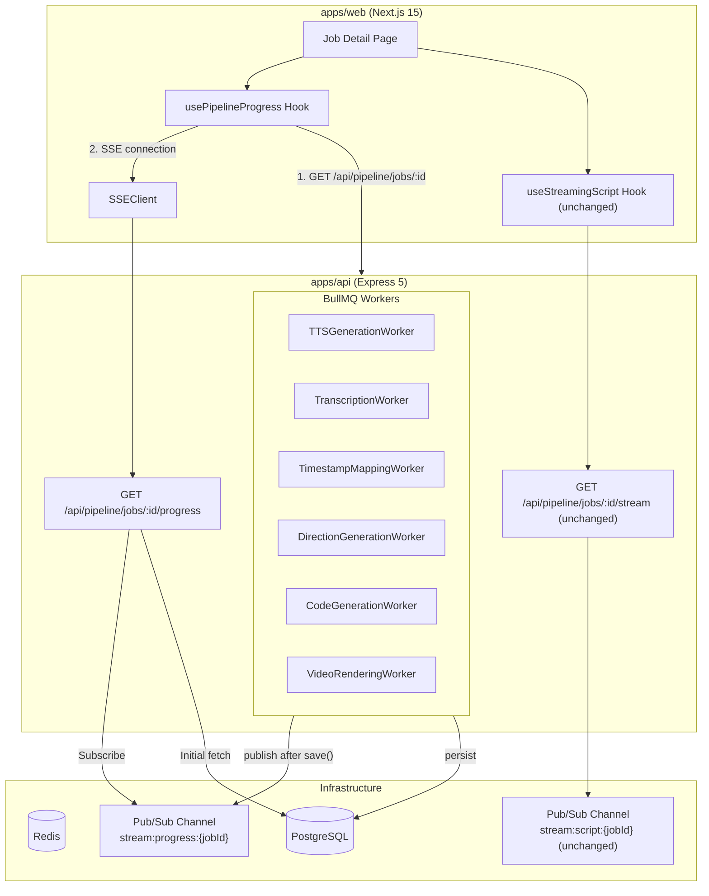
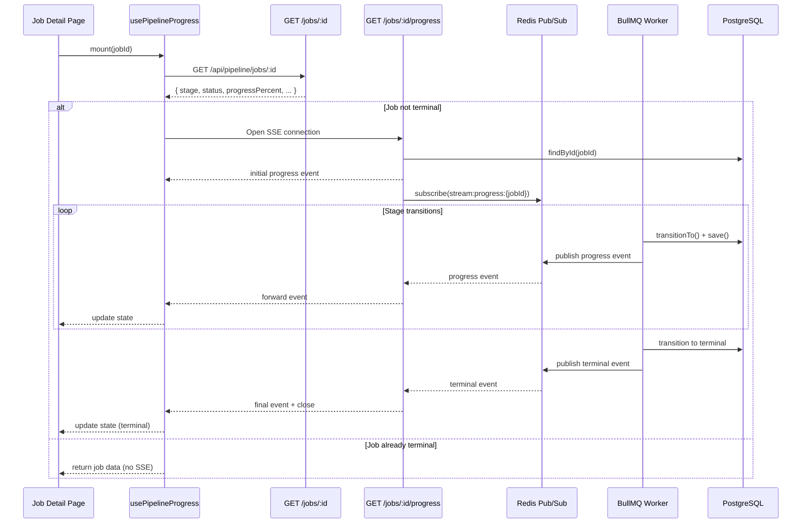

# Design Document: Pipeline Progress SSE

## Overview

This feature replaces the HTTP polling mechanism (`usePipelineJob`) with a Server-Sent Events (SSE) push system for pipeline job progress tracking. The design reuses the existing SSE infrastructure — `RedisStreamEventPublisher`, `RedisStreamEventSubscriber`, `ExpressSSEResponseHelper`, and `SSEClient` — already proven by the script-streaming feature.

The architecture introduces three new components:

1. A **ProgressController** (`GET /api/pipeline/jobs/:id/progress`) that establishes an SSE connection, sends the current job state as an initial event, subscribes to a Redis Pub/Sub channel for live updates, and auto-closes on terminal statuses.
2. A **Pipeline Progress Publisher** pattern injected into each BullMQ worker, publishing a `Progress_Event` to `stream:progress:{jobId}` after every `transitionTo()` + `save()` or `markFailed()` + `save()` call.
3. A **`usePipelineProgress` React hook** that performs an initial HTTP fetch, opens an SSE connection for live updates, and exposes `refetch` / `reconnect` functions for post-action scenarios (approve, regenerate, export).

The existing script-streaming SSE (`GET /api/pipeline/jobs/:id/stream`, `useStreamingScript`, `stream:script:{jobId}` channel) remains completely untouched.

### Key Design Decisions

1. **Separate Redis Pub/Sub channel**: Progress events use `stream:progress:{jobId}`, distinct from `stream:script:{jobId}`. No buffer/replay is needed — the initial event from the endpoint provides the current state, and subsequent events are live transitions.
2. **No event buffer for progress**: Unlike script streaming, progress events are discrete stage transitions (not incremental text). The SSE endpoint sends the current DB state as the first event, so late-connecting clients never miss the current state. This eliminates the need for a Redis list buffer.
3. **Reuse existing `StreamEventPublisher` interface**: Workers publish progress events through the same `RedisStreamEventPublisher` already used for script streaming, just to a different channel.
4. **Reuse existing `SSEClient` on frontend**: The `SSEClient` class already handles fetch-based SSE with retry, abort, and typed event parsing. The new hook wraps it the same way `useStreamingScript` does.
5. **Terminal auto-close**: When the SSE endpoint detects a terminal status (`completed`, `failed`, `awaiting_script_review`) in a received event, it sends the final event and closes the connection. The hook mirrors this by closing on terminal events.
6. **`reconnect` for post-action flows**: After approve/regenerate/export, the job re-enters processing. The hook exposes a `reconnect()` that closes the current SSE connection, performs a fresh HTTP fetch, and opens a new SSE connection if the job is not terminal.
7. **Workers own publishing**: Each worker publishes its own progress event after `save()`. This keeps the publishing co-located with the state transition and avoids a centralized event dispatcher.

## Architecture

### System Architecture Diagram



### Data Flow



## Components and Interfaces

### Backend Components

#### 1. ProgressController

New controller at `apps/api/src/pipeline/presentation/controllers/progress.controller.ts`.

```typescript
class ProgressController {
  constructor(
    private readonly subscriber: StreamEventSubscriber,
    private readonly sseHelper: SSEResponseHelper,
    private readonly jobRepository: PipelineJobRepository,
  ) {}

  async streamProgress(req: Request, res: Response): Promise<void>;
}
```

Responsibilities:
- Validate job ID (UUID format → 400, not found → 404)
- Initialize SSE response headers
- Send initial progress event from current DB state
- Subscribe to `stream:progress:{jobId}` for live events
- Forward received events to the SSE response
- Send heartbeat every 15 seconds
- Auto-close on terminal status events
- Clean up subscription on client disconnect

#### 2. Progress Event Publishing in Workers

Each worker that calls `transitionTo()` + `save()` or `markFailed()` + `save()` will also call `publisher.publish()` to the progress channel. The publisher is the existing `StreamEventPublisher` interface.

```typescript
// After transitionTo + save in any worker:
await this.progressPublisher.publish(`stream:progress:${jobId}`, {
  seq: Date.now(),  // monotonic within a job's lifecycle
  type: "progress",
  data: {
    stage: pipelineJob.stage.value,
    status: pipelineJob.status.value,
    progressPercent: pipelineJob.progressPercent,
  },
});
```

For failure events:
```typescript
await this.progressPublisher.publish(`stream:progress:${jobId}`, {
  seq: Date.now(),
  type: "progress",
  data: {
    stage: pipelineJob.stage.value,
    status: "failed",
    progressPercent: pipelineJob.progressPercent,
    errorCode: errorCode,
    errorMessage: errorMessage,
  },
});
```

#### 3. Route Registration

Add `GET /api/pipeline/jobs/:id/progress` to `pipeline.routes.ts`, wired to `ProgressController.streamProgress`.

### Frontend Components

#### 4. usePipelineProgress Hook

New hook at `apps/web/src/features/pipeline/hooks/use-pipeline-progress.ts`.

```typescript
interface UsePipelineProgressOptions {
  repository: PipelineRepository;
  jobId: string;
  apiBaseUrl: string;
}

interface UsePipelineProgressResult {
  job: PipelineJobDto | null;
  isLoading: boolean;
  error: Error | null;
  refetch: () => Promise<void>;
  reconnect: () => void;
}
```

Responsibilities:
- On mount: fetch job via `GET /api/pipeline/jobs/:id`
- If job is not terminal: open SSE to `/api/pipeline/jobs/:id/progress`
- On progress event: merge stage/status/progressPercent into job state
- On terminal event: close SSE connection
- `refetch()`: single HTTP fetch to refresh job state
- `reconnect()`: close existing SSE, refetch, open new SSE if not terminal
- On unmount: close SSE connection

#### 5. Job Detail Page Updates

Update `apps/web/src/app/jobs/[id]/page.tsx`:
- Replace `usePipelineJob` import with `usePipelineProgress`
- Replace `restartPolling()` calls with `reconnect()`
- All other component logic remains the same

### Dependency Injection Updates

#### Pipeline Factory (`pipeline.factory.ts`)

- Create a new `RedisStreamEventSubscriber` instance for the progress controller (separate from the script streaming subscriber)
- Instantiate `ProgressController` with subscriber, SSE helper, and repository
- Pass `progressController` to `createPipelineRouter`

#### Worker Registry (`worker-registry.ts`)

- Pass the existing `RedisStreamEventPublisher` (`eventPublisher`) to each worker that performs stage transitions
- Workers that already have the publisher (ScriptGenerationWorker) continue using it for script events; they additionally publish progress events

## Data Models

### Progress Event (SSE payload)

```typescript
interface ProgressEvent {
  type: "progress";
  seq: number;           // monotonically increasing (Date.now())
  data: {
    stage: PipelineStage;       // current stage name
    status: PipelineStatus;     // current status
    progressPercent: number;    // 0–100
    errorCode?: string;         // present when status is "failed"
    errorMessage?: string;      // present when status is "failed"
  };
}
```

### SSE Wire Format

```
event: progress
id: 1719500000000
data: {"type":"progress","seq":1719500000000,"data":{"stage":"tts_generation","status":"processing","progressPercent":30}}

```

### Terminal Statuses (connection auto-close triggers)

| Status | Trigger |
|---|---|
| `completed` | Job reaches `done` stage |
| `failed` | Any worker calls `markFailed()` |
| `awaiting_script_review` | Job transitions to `script_review` stage |

### Redis Channel Pattern

| Channel | Purpose |
|---|---|
| `stream:progress:{jobId}` | Pipeline progress events (new) |
| `stream:script:{jobId}` | Script streaming events (existing, unchanged) |


## Correctness Properties

*A property is a characteristic or behavior that should hold true across all valid executions of a system — essentially, a formal statement about what the system should do. Properties serve as the bridge between human-readable specifications and machine-verifiable correctness guarantees.*

### Property 1: Progress event structure invariant

*For any* pipeline job state (any valid stage, status, and progressPercent combination), a progress event constructed from that state SHALL contain `type` equal to `"progress"`, a numeric `seq`, and a `data` object with `stage` (valid PipelineStage), `status` (valid PipelineStatus), and `progressPercent` (integer 0–100). When status is `"failed"`, `data` SHALL additionally contain non-empty `errorCode` and `errorMessage` strings.

**Validates: Requirements 1.4, 2.2, 2.3**

### Property 2: Terminal status detection is consistent

*For any* PipelineStatus value, the function that determines whether a status is terminal SHALL return `true` if and only if the status is one of `"completed"`, `"failed"`, or `"awaiting_script_review"`. This property holds identically on both backend (connection close logic) and frontend (hook close logic).

**Validates: Requirements 1.6, 3.4**

### Property 3: SSE connection is conditional on non-terminal status

*For any* pipeline job returned by the initial fetch, the hook SHALL open an SSE connection if and only if the job's status is not terminal. Equivalently: for any terminal status, no SSE connection is established; for any non-terminal status, an SSE connection is established.

**Validates: Requirements 3.2, 3.5**

### Property 4: Progress event state merge preserves non-progress fields

*For any* existing `PipelineJobDto` and any incoming progress event, merging the event into the job state SHALL update `stage`, `status`, and `progressPercent` to match the event's values while preserving all other fields (`id`, `topic`, `format`, `themeId`, `generatedScript`, `approvedScript`, `generatedScenes`, `approvedScenes`, `createdAt`, `updatedAt`, etc.) unchanged.

**Validates: Requirements 3.3**

### Property 5: Progress and script channels are always distinct

*For any* job ID string, the progress channel `stream:progress:{jobId}` SHALL never equal the script channel `stream:script:{jobId}`.

**Validates: Requirements 5.3**

### Property 6: Worker publishes a progress event for every state change

*For any* valid stage transition (via `transitionTo`) or failure (via `markFailed`), the worker SHALL publish exactly one progress event to `stream:progress:{jobId}` whose `data.stage` and `data.status` match the job's post-transition state.

**Validates: Requirements 2.1, 2.3**

## Error Handling

### Backend Errors

| Scenario | Response | Details |
|---|---|---|
| Invalid UUID format | HTTP 400 | `{ error: "INVALID_INPUT", message: "Job ID must be a valid UUID" }` |
| Job not found | HTTP 404 | `{ error: "NOT_FOUND", message: "Job {id} not found" }` |
| Redis subscription failure | SSE error event | Send error event to client, then close connection |
| Client disconnect | Silent cleanup | Unsubscribe from Redis Pub/Sub, clear heartbeat interval |

### Frontend Errors

| Scenario | Hook Behavior | Details |
|---|---|---|
| Initial fetch fails (network) | `error` set, `isLoading: false` | No SSE connection attempted |
| Initial fetch returns 4xx/5xx | `error` set, `isLoading: false` | Error message from response body |
| SSE connection fails | `error` set | After max retries (3), error state is set |
| SSE connection drops mid-stream | Auto-retry via SSEClient | Exponential backoff, up to 3 retries |
| Malformed SSE event | Skip event | `SSEClient.processBlock` returns null for unparseable data |

### Worker Error Publishing

When a worker catches an error during processing:
1. Call `pipelineJob.markFailed(errorCode, errorMessage)`
2. Call `jobRepository.save(pipelineJob)`
3. Publish a progress event with `status: "failed"`, `errorCode`, and `errorMessage`
4. The SSE endpoint receives this terminal event and closes the connection
5. The frontend hook receives the terminal event, updates state, and closes

## Testing Strategy

### Property-Based Tests (fast-check)

Property-based tests validate the correctness properties defined above. Each test runs a minimum of 100 iterations with randomly generated inputs.

Library: `fast-check` (already in `node_modules`)

| Property | Test Location | What Varies |
|---|---|---|
| Property 1: Event structure | `apps/api/src/pipeline/presentation/controllers/progress.controller.test.ts` | Random stage, status, progressPercent, errorCode, errorMessage |
| Property 2: Terminal detection | `packages/shared/src/types/pipeline-progress.test.ts` | All PipelineStatus values |
| Property 3: SSE conditional | `apps/web/src/features/pipeline/hooks/use-pipeline-progress.test.ts` | Random PipelineJobDto with varying statuses |
| Property 4: State merge | `apps/web/src/features/pipeline/hooks/use-pipeline-progress.test.ts` | Random PipelineJobDto × random ProgressEvent |
| Property 5: Channel distinctness | `apps/api/src/pipeline/presentation/controllers/progress.controller.test.ts` | Random UUID strings |
| Property 6: Worker publishes | `apps/api/src/pipeline/infrastructure/queue/workers/*.test.ts` | Random valid stage transitions |

Each property test is tagged with: `Feature: pipeline-progress-sse, Property {N}: {title}`

### Unit Tests (example-based)

| Test | Location | What's Verified |
|---|---|---|
| SSE headers set correctly | `progress.controller.test.ts` | Content-Type: text/event-stream, Cache-Control, Connection |
| Invalid UUID → 400 | `progress.controller.test.ts` | Various invalid UUID formats |
| Missing job → 404 | `progress.controller.test.ts` | Valid UUID, no matching job |
| Heartbeat interval | `progress.controller.test.ts` | Heartbeat comment sent at 15s intervals |
| Client disconnect cleanup | `progress.controller.test.ts` | Unsubscribe called on req close |
| TTS worker publishes 3 events | `tts-generation.worker.test.ts` | One event per stage transition |
| Hook mounts and fetches | `use-pipeline-progress.test.ts` | HTTP fetch on mount |
| Hook refetch | `use-pipeline-progress.test.ts` | Single fetch on refetch() call |
| Hook reconnect lifecycle | `use-pipeline-progress.test.ts` | Close → fetch → conditional SSE open |
| SSE error sets error state | `use-pipeline-progress.test.ts` | Connection failure → error state |
| Return shape compatibility | `use-pipeline-progress.test.ts` | job, isLoading, error fields present |

### Integration Tests

| Test | What's Verified |
|---|---|
| End-to-end SSE flow | Publish event to Redis → received on SSE response |
| Both SSE streams independent | Script SSE + progress SSE active simultaneously without interference |
| Post-action reconnect | Approve → reconnect → receive new stage events |

### Non-Regression

- All existing `useStreamingScript` tests pass without modification
- All existing `StreamController` tests pass without modification
- `usePipelineJob` hook file and all imports are removed
