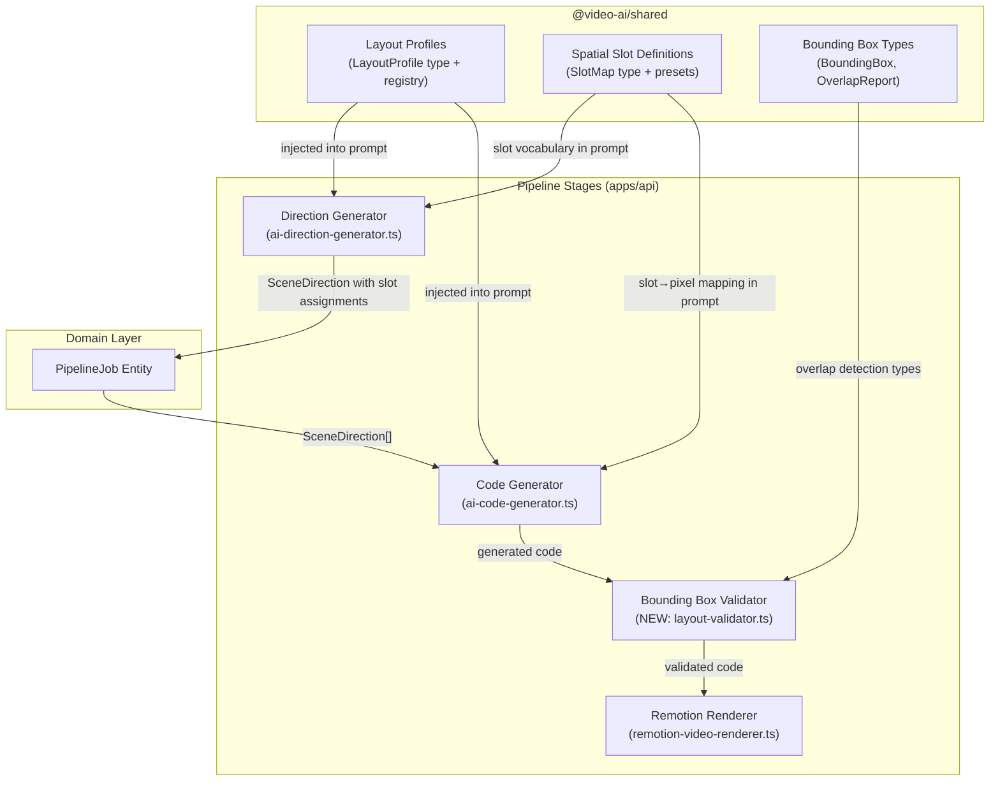
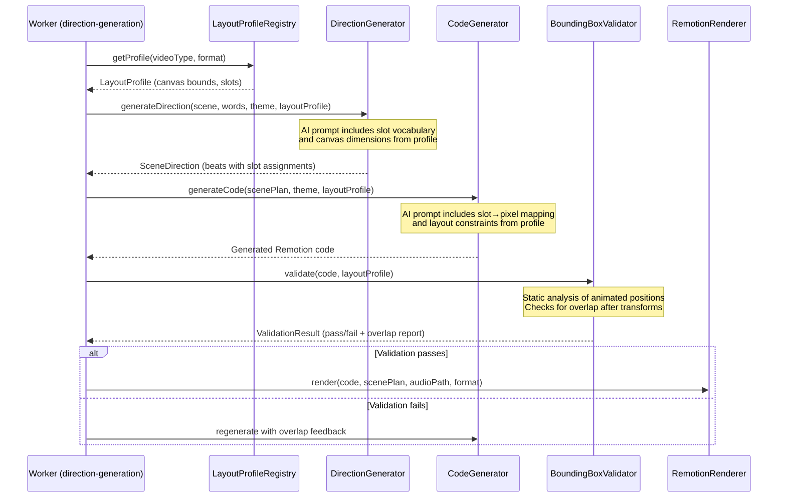
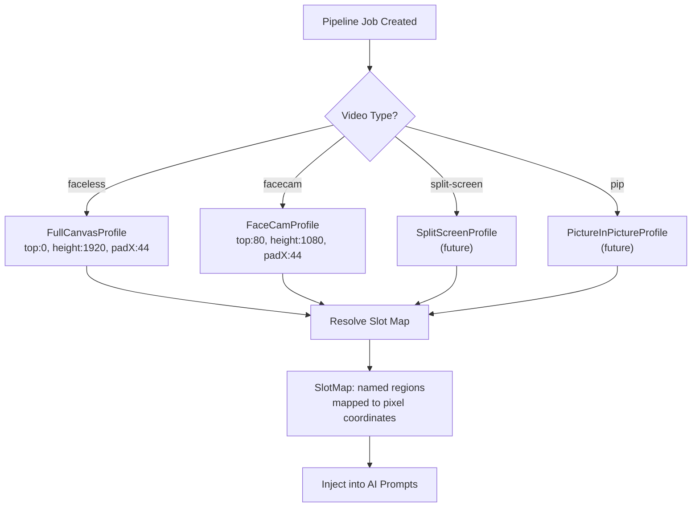

# Design Document: Pixel-Perfect Animation Layout System

## Overview

The Pixel-Perfect Animation Layout System replaces the hardcoded OpenCut-era safe zone constraints (CANVAS_TOP=80, CANVAS_H=1080) that waste ~840px of vertical space on faceless videos. The current system was copied from OpenCut, which reserves the bottom third of the canvas for a face cam — video-ai has no face cam but still uses these same constraints in both the Direction Generator and Code Generator prompts.

This feature introduces three interconnected subsystems: (1) a Layout Profile system that defines usable canvas regions per video type, (2) a Spatial Slot system that gives the Direction Generator a vocabulary for placing elements into non-overlapping screen regions, and (3) a post-animation Bounding Box Validator that statically analyzes generated Remotion code to detect element overlap before rendering. Together, these eliminate wasted space, prevent animation collisions, and provide an extensible foundation for future layout modes (face cam, split screen, picture-in-picture).

The system integrates into the existing pipeline by injecting layout context into the Direction Generator and Code Generator AI prompts, and by adding a validation step between code generation and rendering.

## Architecture

### System Integration Diagram



### Layout Resolution Flow



### Layout Profile Selection Logic



## Components and Interfaces

### Component 1: Layout Profile Registry

**Purpose**: Provides layout configuration based on video type. Acts as the single source of truth for canvas dimensions, safe zones, and padding. Replaces all hardcoded CANVAS_TOP/CANVAS_H values.

**Location**: `@video-ai/shared` (shared package — consumed by both AI prompt builders and future frontend preview)

```typescript
interface LayoutProfile {
  id: string;                    // e.g., "faceless", "facecam", "split-screen"
  name: string;                  // Human-readable name
  canvas: {
    width: number;               // Full canvas width (e.g., 1080)
    height: number;              // Full canvas height (e.g., 1920)
  };
  safeZone: {
    top: number;                 // Y offset from top (0 for faceless, 80 for facecam)
    left: number;                // X offset from left (padding)
    width: number;               // Usable width (canvas.width - left - right padding)
    height: number;              // Usable height
  };
  slots: SlotMap;                // Named spatial regions within the safe zone
  metadata: {
    description: string;
    reservedRegions?: ReservedRegion[];  // Areas reserved for overlays (face cam, PIP)
  };
}

interface ReservedRegion {
  name: string;                  // e.g., "facecam-area"
  top: number;
  left: number;
  width: number;
  height: number;
}

interface LayoutProfileRegistry {
  getProfile(videoType: string): LayoutProfile;
  listProfiles(): LayoutProfile[];
}
```

**Responsibilities**:
- Store and retrieve layout profiles by video type identifier
- Provide default profile (faceless) when no specific type is set
- Validate that profile dimensions are consistent (safe zone fits within canvas)
- Serve as the extensibility point for future layout modes

### Component 2: Spatial Slot System

**Purpose**: Defines a grid of named, non-overlapping screen regions within the safe zone. The Direction Generator assigns beats to slots; the Code Generator maps slots to pixel coordinates. This prevents element overlap by ensuring each beat occupies a dedicated spatial region.

**Location**: `@video-ai/shared` (type definitions and preset slot maps)

```typescript
interface Slot {
  id: string;                    // e.g., "top-third", "center", "bottom-third"
  label: string;                 // Human-readable label for AI prompt
  bounds: {
    top: number;                 // Relative to safe zone top (percentage or pixels)
    left: number;
    width: number;
    height: number;
  };
  allowOverflow: boolean;        // Whether animated content can exceed slot bounds
}

type SlotMap = Record<string, Slot>;

interface SlotAssignment {
  beatId: string;
  slotId: string;                // Which slot this beat occupies
  zIndex: number;                // Stacking order for overlapping animations
}
```

**Slot Presets for Faceless Profile (1080×1920, full canvas)**:

```
┌─────────────────────────┐ y=0
│      top-banner         │ (0–160px, ~8% height)
├─────────────────────────┤ y=160
│                         │
│      top-third          │ (160–640px, ~25% height)
│                         │
├─────────────────────────┤ y=640
│                         │
│      center             │ (640–1280px, ~33% height)
│                         │
├─────────────────────────┤ y=1280
│                         │
│      bottom-third       │ (1280–1760px, ~25% height)
│                         │
├─────────────────────────┤ y=1760
│      bottom-banner      │ (1760–1920px, ~8% height)
└─────────────────────────┘ y=1920
```

**Responsibilities**:
- Define named spatial regions within each layout profile's safe zone
- Provide pixel-coordinate resolution for each slot given a layout profile
- Ensure slots within a profile do not overlap
- Support compound slot references (e.g., "top-half" = top-third + center)

### Component 3: Bounding Box Validator

**Purpose**: Static analysis step that runs between code generation and rendering. Parses the generated Remotion code to extract element positions and animation transforms, then checks whether any element's final animated position would overlap with a sibling element. Reports violations so the code generator can retry with corrective feedback.

**Location**: `apps/api/src/pipeline/infrastructure/services/layout-validator.ts`

```typescript
interface BoundingBox {
  elementId: string;
  slotId?: string;
  initial: { top: number; left: number; width: number; height: number };
  animated: { top: number; left: number; width: number; height: number };
  transforms: AnimationTransform[];
}

interface AnimationTransform {
  property: string;              // "translateY", "translateX", "scale", "rotate"
  from: number;
  to: number;
  timing: { startFrame: number; endFrame: number };
}

interface OverlapViolation {
  elementA: string;
  elementB: string;
  overlapRegion: { top: number; left: number; width: number; height: number };
  frameRange: [number, number];  // When the overlap occurs
  severity: "warning" | "error"; // Warning if <10% overlap, error if >=10%
}

interface ValidationResult {
  valid: boolean;
  violations: OverlapViolation[];
  boundingBoxes: BoundingBox[];
  summary: string;               // Human-readable summary for retry prompt
}

interface LayoutValidator {
  validate(params: {
    code: string;
    layoutProfile: LayoutProfile;
    scenePlan: ScenePlan;
  }): Promise<Result<ValidationResult, PipelineError>>;
}
```

**Responsibilities**:
- Parse generated Remotion code to extract element positions (static analysis via AST or regex)
- Compute animated bounding boxes by applying interpolation/spring transforms
- Detect pairwise overlap between sibling elements within the same scene
- Produce a structured report that can be fed back into the code generator prompt for retry
- Distinguish between minor overlap (warning) and significant overlap (error)

### Component 4: Enhanced Direction Generator (modified)

**Purpose**: The existing `AIDirectionGenerator` is modified to accept a `LayoutProfile` and include slot assignments in its output. The AI prompt is updated to reference the slot vocabulary instead of hardcoded safe zone values.

**Location**: `apps/api/src/pipeline/infrastructure/services/ai-direction-generator.ts` (modified)

```typescript
// Updated port interface
interface DirectionGenerator {
  generateDirection(params: {
    scene: SceneBoundary;
    words: WordTimestamp[];
    theme: AnimationTheme;
    layoutProfile: LayoutProfile;          // NEW
    previousDirection?: SceneDirection;
  }): Promise<Result<SceneDirection, PipelineError>>;
}
```

**Changes to AI Prompt**:
- Replace hardcoded `Canvas: 1080x1920. Safe zone: top=80 to y=1150` with dynamic values from `LayoutProfile`
- Add slot vocabulary section listing available slots with their pixel bounds
- Instruct AI to assign each beat a `slot` field from the available slots
- Include slot constraint: "beats assigned to different slots MUST NOT produce overlapping visuals"

**Responsibilities**:
- Inject layout profile dimensions into the system prompt dynamically
- Present slot vocabulary to the AI for spatial assignment
- Validate that returned beat slot assignments reference valid slot IDs
- Auto-correct slot assignments if AI returns invalid slot references

### Component 5: Enhanced Code Generator (modified)

**Purpose**: The existing `AICodeGenerator` is modified to accept a `LayoutProfile` and use slot-to-pixel mappings instead of hardcoded CANVAS_TOP/CANVAS_H constants.

**Location**: `apps/api/src/pipeline/infrastructure/services/ai-code-generator.ts` (modified)

```typescript
// Updated port interface
interface CodeGenerator {
  generateCode(params: {
    scenePlan: ScenePlan;
    theme: AnimationTheme;
    layoutProfile: LayoutProfile;          // NEW
  }): Promise<Result<string, PipelineError>>;
}
```

**Changes to AI Prompt**:
- Replace hardcoded `CANVAS_TOP=80, CANVAS_H=1080` with dynamic values from `LayoutProfile.safeZone`
- Add slot-to-pixel mapping table so the AI knows exact pixel coordinates for each slot
- Add layout rule: "Each beat's content MUST be positioned within its assigned slot bounds"
- Add defensive rule: "animated translateY/scale MUST NOT push content outside slot bounds"

**Responsibilities**:
- Inject layout profile safe zone into the system prompt dynamically
- Provide slot→pixel coordinate mapping to the AI
- Replace hardcoded component structure template with profile-driven template
- Ensure generated code uses profile values instead of magic numbers

## Data Models

### New Types in `@video-ai/shared`

```typescript
// --- Layout Profile Types ---

interface LayoutProfile {
  id: string;
  name: string;
  canvas: { width: number; height: number };
  safeZone: { top: number; left: number; width: number; height: number };
  slots: SlotMap;
  metadata: {
    description: string;
    reservedRegions?: ReservedRegion[];
  };
}

interface ReservedRegion {
  name: string;
  top: number;
  left: number;
  width: number;
  height: number;
}

interface Slot {
  id: string;
  label: string;
  bounds: { top: number; left: number; width: number; height: number };
  allowOverflow: boolean;
}

type SlotMap = Record<string, Slot>;

// --- Validation Types ---

interface BoundingBox {
  elementId: string;
  slotId?: string;
  initial: { top: number; left: number; width: number; height: number };
  animated: { top: number; left: number; width: number; height: number };
  transforms: AnimationTransform[];
}

interface AnimationTransform {
  property: string;
  from: number;
  to: number;
  timing: { startFrame: number; endFrame: number };
}

interface OverlapViolation {
  elementA: string;
  elementB: string;
  overlapRegion: { top: number; left: number; width: number; height: number };
  frameRange: [number, number];
  severity: "warning" | "error";
}

interface ValidationResult {
  valid: boolean;
  violations: OverlapViolation[];
  boundingBoxes: BoundingBox[];
  summary: string;
}
```

### Extended SceneBeat Type

The existing `SceneBeat` type in `@video-ai/shared` is extended with an optional slot assignment:

```typescript
interface SceneBeat {
  id: string;
  timeRange: [number, number];
  frameRange: [number, number];
  spokenText: string;
  visual: string;
  typography: string;
  motion: string;
  sfx: string[];
  slot?: string;                 // NEW — assigned spatial slot ID
}
```

### Layout Profile Presets

```typescript
// Faceless profile — uses full 1080×1920 canvas
const FACELESS_PROFILE: LayoutProfile = {
  id: "faceless",
  name: "Faceless (Full Canvas)",
  canvas: { width: 1080, height: 1920 },
  safeZone: { top: 0, left: 44, width: 992, height: 1920 },
  slots: {
    "top-banner":    { id: "top-banner",    label: "Top Banner",    bounds: { top: 0,    left: 0, width: 992, height: 160  }, allowOverflow: false },
    "top-third":     { id: "top-third",     label: "Top Third",     bounds: { top: 160,  left: 0, width: 992, height: 480  }, allowOverflow: false },
    "center":        { id: "center",        label: "Center",        bounds: { top: 640,  left: 0, width: 992, height: 640  }, allowOverflow: false },
    "bottom-third":  { id: "bottom-third",  label: "Bottom Third",  bounds: { top: 1280, left: 0, width: 992, height: 480  }, allowOverflow: false },
    "bottom-banner": { id: "bottom-banner", label: "Bottom Banner", bounds: { top: 1760, left: 0, width: 992, height: 160  }, allowOverflow: false },
  },
  metadata: { description: "Full canvas layout for faceless videos — no reserved regions" },
};

// Face cam profile — reserves bottom for camera overlay
const FACECAM_PROFILE: LayoutProfile = {
  id: "facecam",
  name: "Face Cam",
  canvas: { width: 1080, height: 1920 },
  safeZone: { top: 80, left: 44, width: 992, height: 1080 },
  slots: {
    "top-third":    { id: "top-third",    label: "Top Third",    bounds: { top: 0,   left: 0, width: 992, height: 360 }, allowOverflow: false },
    "center":       { id: "center",       label: "Center",       bounds: { top: 360, left: 0, width: 992, height: 360 }, allowOverflow: false },
    "bottom-third": { id: "bottom-third", label: "Bottom Third", bounds: { top: 720, left: 0, width: 992, height: 360 }, allowOverflow: false },
  },
  metadata: {
    description: "Layout with bottom reserved for face cam overlay",
    reservedRegions: [
      { name: "facecam-area", top: 1160, left: 0, width: 1080, height: 760 },
    ],
  },
};
```

### Pipeline Job Extension

The `PipelineJob` entity does not need schema changes. The layout profile is resolved at runtime from the video type (currently always "faceless") and injected into the direction and code generation workers. If future video types require persisting the layout choice, a `layoutProfileId` field can be added to the job record.

### Validation Rules

- `LayoutProfile.safeZone` must fit within `LayoutProfile.canvas` bounds
- All slots in a `SlotMap` must fit within the `safeZone` dimensions
- No two slots in the same `SlotMap` may overlap (pairwise check on bounds)
- `SceneBeat.slot` (when present) must reference a valid slot ID from the active profile
- Slot bounds are relative to the safe zone origin, not the canvas origin

## Error Handling

### Error Scenario 1: Invalid Slot Assignment from AI

**Condition**: The Direction Generator AI returns a beat with a `slot` value that doesn't exist in the active layout profile's slot map.
**Response**: The direction generator auto-corrects by assigning the beat to the closest matching slot based on the beat's position in the scene (first beat → top slot, last beat → bottom slot, middle beats → center).
**Recovery**: Processing continues with the corrected slot assignment. A warning is logged.

### Error Scenario 2: Bounding Box Validation Failure

**Condition**: The Bounding Box Validator detects significant overlap (≥10% area) between sibling elements in the generated code.
**Response**: The code generator retries with the overlap report injected into the prompt as corrective feedback (up to 2 retries, consistent with existing retry policy).
**Recovery**: If all retries fail validation, the pipeline marks the job as failed with error code `code_generation_failed` and includes the overlap summary in the error message.

### Error Scenario 3: Layout Profile Not Found

**Condition**: A video type is requested that has no registered layout profile.
**Response**: The system falls back to the `faceless` profile (full canvas) and logs a warning.
**Recovery**: Processing continues with the default profile. No user-facing error.

### Error Scenario 4: Code Generation Produces Out-of-Bounds Elements

**Condition**: Generated code positions elements outside the safe zone defined by the layout profile.
**Response**: The validator flags these as violations. The code generator retries with boundary constraint feedback.
**Recovery**: Same retry flow as overlap violations.

## Correctness Properties

*A property is a characteristic or behavior that should hold true across all valid executions of a system — essentially, a formal statement about what the system should do. Properties serve as the bridge between human-readable specifications and machine-verifiable correctness guarantees.*

### Property 1: Safe zone containment within canvas

*For any* LayoutProfile with arbitrary canvas dimensions and safe zone bounds, the safe zone top + height SHALL be less than or equal to the canvas height, and the safe zone left + width SHALL be less than or equal to the canvas width. Validation SHALL accept profiles where the safe zone fits and reject profiles where it does not.

**Validates: Requirement 1.2**

### Property 2: Slot containment within safe zone

*For any* LayoutProfile with a valid safe zone and an arbitrary Slot_Map, every slot's bounds (top + height, left + width) SHALL fit within the safe zone dimensions. Validation SHALL accept slot maps where all slots fit and reject slot maps where any slot exceeds the safe zone.

**Validates: Requirement 1.3**

### Property 3: Slot non-overlap invariant

*For any* Slot_Map containing two or more slots, no two distinct slots SHALL have overlapping bounds. Validation SHALL detect and reject any slot map where a pairwise overlap exists.

**Validates: Requirement 1.4**

### Property 4: Beat slot assignment validity after auto-correction

*For any* SceneDirection produced by the Direction_Generator and any LayoutProfile, after auto-correction, every beat's slot field SHALL reference a valid slot id present in the profile's Slot_Map. The auto-correction function SHALL always produce a valid slot id regardless of the invalid input.

**Validates: Requirements 4.3, 4.4**

### Property 5: Animated bounding box computability

*For any* BoundingBox with an initial position and a set of AnimationTransforms (translateY, translateX, scale), applying the transforms SHALL produce an animated bounding box with finite, non-NaN top, left, width, and height values.

**Validates: Requirement 6.2**

### Property 6: Rectangle overlap detection correctness

*For any* two rectangles (defined by top, left, width, height), the overlap detection function SHALL return true if and only if the rectangles geometrically intersect (i.e., one rectangle's left < the other's right AND one's top < the other's bottom, and vice versa).

**Validates: Requirement 6.3**

### Property 7: Overlap severity classification

*For any* two overlapping bounding boxes, the Bounding_Box_Validator SHALL classify the violation as "warning" when the overlap area is less than 10% of the smaller element's area, and as "error" when the overlap area is 10% or more of the smaller element's area.

**Validates: Requirements 6.4, 6.5**

### Property 8: Out-of-bounds element detection

*For any* BoundingBox whose animated position extends beyond the safe zone bounds of the active LayoutProfile, the Bounding_Box_Validator SHALL detect and report the element as a violation.

**Validates: Requirement 6.7**

### Property 9: Non-overlapping slot assignments produce zero violations

*For any* set of elements where each element is positioned entirely within its assigned slot bounds, and all slots in the active profile are non-overlapping, the Bounding_Box_Validator SHALL report zero overlap violations.

**Validates: Requirements 6.3, 6.6**

## Testing Strategy

### Unit Testing Approach

- Layout profile registry: verify profile lookup, default fallback, validation of profile constraints
- Slot map validation: verify no-overlap invariant for all preset slot maps
- Slot resolution: verify pixel coordinate calculation from percentage-based slot bounds
- Bounding box computation: verify transform application (translateY, scale) produces correct animated bounds
- Overlap detection: verify pairwise overlap calculation with known overlapping and non-overlapping rectangles

### Property-Based Testing Approach

**Property Test Library**: fast-check

- For any valid LayoutProfile, all slots must fit within the safe zone bounds
- For any two distinct slots in the same SlotMap, their bounds must not overlap
- For any BoundingBox with transforms applied, the animated bounds must be computable and finite
- For any set of non-overlapping slot assignments, the validator must report zero violations

### Integration Testing Approach

- Direction generator prompt injection: verify that the generated prompt contains the correct canvas dimensions and slot vocabulary from the layout profile (not hardcoded values)
- Code generator prompt injection: verify that the generated prompt contains slot-to-pixel mappings from the layout profile
- End-to-end validation flow: generate code → validate → verify no false positives on known-good layouts
- Retry with feedback: verify that overlap report is correctly injected into retry prompt

## Performance Considerations

- The bounding box validator performs static analysis on generated code (string parsing + arithmetic). This is CPU-bound but fast — expected <100ms for typical generated components (<500 lines).
- Layout profile resolution is a simple map lookup — negligible overhead.
- No additional AI calls are introduced unless validation fails and triggers a retry. The retry budget remains the same (2 retries) as the existing code generator.
- Slot maps are small (5–8 entries) — pairwise overlap checks are O(n²) but n is tiny.

## Security Considerations

- Layout profiles are defined in the shared package as static constants — no user input influences profile definitions.
- The bounding box validator parses AI-generated code but does not execute it. Static analysis only.
- No new external API calls or network requests are introduced.

## Dependencies

- **Existing**: `@video-ai/shared` (extended with layout types), `ai` (Vercel AI SDK), `@remotion/bundler`, `@remotion/renderer`
- **New**: None. The bounding box validator uses standard TypeScript string parsing / regex. No new npm packages required.
- **Modified services**: `ai-direction-generator.ts`, `ai-code-generator.ts`, `direction-generation.worker.ts`, `code-generation.worker.ts`
- **New service**: `layout-validator.ts` (infrastructure layer)
- **New shared exports**: `LayoutProfile`, `SlotMap`, `Slot`, `ReservedRegion`, layout profile presets, validation types
