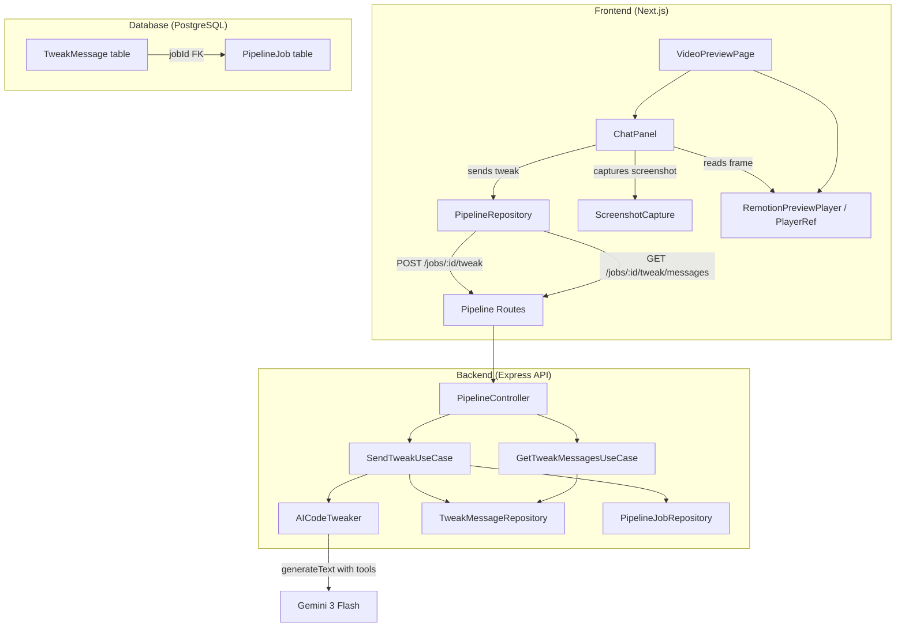

# Design Document: Preview Chat Tweaks

## Overview

This feature adds a conversational chat interface to the video preview page, allowing users to request animation tweaks in natural language. The system captures a screenshot of the current Remotion player frame and timeline position, sends them alongside the user's message to a backend AI agent, which makes surgical code edits using `read_code`/`edit_code` tools. The updated code is persisted and the frontend re-evaluates it for instant visual feedback.

The design follows the existing autofix pattern (`AICodeAutoFixer` + `AutofixCodeUseCase`) but extends it with:
- Conversational context (chat history with last 10 messages sent to the LLM)
- Visual context (screenshot of the current player frame)
- Temporal context (current frame number and time in seconds)
- A dedicated chat UI replacing the info panel when in preview-eligible stages

## Architecture

The feature spans three layers of the existing clean architecture:



**Key design decisions:**

1. **Follow the autofix pattern** — The `AICodeTweaker` service mirrors `AICodeAutoFixer` with the same `read_code`/`edit_code` tool pair, `generateText` from AI SDK, and `Main` function validation. This keeps the codebase consistent.

2. **Chat history in a separate table** — Rather than adding a JSON column to `PipelineJob`, a dedicated `TweakMessage` table provides proper indexing, ordering, and avoids bloating the job record.

3. **Screenshot capture on the client** — Using `html2canvas` (already a dependency via OpenCut's `capture-frames.ts` pattern) to capture the Remotion player container. This runs client-side because the Remotion player is a browser-rendered component.

4. **Last 10 messages context window** — Balances token cost with conversational continuity. The system prompt is always included outside this window.

## Components and Interfaces

### Backend Components

#### 1. `TweakMessage` Prisma Model
New database table for chat history persistence.

#### 2. `TweakMessageRepository` Interface + Prisma Implementation
- `findByJobId(jobId: string): Promise<TweakMessage[]>` — returns all messages in chronological order
- `findRecentByJobId(jobId: string, limit: number): Promise<TweakMessage[]>` — returns the N most recent messages
- `create(params: CreateTweakMessageParams): Promise<TweakMessage>` — persists a new message

#### 3. `CodeTweaker` Interface (Application Layer)
```typescript
interface CodeTweakParams {
  currentCode: string;
  message: string;
  screenshot?: string;       // base64 PNG without prefix
  currentFrame?: number;
  currentTimeSeconds?: number;
  chatHistory: TweakMessageDto[];
}

interface CodeTweakResult {
  tweakedCode: string;
  explanation: string;
}

interface CodeTweaker {
  tweakCode(params: CodeTweakParams): Promise<Result<CodeTweakResult, PipelineError>>;
}
```

#### 4. `AICodeTweaker` Service (Infrastructure Layer)
Implements `CodeTweaker`. Mirrors `AICodeAutoFixer` structure:
- Uses `generateText` from AI SDK with `gemini-3-flash-preview`
- Creates `read_code`/`edit_code` tools via the same `createCodeEditorTools` factory pattern
- Builds a multi-part message with text prompt + optional image content part (base64 PNG screenshot)
- Includes chat history as prior messages for conversational context
- Limits to 10 tool-use steps (`stepCountIs(10)`)
- Validates that `Main` function still exists after edits
- System prompt adapted from OpenCut's `SCENE_CODE_TWEAK_SYSTEM_PROMPT` for the video-ai context

#### 5. `SendTweakUseCase` (Application Layer)
Orchestrates the tweak flow:
1. Validates job exists and is in a preview-eligible stage
2. Persists the user message to `TweakMessageRepository`
3. Fetches the last 10 messages for context
4. Retrieves current `generatedCode` from the job
5. Calls `AICodeTweaker.tweakCode()`
6. On success: updates `PipelineJob.generatedCode`, persists assistant message, returns result
7. On failure: persists assistant error message, returns error

#### 6. `GetTweakMessagesUseCase` (Application Layer)
Simple query use case — fetches all messages for a job from `TweakMessageRepository`.

#### 7. API Routes
- `POST /jobs/:id/tweak` — accepts `{ message: string, screenshot?: string, frame?: number, timeSeconds?: number }`
- `GET /jobs/:id/tweak/messages` — returns `{ messages: TweakMessageDto[] }`

### Frontend Components

#### 1. `ChatPanel` Component
Replaces the info/actions section in the right column when the job is in a preview-eligible stage. Contains:
- Compact job metadata bar (format, resolution, theme, date)
- Stage indicator + progress bar
- Action buttons (Download, Regenerate, Export) in a compact row
- Scrollable message list with user/assistant message bubbles
- Text input with send button at the bottom
- Loading indicator while a tweak is processing

#### 2. `useTweakChat` Hook
Manages chat state:
- Fetches initial messages via `repository.getTweakMessages(jobId)`
- Provides `sendMessage(text)` that:
  1. Captures screenshot from PlayerRef
  2. Reads current frame/time from PlayerRef
  3. Calls `repository.sendTweak({ jobId, message, screenshot, frame, timeSeconds })`
  4. On success: adds assistant message to local state, triggers code re-evaluation via callback
- Manages loading/error states
- Auto-scrolls to latest message

#### 3. Screenshot Capture Utility
A function `capturePlayerScreenshot(playerContainerRef)` that:
- Uses `html2canvas` to capture the Remotion player container element
- Returns base64 PNG string without the `data:image/png;base64,` prefix
- Returns `null` on failure (graceful degradation per Requirement 3.3)

#### 4. `PipelineRepository` Extensions
```typescript
// Added to existing PipelineRepository interface
sendTweak(params: {
  jobId: string;
  message: string;
  screenshot?: string;
  frame?: number;
  timeSeconds?: number;
}): Promise<{ updatedCode: string; explanation: string }>;

getTweakMessages(jobId: string): Promise<TweakMessageDto[]>;
```

### Integration Points

- `VideoPreviewPage` conditionally renders `ChatPanel` vs existing info section based on `isPreviewEligible`
- `ChatPanel` receives `PlayerRef` from `RemotionPreviewPlayer` to read frame position and capture screenshots
- On successful tweak, `usePreviewData.refetch()` is called to re-evaluate the updated code
- The existing `handleAutofixForPlayer` and `handleRegenerateCode` remain available as action buttons within the chat panel

## Data Models

### TweakMessage (New Prisma Model)

```prisma
model TweakMessage {
  id        String   @id @default(uuid())
  createdAt DateTime @default(now())

  jobId String
  job   PipelineJob @relation(fields: [jobId], references: [id], onDelete: Cascade)

  role    String   // "user" or "assistant"
  content String   @db.Text

  @@index([jobId, createdAt])
}
```

The `PipelineJob` model gets a reverse relation:
```prisma
model PipelineJob {
  // ... existing fields ...
  tweakMessages TweakMessage[]
}
```

### TweakMessageDto (Shared Type)

```typescript
interface TweakMessageDto {
  id: string;
  jobId: string;
  role: "user" | "assistant";
  content: string;
  createdAt: string; // ISO 8601
}
```

### API Request/Response Shapes

**POST /jobs/:id/tweak**
```typescript
// Request
{
  message: string;
  screenshot?: string;    // base64 PNG, no prefix
  frame?: number;         // current frame number
  timeSeconds?: number;   // current time in seconds
}

// Success Response (200)
{
  status: "ok";
  updatedCode: string;
  explanation: string;
}

// Error Response (400/404/409)
{
  error: string;
  message: string;
}
```

**GET /jobs/:id/tweak/messages**
```typescript
// Response (200)
{
  messages: TweakMessageDto[];
}
```


## Correctness Properties

*A property is a characteristic or behavior that should hold true across all valid executions of a system — essentially, a formal statement about what the system should do. Properties serve as the bridge between human-readable specifications and machine-verifiable correctness guarantees.*

### Property 1: Message persistence round-trip

*For any* valid tweak message with any role ("user" or "assistant"), any non-empty content string, and any valid jobId, storing the message via the repository and then retrieving messages for that jobId should return a message with the same role, content, and jobId.

**Validates: Requirements 1.1, 1.4**

### Property 2: Chat history chronological ordering

*For any* set of tweak messages with varying timestamps stored for a single job, retrieving them via `findByJobId` should return them sorted in ascending chronological order by `createdAt`.

**Validates: Requirements 1.2**

### Property 3: Context window bounds

*For any* chat history of length N (where N >= 0) for a job, the context window sent to the Tweak_Agent should contain exactly `min(N, 10)` messages, and those messages should be the N most recent (by `createdAt`) when N > 10, or all messages when N <= 10.

**Validates: Requirements 2.1, 2.2**

### Property 4: Screenshot base64 prefix stripping

*For any* base64 string, if it is prefixed with `data:image/png;base64,`, the stripping function should remove exactly that prefix and return the remaining content unchanged. If the string has no such prefix, it should be returned as-is.

**Validates: Requirements 3.2**

### Property 5: Code edit correctness (applyEdit)

*For any* code string and any substring `oldStr` that appears exactly once in the code, calling `applyEdit(code, oldStr, newStr)` should produce a result where `oldStr` is replaced by `newStr` at the correct position, the text before and after the replacement is unchanged, and the result length equals `code.length - oldStr.length + newStr.length`.

**Validates: Requirements 5.2**

### Property 6: Stage validation for tweak eligibility

*For any* pipeline stage value, the tweak use case should accept the request only when the stage is one of "preview", "rendering", or "done", and should return a validation error for all other stages.

**Validates: Requirements 7.2, 7.3**

## Error Handling

### Backend Errors

| Error Condition | HTTP Status | Error Code | Behavior |
|---|---|---|---|
| Job not found | 404 | `NOT_FOUND` | Return error, no message persisted |
| Job not in preview-eligible stage | 409 | `CONFLICT` | Return error with stage info |
| Missing `message` field in request | 400 | `INVALID_INPUT` | Return validation error |
| AI tweaker fails (LLM error) | 500 | `TWEAK_FAILED` | Persist error as assistant message, return error |
| Tweaked code missing `Main` function | 400 | `CODE_STRUCTURE_BROKEN` | Persist error as assistant message, do NOT update job code |
| AI tweaker makes no changes | 400 | `NO_CHANGES` | Persist explanation as assistant message, do NOT update job code |

### Frontend Error Handling

- **Screenshot capture failure**: Silently degrade — send the tweak without a screenshot. Log a warning to console.
- **PlayerRef unavailable**: Send tweak without frame/time context. The agent can still operate on code alone.
- **Network error on sendTweak**: Display error in the chat as a system message. Allow retry.
- **Network error on getTweakMessages**: Show empty chat with a retry option. Don't block the preview player.
- **Code evaluation failure after tweak**: Display the error in the Remotion player's error fallback (existing behavior). The chat shows the assistant's explanation so the user can request a follow-up fix.

## Testing Strategy

### Unit Tests

- **`applyEdit` function**: Test exact match replacement, no-match error, multiple-match error, identical strings error. These are specific edge cases complementing Property 5.
- **`SendTweakUseCase`**: Test with mocked repository and tweaker — verify orchestration flow (message persistence order, code update on success, no code update on failure).
- **`GetTweakMessagesUseCase`**: Test with mocked repository — verify it returns messages.
- **Context window slicing**: Test the function that selects the last N messages from a list.
- **Prompt construction**: Test that frame, time, and screenshot are correctly included in the prompt.
- **`ChatPanel` component**: Render tests for conditional display, message list rendering, input field presence, loading states.

### Property-Based Tests

Property-based testing is appropriate for this feature because several core functions are pure transformations with clear input/output behavior and large input spaces (arbitrary strings, varying list lengths, different stage values).

**Library**: `fast-check` (already available in the project's test ecosystem via vitest)

**Configuration**: Minimum 100 iterations per property test.

Each property test must be tagged with a comment referencing the design property:
- **Feature: preview-chat-tweaks, Property 1: Message persistence round-trip**
- **Feature: preview-chat-tweaks, Property 2: Chat history chronological ordering**
- **Feature: preview-chat-tweaks, Property 3: Context window bounds**
- **Feature: preview-chat-tweaks, Property 4: Screenshot base64 prefix stripping**
- **Feature: preview-chat-tweaks, Property 5: Code edit correctness (applyEdit)**
- **Feature: preview-chat-tweaks, Property 6: Stage validation for tweak eligibility**

### Integration Tests

- **API endpoint tests**: Verify `POST /jobs/:id/tweak` and `GET /jobs/:id/tweak/messages` routes with a test database.
- **Repository tests**: Verify Prisma `TweakMessageRepository` against a real PostgreSQL instance.
- **Frontend repository**: Verify `sendTweak` and `getTweakMessages` call the correct endpoints with correct payloads (mocked fetch).

### End-to-End Smoke Tests

- Send a tweak message on a preview-eligible job and verify the response contains updated code.
- Load the preview page and verify the chat panel appears with existing messages.
