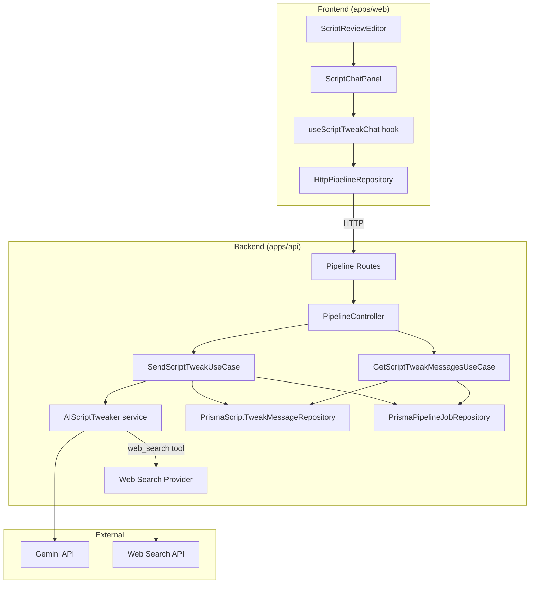
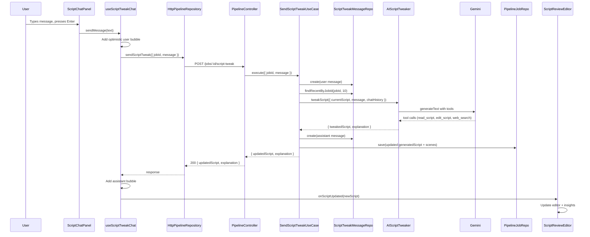

# Design Document: Script Chat

## Overview

This feature adds a natural language chat interface to the script review page, allowing users to iteratively refine their video script through conversation with an AI assistant. Instead of manually rewriting text or fully regenerating the script, users describe changes in plain language (e.g., "make the intro more punchy", "add recent stats about AI") and the AI applies targeted edits.

The architecture mirrors the existing video preview tweak chat system (`AICodeTweaker` → `SendTweakUseCase` → `ChatPanel` → `useTweakChat`) but operates on script text instead of Remotion animation code. An additional `web_search` tool enables the AI to look up current facts and statistics when users request them.

### Key Design Decisions

1. **Mirror existing tweak architecture** — Reuse the same layered pattern (AI service → use case → controller → route → frontend hook → UI component) to maintain consistency and reduce cognitive overhead.
2. **Separate message storage** — Script tweak messages get their own `ScriptTweakMessage` Prisma model rather than sharing `TweakMessage`, because the two conversations are conceptually distinct (script editing vs. code editing) and may diverge in schema over time.
3. **Tool-based editing** — The AI uses `read_script` / `edit_script` tools (mirroring `read_code` / `edit_code`) for surgical string replacements rather than regenerating the entire script, preserving user edits and scene structure.
4. **Web search as an optional tool** — The `web_search` tool is exposed to the AI model but only invoked when the model determines it needs external data. This keeps simple edits fast while enabling fact-based requests.

## Architecture



### Data Flow: Send Script Tweak



## Components and Interfaces

### Backend Components

#### 1. ScriptTweaker Interface (Application Layer)

```typescript
// apps/api/src/pipeline/application/interfaces/script-tweaker.ts
interface ScriptTweakParams {
  currentScript: string;
  message: string;
  chatHistory: TweakMessageDto[];
}

interface ScriptTweakResult {
  tweakedScript: string;
  explanation: string;
}

interface ScriptTweaker {
  tweakScript(
    params: ScriptTweakParams,
  ): Promise<Result<ScriptTweakResult, PipelineError>>;
}
```

Mirrors `CodeTweaker` but without screenshot/frame context (not relevant for script editing).

#### 2. AIScriptTweaker Service (Infrastructure Layer)

```typescript
// apps/api/src/pipeline/infrastructure/services/ai-script-tweaker.ts
class AIScriptTweaker implements ScriptTweaker
```

Mirrors `AICodeTweaker` with three tools instead of two:

- **`read_script`** — Returns the current full script text. The AI must call this first.
- **`edit_script`** — Replaces an exact substring (`oldStr` → `newStr`). Uses the same `applyEdit` logic as `AICodeTweaker` (not-found error, ambiguous-match error).
- **`web_search`** — Performs a web search query and returns summarized snippets. Used when the user requests facts, statistics, or current data.

System prompt is tailored for script editing: instructs the AI to make surgical text edits, preserve scene structure, and provide short plain-language explanations of changes.

#### 3. ScriptTweakMessageRepository Interface (Domain Layer)

```typescript
// apps/api/src/pipeline/domain/interfaces/repositories/script-tweak-message-repository.ts
interface CreateScriptTweakMessageParams {
  jobId: string;
  role: string;
  content: string;
}

interface ScriptTweakMessageRepository {
  findByJobId(jobId: string): Promise<ScriptTweakMessage[]>;
  findRecentByJobId(
    jobId: string,
    limit: number,
  ): Promise<ScriptTweakMessage[]>;
  create(params: CreateScriptTweakMessageParams): Promise<ScriptTweakMessage>;
}
```

Identical contract to `TweakMessageRepository` but operates on the `ScriptTweakMessage` Prisma model.

#### 4. PrismaScriptTweakMessageRepository (Infrastructure Layer)

```typescript
// apps/api/src/pipeline/infrastructure/repositories/prisma-script-tweak-message.repository.ts
class PrismaScriptTweakMessageRepository implements ScriptTweakMessageRepository
```

Mirrors `PrismaTweakMessageRepository` — queries `prisma.scriptTweakMessage` with the same `findByJobId`, `findRecentByJobId`, and `create` methods.

#### 5. SendScriptTweakUseCase (Application Layer)

```typescript
// apps/api/src/pipeline/application/use-cases/send-script-tweak.use-case.ts
interface SendScriptTweakRequest {
  jobId: string;
  message: string;
}

interface SendScriptTweakResponse {
  updatedScript: string;
  explanation: string;
}

class SendScriptTweakUseCase implements UseCase<SendScriptTweakRequest, Result<SendScriptTweakResponse, ValidationError>>
```

Mirrors `SendTweakUseCase` with these differences:

- Validates job is in `script_review` stage (not `preview`/`rendering`/`done`).
- Reads `job.generatedScript` instead of `job.generatedCode`.
- Calls `scriptTweaker.tweakScript()` instead of `codeTweaker.tweakCode()`.
- Updates `job.generatedScript` and re-parses scene boundaries from the updated script.
- Uses `ScriptTweakMessageRepository` instead of `TweakMessageRepository`.

#### 6. GetScriptTweakMessagesUseCase (Application Layer)

```typescript
// apps/api/src/pipeline/application/use-cases/get-script-tweak-messages.use-case.ts
class GetScriptTweakMessagesUseCase implements UseCase<GetScriptTweakMessagesRequest, Result<GetScriptTweakMessagesResponse, ValidationError>>
```

Mirrors `GetTweakMessagesUseCase` — validates job exists, fetches all `ScriptTweakMessage` records ordered by `createdAt` ascending.

#### 7. API Routes

Two new routes added to `pipeline.routes.ts`:

| Method | Path                              | Controller Method        | Description                   |
| ------ | --------------------------------- | ------------------------ | ----------------------------- |
| POST   | `/jobs/:id/script-tweak`          | `sendScriptTweak`        | Send a script tweak message   |
| GET    | `/jobs/:id/script-tweak/messages` | `getScriptTweakMessages` | Get script tweak chat history |

#### 8. PipelineController Extensions

Two new methods on `PipelineController`:

- `sendScriptTweak(req, res)` — Validates `message` field, delegates to `SendScriptTweakUseCase`.
- `getScriptTweakMessages(req, res)` — Delegates to `GetScriptTweakMessagesUseCase`.

#### 9. PipelineFactory Wiring

`createPipelineModule` in `pipeline.factory.ts` is extended to:

- Instantiate `PrismaScriptTweakMessageRepository`.
- Instantiate `AIScriptTweaker`.
- Instantiate `SendScriptTweakUseCase` and `GetScriptTweakMessagesUseCase`.
- Pass them to `PipelineController`.

### Frontend Components

#### 1. useScriptTweakChat Hook

```typescript
// apps/web/src/features/pipeline/hooks/use-script-tweak-chat.ts
interface UseScriptTweakChatOptions {
  repository: PipelineRepository;
  jobId: string;
  onScriptUpdated: (newScript: string) => void;
}

interface UseScriptTweakChatResult {
  messages: TweakMessageDto[];
  sendMessage: (text: string) => Promise<void>;
  isLoading: boolean;
  isFetchingHistory: boolean;
  error: string | null;
}
```

Mirrors `useTweakChat` but simplified — no `playerRef`, `playerContainerRef`, `fps`, or screenshot capture since those are video-preview-specific. The `onScriptUpdated` callback receives the new script text so the parent component can update the editor.

Flow:

1. On mount, fetches existing `ScriptTweakMessage` history via `repository.getScriptTweakMessages(jobId)`.
2. On `sendMessage(text)`: adds optimistic user bubble → calls `repository.sendScriptTweak({ jobId, message })` → on success adds assistant bubble and calls `onScriptUpdated(response.updatedScript)` → on error adds error bubble.

#### 2. ScriptChatPanel Component

```typescript
// apps/web/src/features/pipeline/components/script-chat-panel.tsx
interface ScriptChatPanelProps {
  job: PipelineJobDto;
  repository: PipelineRepository;
  onScriptUpdated: (newScript: string) => void;
}
```

Mirrors `ChatPanel` but without player-related props. Uses `useScriptTweakChat` internally. Same UI structure: scrollable message list, input field, send button, loading indicator, error styling.

Placeholder text: "Describe a change to your script…" (vs. "Describe a tweak…" for code tweaks).

#### 3. ScriptReviewEditor Layout Changes

The current 3-column layout (50% editor | 25% narration | 25% insights) is reorganized to a 2-row layout:

- **Top row**: Script editor (left, ~60%) + Script chat panel (right, ~40%)
- **Bottom row or sidebar**: Narration controls and insights panel collapse into a compact bar below the editor, or the narration and insights panels move into a collapsible sidebar.

The chosen approach: **Replace the 3-column layout with a 2-column layout** where the left column contains the script editor and the right column contains the chat panel. Narration and insights move into a compact horizontal bar below the editor column. This preserves all existing functionality while giving the chat panel prominent placement.

#### 4. PipelineRepository Interface Extensions

Two new methods added to `PipelineRepository`:

```typescript
sendScriptTweak(params: SendScriptTweakParams): Promise<SendScriptTweakResponse>;
getScriptTweakMessages(jobId: string): Promise<TweakMessageDto[]>;
```

#### 5. HttpPipelineRepository Implementation

Two new methods in `HttpPipelineRepository`:

- `sendScriptTweak` → `POST /api/pipeline/jobs/:id/script-tweak`
- `getScriptTweakMessages` → `GET /api/pipeline/jobs/:id/script-tweak/messages`

#### 6. Shared Types

New types in `packages/shared`:

```typescript
// New DTO type (reuses TweakMessageDto since the shape is identical)
// No new DTO needed — ScriptTweakMessage uses the same TweakMessageDto shape

// New frontend types in pipeline.types.ts
interface SendScriptTweakParams {
  jobId: string;
  message: string;
}

interface SendScriptTweakResponse {
  status: "ok";
  updatedScript: string;
  explanation: string;
}
```

### PipelineJob Domain Entity Extension

A new method is added to `PipelineJob`:

```typescript
updateGeneratedScript(script: string): void
```

This mirrors `updateGeneratedCode` — updates `generatedScript` without stage validation, since the job remains in `script_review` stage during tweaking.

## Data Models

### ScriptTweakMessage (Prisma)

```prisma
model ScriptTweakMessage {
  id        String   @id @default(uuid())
  createdAt DateTime @default(now())

  jobId String
  job   PipelineJob @relation(fields: [jobId], references: [id], onDelete: Cascade)

  role    String   // "user" or "assistant"
  content String   @db.Text

  @@index([jobId, createdAt])
}
```

This mirrors the existing `TweakMessage` model exactly. The `PipelineJob` model gains a new relation field:

```prisma
model PipelineJob {
  // ... existing fields ...
  scriptTweakMessages ScriptTweakMessage[]
}
```

### Scene Re-parsing

When the script is updated via a tweak, the `SendScriptTweakUseCase` re-parses scene boundaries from the updated script text using the same scene-parsing logic used during script generation. The updated `generatedScenes` JSON is saved alongside the updated `generatedScript`.

## Correctness Properties

_A property is a characteristic or behavior that should hold true across all valid executions of a system — essentially, a formal statement about what the system should do. Properties serve as the bridge between human-readable specifications and machine-verifiable correctness guarantees._

### Property 1: edit_script produces correct single-occurrence replacement

_For any_ script string and any `oldStr` that appears exactly once in the script, calling `edit_script(oldStr, newStr)` SHALL produce a script where `oldStr` is replaced by `newStr` and all other content is unchanged.

**Validates: Requirements 6.2, 6.3, 6.4**

### Property 2: read_script returns exact script content

_For any_ script string stored as the current script, calling `read_script` SHALL return that exact string with no modifications.

**Validates: Requirements 6.1**

### Property 3: Script tweak messages are returned in chronological order

_For any_ set of ScriptTweakMessages associated with a job, querying messages SHALL return them sorted by `createdAt` ascending.

**Validates: Requirements 4.4, 5.1, 9.2**

### Property 4: Conversation context is limited to 10 most recent messages

_For any_ conversation with N messages where N > 10, the ScriptTweaker SHALL receive exactly the 10 most recent messages as context, ordered chronologically.

**Validates: Requirements 6.5, 9.1**

### Property 5: Successful tweak persists both user and assistant messages

_For any_ successful script tweak request, the system SHALL persist exactly one user message (before AI invocation) and one assistant message (after AI response) as ScriptTweakMessages.

**Validates: Requirements 4.1, 4.2, 4.3**

### Property 6: Successful tweak updates the job's generated script

_For any_ successful script tweak, the PipelineJob's `generatedScript` field SHALL be updated to equal the `tweakedScript` returned by the ScriptTweaker.

**Validates: Requirements 10.1**

## Error Handling

| Error Condition                  | Layer      | Response                                                            |
| -------------------------------- | ---------- | ------------------------------------------------------------------- |
| Job not found                    | Use Case   | `Result.fail(ValidationError("NOT_FOUND"))` → 404                   |
| Job not in `script_review` stage | Use Case   | `Result.fail(ValidationError("CONFLICT"))` → 409                    |
| Job has no generated script      | Use Case   | `Result.fail(ValidationError("NOT_FOUND"))` → 404                   |
| `edit_script` oldStr not found   | AI Tool    | Error message returned to AI model for retry                        |
| `edit_script` ambiguous match    | AI Tool    | Error message returned to AI model for retry                        |
| AI makes no edits                | AI Service | `Result.fail(PipelineError)` → persisted as error assistant message |
| AI API failure                   | AI Service | `Result.fail(PipelineError)` → persisted as error assistant message |
| Web search failure               | AI Tool    | Error message returned to AI model (graceful degradation)           |
| Empty message submitted          | Controller | 400 Bad Request                                                     |
| Network error (frontend)         | Hook       | Error bubble in chat + error state                                  |

Error messages from the AI service are persisted as assistant messages so the user sees them in the chat history. The AI model receives tool-level errors (not-found, ambiguous match) as feedback to retry with corrected inputs.

## Testing Strategy

### Property-Based Tests

Property-based testing applies to the core editing logic and message handling, which are pure functions with clear input/output behavior and large input spaces.

**Library**: `fast-check` (already available in the project's Jest setup)
**Configuration**: Minimum 100 iterations per property test.
**Tag format**: `Feature: script-chat, Property {number}: {property_text}`

Properties to implement as PBT:

- Property 1: `applyEdit` function correctness (single-occurrence replacement, not-found error, ambiguous-match error)
- Property 2: `read_script` tool returns exact content
- Property 3: Message ordering from repository
- Property 4: Context window limiting to 10 messages
- Property 5: Message persistence (user + assistant) via use case with mocked dependencies
- Property 6: Job script update via use case with mocked dependencies

### Unit Tests (Example-Based)

- **SendScriptTweakUseCase**: Job not found → 404, wrong stage → conflict, no script → 404, successful tweak flow, failed tweak flow.
- **GetScriptTweakMessagesUseCase**: Job not found → 404, returns messages for valid job.
- **PipelineController**: `sendScriptTweak` validates message field, `getScriptTweakMessages` delegates correctly.
- **useScriptTweakChat hook**: Fetches history on mount, optimistic user message, assistant message on success, error message on failure, loading state transitions.
- **ScriptChatPanel**: Renders input and send button, sends on Enter, displays messages, shows loading indicator, shows error styling.
- **ScriptReviewEditor layout**: Chat panel renders alongside editor, narration and insights remain accessible.

### Integration Tests

- **Web search tool**: 1-2 example queries to verify the search provider returns results.
- **Full tweak flow**: POST to `/jobs/:id/script-tweak` with a real (mocked AI) pipeline, verify script is updated and messages are persisted.
