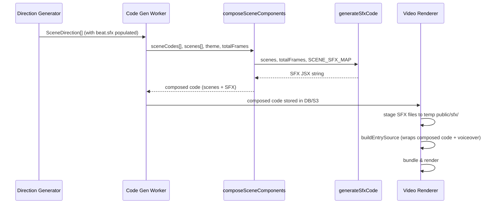

# Design Document: SFX Audio Pipeline

## Overview

This feature adds a sound effects (SFX) audio layer to the video generation pipeline. The SFX layer runs alongside the existing voiceover audio and includes three categories of sounds:

1. **Ambient beds** — looped background audio per scene, mapped deterministically by scene type via `SCENE_SFX_MAP`
2. **Transition sounds** — one-shot audio hits at scene entry, also mapped by `SCENE_SFX_MAP`
3. **Utility sounds** — short accent sounds (text-pop, slide-in, success-ding, scene-fade) placed at specific beat boundaries by the LLM direction generator

The SFX code is generated deterministically in `composeSceneComponents` so that both the browser preview (Remotion Player) and the server-side render (Remotion bundler) share the same composed output. SFX files live in two locations: committed to `apps/web/public/sfx/` for browser preview, and copied into the Remotion temp `public/sfx/` directory at render time. All `<Audio>` references use `staticFile("sfx/<filename>")` which resolves correctly in both contexts.

The direction generator's system prompt is updated to guide the LLM in populating `SceneBeat.sfx` arrays with utility sound filenames from `SFX_UTILITY_ASSETS`.

## Architecture

The SFX pipeline touches four existing components and introduces one new pure function:

```mermaid
flowchart TD
    subgraph "Direction Generation Stage"
        DG[AIDirectionGenerator] -->|populates SceneBeat.sfx| SD[SceneDirection]
    end

    subgraph "Code Generation Stage"
        CGW[CodeGenerationWorker] --> CSC[composeSceneComponents]
        CSC -->|calls| GSC[generateSfxCode ★ NEW]
        GSC -->|returns SFX Audio JSX string| CSC
        CSC -->|composed code with SFX| S3[Object Store]
    end

    subgraph "Preview Path"
        WEB[apps/web/public/sfx/] -->|staticFile resolves| CE[code-evaluator.ts]
        CE --> RPP[RemotionPreviewPlayer]
    end

    subgraph "Render Path"
        RVR[RemotionVideoRenderer] -->|stages SFX files| TMP[temp public/sfx/]
        RVR -->|calls buildEntrySource| ENTRY[Remotion Entry File]
        TMP -->|staticFile resolves| ENTRY
    end
```



**Key design decision:** SFX `<Audio>` components are generated inside `composeSceneComponents` (not in `buildEntrySource`) so the composed code string contains all SFX audio elements. This means:

- The browser preview evaluates the same composed code and gets SFX audio for free
- The server-side render wraps the same composed code in `buildEntrySource` which only adds voiceover — SFX is already in the code
- SFX audio elements are siblings to scene visuals at the top level, not nested inside scene components

**Rationale:** Generating SFX in `composeSceneComponents` keeps the SFX layer as part of the shared code path. If we generated it in `buildEntrySource` instead, the browser preview would not have SFX since `buildEntrySource` is only used for server-side rendering.

## Components and Interfaces

### 1. `generateSfxCode(scenePlan, sfxMap)` — NEW pure function

**Location:** `apps/api/src/pipeline/infrastructure/queue/workers/code-generation.worker.ts` (co-located with `composeSceneComponents`)

**Signature:**

```typescript
function generateSfxCode(
  scenes: SceneDirection[],
  totalFrames: number,
  sfxMap: Record<string, SfxProfile>,
): string;
```

**Responsibility:** Produces a JSX string containing all SFX `<Audio>` components wrapped in a single `<Sequence>`. This string is inserted into the composed Main component by `composeSceneComponents`.

**Output structure:**

```jsx
<Sequence from={0} durationInFrames={totalFrames}>
  {/* Scene 1 ambient */}
  <Sequence from={0} durationInFrames={180}>
    <Audio src={staticFile("sfx/ambience-hook.mp3")} volume={0.12} loop />
  </Sequence>
  {/* Scene 1 transition */}
  <Sequence from={0}>
    <Audio src={staticFile("sfx/whoosh-forward.mp3")} volume={0.35} />
  </Sequence>
  {/* Scene 1 beat utility sounds */}
  <Sequence from={45}>
    <Audio src={staticFile("sfx/text-pop.mp3")} volume={0.25} />
  </Sequence>
  {/* Scene 2 ambient, transition, utilities... */}
</Sequence>
```

**Properties:**

- Pure function — output depends only on inputs, no side effects
- Deterministic — same inputs always produce same output
- Skips scenes whose type is not in `sfxMap`
- Skips utility sounds whose filename is not in `ALL_SFX_FILENAMES`
- Respects volume caps: ambient ≤ 0.15, transition ≤ 0.40, utility ≤ 0.30

### 2. `composeSceneComponents` — MODIFIED

**Changes:** After composing scene components into the Main function, call `generateSfxCode` and insert the returned string as a sibling to the scene `<Sequence>` elements inside the `<AbsoluteFill>`.

**Before:**

```jsx
function Main({ scenePlan }) {
  return (
    <AbsoluteFill style={{ backgroundColor: "..." }}>
      <Sequence key={1} from={0} durationInFrames={180}>
        <Scene1 scene={scenePlan.scenes[0]} />
      </Sequence>
      ...
    </AbsoluteFill>
  );
}
```

**After:**

```jsx
function Main({ scenePlan }) {
  return (
    <AbsoluteFill style={{ backgroundColor: "..." }}>
      <Sequence key={1} from={0} durationInFrames={180}>
        <Scene1 scene={scenePlan.scenes[0]} />
      </Sequence>
      ...
      {/* SFX Audio Layer */}
      <Sequence from={0} durationInFrames={totalFrames}>
        ...SFX Audio components...
      </Sequence>
    </AbsoluteFill>
  );
}
```

The `composeSceneComponents` function signature gains a `totalFrames` parameter (or derives it from scenes).

### 3. `RemotionVideoRenderer.render()` — MODIFIED

**Changes:** Before bundling, copy all SFX files from `packages/shared/src/sfx/assets/` into `<tmpDir>/public/sfx/`. This is the SFX staging step.

**Staging logic:**

```typescript
// Create sfx subdirectory in temp public
const sfxDir = path.join(publicDir, "sfx");
fs.mkdirSync(sfxDir, { recursive: true });

// Copy all SFX files
for (const filename of ALL_SFX_FILENAMES) {
  const src = path.resolve(
    __dirname,
    "../../../../packages/shared/src/sfx/assets",
    filename,
  );
  // or use a resolved path from the shared package
  const dest = path.join(sfxDir, filename);
  fs.copyFileSync(src, dest);
}
```

**Graceful degradation:**

- If a single file copy fails, log a warning and continue
- If all copies fail, log a warning and render without SFX (voiceover still works)
- Never return `Result.fail()` for SFX-only issues

### 4. `AIDirectionGenerator` — MODIFIED

**Changes:** Update the system prompt (`buildDirectionSystemPrompt`) to include utility SFX guidance. The existing `sfx` field in the beat JSON schema already exists in the prompt — we enhance the instructions to reference `SFX_UTILITY_ASSETS` filenames specifically and provide placement guidelines.

**Updated sfx section in system prompt:**

```
### sfx field (utility sounds only):
Available utility SFX files (use ONLY these exact filenames):
- text-pop.mp3 — text or label appearing on screen
- slide-in.mp3 — element sliding or entering the frame
- success-ding.mp3 — positive reveal, completion, checkmark
- scene-fade.mp3 — scene ending, dissolve, fade out

Rules:
- Place 1-3 utility sounds per scene, only on beats with distinct visual events
- Do NOT place a utility sound on every beat
- Do NOT use ambient or transition filenames (ambience-*.mp3, whoosh-*.mp3, etc.) — those are handled automatically
- Format: ["text-pop.mp3"] or ["slide-in.mp3", "success-ding.mp3"]
```

### 5. `apps/web/public/sfx/` — NEW directory

All 18 SFX files committed to the web app's public directory so `staticFile("sfx/<filename>")` resolves in the browser preview context.

### 6. `buildEntrySource` — MODIFIED (minimal)

**Changes:** The voiceover `<Audio>` component remains as-is. No SFX-specific changes needed in `buildEntrySource` since SFX audio is already part of the composed code. The only change is ensuring `Audio` and `staticFile` are imported (they already are).

## Data Models

### Existing types (no changes needed)

**`SceneBeat.sfx`** — already defined as `sfx?: string[]` in `pipeline.types.ts`. The direction generator populates this with utility sound filenames.

**`SfxProfile`** — already defined in `sfx-library.ts`:

```typescript
interface SfxProfile {
  ambience: string;
  transition: string;
  ambienceVolume: number;
  transitionVolume: number;
}
```

**`SCENE_SFX_MAP`** — already defined as `Record<SceneType, SfxProfile>`.

**`ALL_SFX_FILENAMES`** — already exported as `string[]` containing all 18 filenames.

### Constants

**Utility sound volume cap:** `0.25` (hardcoded in `generateSfxCode`, within the 0.30 max constraint)

**SFX path prefix:** `"sfx/"` — used in all `staticFile()` calls for SFX files

### Data flow



## Correctness Properties

_A property is a characteristic or behavior that should hold true across all valid executions of a system — essentially, a formal statement about what the system should do. Properties serve as the bridge between human-readable specifications and machine-verifiable correctness guarantees._

### Property 1: Ambient bed composition correctness

_For any_ valid scene plan and any scene within it whose type exists in `SCENE_SFX_MAP`, the generated SFX code SHALL contain an `<Audio>` element for that scene's ambient bed where: the filename matches `SCENE_SFX_MAP[sceneType].ambience`, the wrapping `<Sequence>` has `from` equal to the scene's `startFrame` and `durationInFrames` equal to the scene's `durationFrames`, the `volume` matches `SCENE_SFX_MAP[sceneType].ambienceVolume`, the `loop` prop is set to `true`, and the `src` uses `staticFile("sfx/<filename>")`.

**Validates: Requirements 3.1, 3.2, 3.3, 3.4, 3.5, 2.4**

### Property 2: Transition sound composition correctness

_For any_ valid scene plan and any scene within it whose type exists in `SCENE_SFX_MAP`, the generated SFX code SHALL contain an `<Audio>` element for that scene's transition sound where: the filename matches `SCENE_SFX_MAP[sceneType].transition`, the wrapping `<Sequence>` has `from` equal to the scene's `startFrame`, the `volume` matches `SCENE_SFX_MAP[sceneType].transitionVolume`, no `loop` prop is set, and the `src` uses `staticFile("sfx/<filename>")`.

**Validates: Requirements 4.1, 4.2, 4.3, 4.4, 4.5, 2.4**

### Property 3: Utility sound composition correctness

_For any_ valid scene plan and any beat within it that contains a non-empty `sfx` array with valid filenames (present in `ALL_SFX_FILENAMES`), the generated SFX code SHALL contain an `<Audio>` element for each valid filename where: the wrapping `<Sequence>` has `from` equal to the beat's `frameRange[0]`, the `volume` is `0.25`, and the `src` uses `staticFile("sfx/<filename>")`.

**Validates: Requirements 5.1, 5.2, 5.3, 5.4, 2.4**

### Property 4: Invalid utility filenames are skipped

_For any_ scene plan where beats contain `sfx` entries with filenames NOT present in `ALL_SFX_FILENAMES`, the generated SFX code SHALL NOT contain `staticFile` references to those invalid filenames, and valid filenames in the same beat SHALL still be included.

**Validates: Requirements 5.5**

### Property 5: SFX code generation round-trip

_For any_ valid scene plan, generating SFX code via `generateSfxCode` SHALL produce a string that is parseable as valid JSX without syntax errors.

**Validates: Requirements 8.1, 8.3**

### Property 6: SFX code generation idempotence

_For any_ valid scene plan, calling `generateSfxCode` twice with the same input SHALL produce identical output strings.

**Validates: Requirements 8.2, 8.4**

### Property 7: Volume mixing caps

_For any_ valid scene plan, all volume values in the generated SFX code SHALL respect the mixing constraints: ambient volumes ≤ 0.15, transition volumes ≤ 0.40, and utility volumes ≤ 0.30.

**Validates: Requirements 9.1, 9.2, 9.3, 9.4**

### Property 8: Unknown scene type graceful skip

_For any_ scene plan containing a scene whose type is NOT present in `SCENE_SFX_MAP`, the `generateSfxCode` function SHALL produce valid output that simply omits SFX for that scene, without throwing an error.

**Validates: Requirements 10.4**

## Error Handling

### SFX File Staging (RemotionVideoRenderer)

| Failure                             | Behavior                                                                    | Severity |
| ----------------------------------- | --------------------------------------------------------------------------- | -------- |
| Single SFX file missing from assets | Log warning with filename, skip that file, continue staging remaining files | Warning  |
| All SFX files fail to copy          | Log warning, proceed with render (voiceover-only, no SFX)                   | Warning  |
| SFX subdirectory creation fails     | Log warning, proceed with render (voiceover-only)                           | Warning  |
| Voiceover download fails            | Return `Result.fail()` — this is a critical failure                         | Error    |

**Principle:** SFX failures never block rendering. Only voiceover and visual failures produce `Result.fail()`.

### SFX Code Generation (generateSfxCode)

| Failure                                    | Behavior                                      |
| ------------------------------------------ | --------------------------------------------- |
| Scene type not in `SCENE_SFX_MAP`          | Skip SFX for that scene, continue with others |
| Beat `sfx` array contains invalid filename | Skip that entry, include valid entries        |
| Beat `sfx` is undefined or empty           | No utility sounds for that beat (normal case) |
| Empty scene plan (no scenes)               | Return empty SFX wrapper `<Sequence>`         |

### Direction Generator (AIDirectionGenerator)

| Failure                                             | Behavior                                                                     |
| --------------------------------------------------- | ---------------------------------------------------------------------------- |
| LLM omits `sfx` field from beats                    | `sfx` defaults to `undefined` — no utility sounds (acceptable)               |
| LLM uses invalid filenames                          | Filtered out by `generateSfxCode` at composition time                        |
| LLM places ambient/transition filenames in beat sfx | Filtered out by `generateSfxCode` (only `SFX_UTILITY_ASSETS` filenames pass) |

## Testing Strategy

### Property-Based Tests

**Library:** [fast-check](https://github.com/dubzzz/fast-check) (already available in the Jest ecosystem)

**Configuration:** Minimum 100 iterations per property test.

**Tag format:** `Feature: sfx-audio-pipeline, Property {N}: {title}`

Each of the 8 correctness properties maps to a single property-based test. The tests exercise `generateSfxCode` as a pure function with randomly generated `SceneDirection[]` inputs:

- **Generator strategy:** Generate random scene plans with 1–8 scenes, each with a random `SceneType` from the 8 valid types (plus occasional invalid types for Property 8), random `startFrame`/`durationFrames`, and 1–4 beats per scene with random `sfx` arrays containing a mix of valid and invalid filenames.
- **Properties 1–4, 7–8** test the output string of `generateSfxCode` by parsing it and verifying structural properties.
- **Property 5** verifies the output parses as valid JSX (using sucrase or a lightweight JSX parser).
- **Property 6** calls the function twice and asserts string equality.

### Unit Tests (Example-Based)

| Test                                                                          | Validates         |
| ----------------------------------------------------------------------------- | ----------------- |
| `composeSceneComponents` includes SFX code block in output                    | Req 7.1, 7.3      |
| `buildEntrySource` voiceover Audio unchanged after SFX integration            | Req 7.2           |
| SFX staging copies all 18 files to `public/sfx/`                              | Req 1.1, 1.2, 1.4 |
| SFX staging handles missing file gracefully                                   | Req 1.3, 10.1     |
| SFX staging total failure still allows render                                 | Req 10.2, 10.3    |
| Direction generator prompt includes utility SFX filenames                     | Req 6.1, 6.4      |
| Direction generator prompt excludes ambient/transition from beat sfx guidance | Req 6.5           |
| First scene includes transition sound                                         | Req 4.5           |
| `apps/web/public/sfx/` contains all `ALL_SFX_FILENAMES` entries               | Req 2.1, 2.3      |

### Integration Tests

| Test                                                                 | Validates         |
| -------------------------------------------------------------------- | ----------------- |
| Full code generation → evaluation round-trip with SFX                | Req 8.1           |
| Direction generator produces SceneDirection with sfx field populated | Req 6.1, 6.2, 6.3 |
| Browser preview resolves `staticFile("sfx/...")` correctly           | Req 2.2           |
