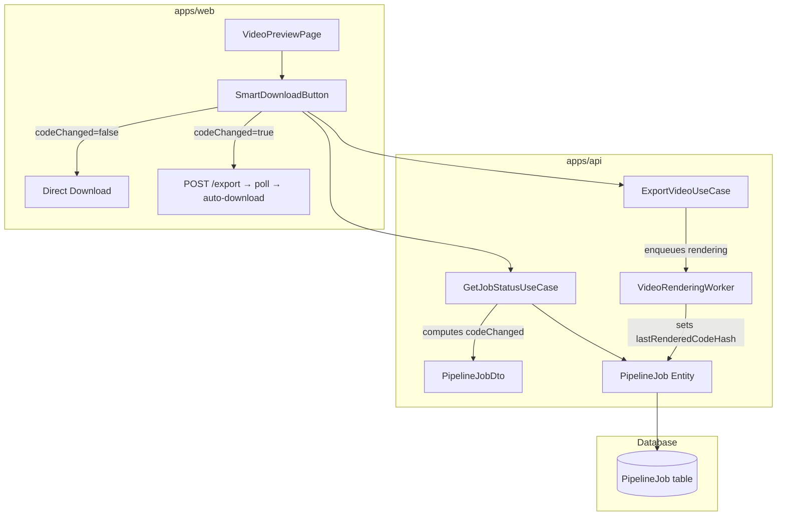

# Design Document: Smart Download

## Overview

This feature merges the separate "Re-render" and "Download" buttons on the video preview page into a single smart "Download" button. The backend persists a SHA-256 hash of the `generatedCode` at render time (`lastRenderedCodeHash`) and exposes a computed `codeChanged` boolean on the job status DTO. The frontend uses this flag to decide whether to download the existing video directly or trigger a re-render first, then auto-download once complete.

### Key Design Decisions

1. **Server-side hash comparison** — The `codeChanged` flag is computed on the backend in the `GetJobStatusUseCase`, not on the client. This keeps the frontend thin and avoids shipping hashing logic to the browser.
2. **SHA-256 hex string** — Standard, deterministic, and available via Node.js `crypto` module with no external dependencies.
3. **Hash stored at render completion** — The `VideoRenderingWorker` computes and stores the hash right after a successful render, before transitioning to "done". This guarantees the hash always reflects the code that produced the current video.
4. **Session-scoped auto-download** — A React ref tracks whether the current user session initiated the render, preventing unwanted downloads on page reload.

## Architecture

The feature touches three layers of the existing Clean Architecture:



### Data Flow

1. **Render completes** → `VideoRenderingWorker` computes `SHA-256(generatedCode)` → stores as `lastRenderedCodeHash` on the entity → saves to DB.
2. **Frontend polls** → `GET /api/pipeline/jobs/:id` → `GetJobStatusUseCase` loads entity, computes current hash of `generatedCode`, compares with `lastRenderedCodeHash` → returns `codeChanged` in DTO.
3. **User clicks Download** → if `codeChanged` is false, browser downloads `videoUrl` directly. If true, frontend calls `POST /api/pipeline/jobs/:id/export`, sets a `pendingDownloadRef`, and polls until stage becomes "done" → auto-downloads.

## Components and Interfaces

### Backend

#### 1. `computeCodeHash(code: string): string` (new utility)

A pure function in `pipeline/domain/services/` (or `pipeline/application/services/`):

```typescript
import { createHash } from "node:crypto";

export function computeCodeHash(code: string): string {
  return createHash("sha256").update(code).digest("hex");
}
```

#### 2. `PipelineJob` entity (modified)

Add a `lastRenderedCodeHash` property:

- New field in `PipelineJobProps`: `lastRenderedCodeHash: string | null`
- New getter: `get lastRenderedCodeHash(): string | null`
- New setter: `setLastRenderedCodeHash(hash: string): void`
- `create()` initializes it to `null`
- `reconstitute()` accepts it from persistence

#### 3. `VideoRenderingWorker` (modified)

After `pipelineJob.setVideoPath(videoPath)` and before `pipelineJob.transitionTo("done")`:

```typescript
const codeHash = computeCodeHash(code);
pipelineJob.setLastRenderedCodeHash(codeHash);
```

#### 4. `GetJobStatusUseCase` / `mapToDto` (modified)

Add `codeChanged` to the DTO when stage is "preview" or "done":

```typescript
if (job.stage.value === "preview" || job.stage.value === "done") {
  if (!job.generatedCode) {
    dto.codeChanged = false;
  } else if (!job.lastRenderedCodeHash) {
    dto.codeChanged = true;
  } else {
    dto.codeChanged =
      computeCodeHash(job.generatedCode) !== job.lastRenderedCodeHash;
  }
}
```

#### 5. `PipelineJobMapper` (modified)

Map `lastRenderedCodeHash` in both `toDomain` and `toPersistence`.

#### 6. `PipelineJobDto` in `@video-ai/shared` (modified)

Add optional field:

```typescript
codeChanged?: boolean;
```

### Frontend

#### 7. `SmartDownloadButton` (new component)

Replaces the current inline Download / Re-render buttons in `VideoPreviewPage`. Props:

```typescript
interface SmartDownloadButtonProps {
  job: PipelineJobDto;
  onExport: () => void;
}
```

Behavior matrix:

| Stage       | codeChanged | Label                         | Action                  |
| ----------- | ----------- | ----------------------------- | ----------------------- |
| `preview`   | —           | "Download" + render indicator | Call `onExport`         |
| `done`      | `false`     | "Download"                    | Direct browser download |
| `done`      | `true`      | "Download" + render indicator | Call `onExport`         |
| `rendering` | —           | "Rendering…" (disabled)       | None                    |

#### 8. `VideoPreviewPage` (modified)

- Remove the separate "Re-render" button when stage is "done".
- Replace the current Download/Export buttons with `<SmartDownloadButton>`.
- Add a `pendingDownloadRef` (React `useRef<boolean>`) set to `true` when the smart button triggers an export.
- When `job.stage` transitions to "done" and `pendingDownloadRef.current` is `true`, auto-download the video and reset the ref.

#### 9. `JobDetailPage` (modified)

No structural changes needed — it already passes `onExport` to `VideoPreviewPage`.

### Database

#### 10. Prisma schema migration

Add column to `PipelineJob` model:

```prisma
lastRenderedCodeHash String?
```

## Data Models

### Modified: `PipelineJob` entity

```
PipelineJobProps {
  ...existing fields...
  + lastRenderedCodeHash: string | null  // SHA-256 hex, null for new/never-rendered jobs
}
```

### Modified: `PipelineJobDto` (shared types)

```typescript
export interface PipelineJobDto {
  ...existing fields...
  codeChanged?: boolean;  // Present when stage is "preview" or "done"
}
```

### Modified: Prisma `PipelineJob` model

```
+ lastRenderedCodeHash  String?   // nullable, populated after first successful render
```

## Correctness Properties

_A property is a characteristic or behavior that should hold true across all valid executions of a system — essentially, a formal statement about what the system should do. Properties serve as the bridge between human-readable specifications and machine-verifiable correctness guarantees._

### Property 1: Mapper round-trip preserves lastRenderedCodeHash

_For any_ valid `lastRenderedCodeHash` value (including `null` and any 64-character lowercase hex string), mapping a `PipelineJob` entity to persistence via `PipelineJobMapper.toPersistence` and back to domain via `PipelineJobMapper.toDomain` SHALL produce an entity with the same `lastRenderedCodeHash` value.

**Validates: Requirements 1.4**

### Property 2: Hash output format invariant

_For any_ non-empty string input, `computeCodeHash(input)` SHALL produce a string that is exactly 64 characters long and contains only lowercase hexadecimal characters (`[0-9a-f]`).

**Validates: Requirements 2.1, 2.2**

### Property 3: Hash determinism

_For any_ string input, computing `computeCodeHash(input)` twice SHALL produce identical output.

**Validates: Requirements 2.3**

### Property 4: codeChanged computation correctness

_For any_ `generatedCode` string and _any_ `lastRenderedCodeHash` value (including `null`):

- If `generatedCode` is `null`, `codeChanged` SHALL be `false`.
- If `lastRenderedCodeHash` is `null` and `generatedCode` is not `null`, `codeChanged` SHALL be `true`.
- If `lastRenderedCodeHash` is not `null`, `codeChanged` SHALL equal `computeCodeHash(generatedCode) !== lastRenderedCodeHash`.

**Validates: Requirements 3.2, 3.3, 3.4**

## Error Handling

| Scenario                                                        | Layer                  | Handling                                                                                                      |
| --------------------------------------------------------------- | ---------------------- | ------------------------------------------------------------------------------------------------------------- |
| `generatedCode` is `null` at render time                        | `VideoRenderingWorker` | Already handled — marks job as failed with `rendering_failed` error code. No hash is computed.                |
| Hash computation fails (theoretically impossible with `crypto`) | `computeCodeHash`      | Let the error propagate — Node's `crypto.createHash` does not fail for valid string input.                    |
| `lastRenderedCodeHash` is `null` on a "done" job                | `GetJobStatusUseCase`  | Treated as `codeChanged = true`. This covers legacy jobs that were rendered before this feature was deployed. |
| Export triggered while already rendering                        | `ExportVideoUseCase`   | Already handled — stage validation rejects the transition. Frontend disables the button during rendering.     |
| Auto-download fails (network error fetching video blob)         | `SmartDownloadButton`  | Falls back to `window.open(videoUrl)` in a new tab, matching the current download behavior.                   |
| Polling detects "failed" after export                           | `VideoPreviewPage`     | Resets `pendingDownloadRef`, shows error state. No download attempted.                                        |

### Backward Compatibility

- Existing jobs without `lastRenderedCodeHash` (null) will show `codeChanged = true` when in "preview" or "done" stage with `generatedCode`. This is the safe default — it prompts a re-render rather than serving a potentially stale video.
- The `codeChanged` field is optional on the DTO, so older frontend versions that don't read it will continue to work.

## Testing Strategy

### Property-Based Tests (fast-check)

The project uses Jest + ts-jest. Property-based tests will use [fast-check](https://github.com/dubzzz/fast-check) with a minimum of 100 iterations per property.

| Property                            | Test File                         | What Varies                                                |
| ----------------------------------- | --------------------------------- | ---------------------------------------------------------- |
| Property 1: Mapper round-trip       | `pipeline-job.mapper.test.ts`     | Random hash strings (hex + null)                           |
| Property 2: Hash format             | `compute-code-hash.test.ts`       | Random strings (unicode, empty-ish, long)                  |
| Property 3: Hash determinism        | `compute-code-hash.test.ts`       | Random strings                                             |
| Property 4: codeChanged correctness | `get-job-status.use-case.test.ts` | Random code strings × random hash strings (including null) |

### Unit Tests (example-based)

| Requirement                  | Test File                         | Cases                                                                               |
| ---------------------------- | --------------------------------- | ----------------------------------------------------------------------------------- |
| 1.1 Default null hash        | `pipeline-job.test.ts`            | New entity has `lastRenderedCodeHash === null`                                      |
| 2.1 SHA-256 known values     | `compute-code-hash.test.ts`       | Known input/output pairs                                                            |
| 3.1 DTO includes codeChanged | `get-job-status.use-case.test.ts` | Stage preview → field present; stage script_generation → field absent               |
| 3.4 No generatedCode         | `get-job-status.use-case.test.ts` | `generatedCode = null` → `codeChanged = false`                                      |
| 4.1–4.5 Button states        | `smart-download-button.test.tsx`  | Each stage/codeChanged combination renders correct label, indicator, disabled state |
| 5.2 Failed render            | `video-preview-page.test.tsx`     | Export → failed → no download                                                       |
| 5.3 Session-scoped download  | `video-preview-page.test.tsx`     | Page load with done stage → no auto-download                                        |

### Integration Tests

| Requirement                   | Test File                         | Scope                                       |
| ----------------------------- | --------------------------------- | ------------------------------------------- |
| 1.2 Worker sets hash          | `video-rendering.worker.test.ts`  | Mock renderer, verify hash stored on entity |
| 5.1 Auto-download flow        | `video-preview-page.test.tsx`     | Export → poll → done → download triggered   |
| 6.1 Tweak updates codeChanged | `get-job-status.use-case.test.ts` | Modify code, re-query, verify flag          |
