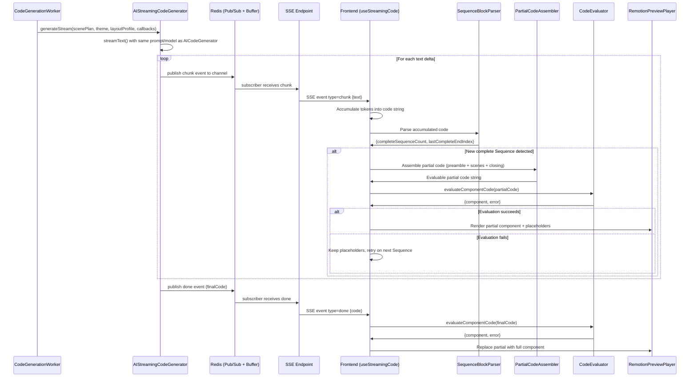
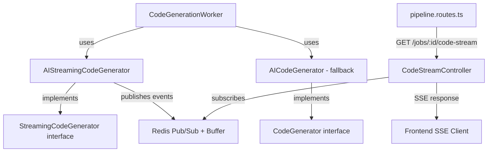

# Design Document: Streaming Code Preview

## Overview

This feature adds progressive/streaming code preview to the video generation pipeline. Currently, the `AICodeGenerator` uses `generateText()` to produce the entire Remotion component in one shot, and the frontend waits for the full code before rendering anything in the `RemotionPreviewPlayer`. With streaming code preview, a new `AIStreamingCodeGenerator` uses `streamText()` to emit code tokens incrementally. These tokens are delivered to the frontend via a new SSE endpoint. The frontend accumulates tokens, detects complete `<Sequence>` scene blocks using JSX depth tracking, assembles evaluable partial code (preamble + complete scenes + closing tags), and renders completed scenes immediately in the Remotion Player — while showing loading placeholders for scenes still being generated.

### Key Design Decisions

1. **Separate streaming implementation**: The `AIStreamingCodeGenerator` is a new class implementing a new `StreamingCodeGenerator` interface. The existing `AICodeGenerator` and `CodeGenerator` interface remain unchanged, preserving the batch fallback path.
2. **SSE event format mirrors existing script streaming**: The new `/api/pipeline/jobs/:id/code-stream` endpoint follows the same SSE patterns as the existing `/api/pipeline/jobs/:id/stream` endpoint (Redis Pub/Sub + event buffer for replay, heartbeat, cleanup on disconnect).
3. **JSX depth tracking for scene detection**: The `SequenceBlockParser` tracks `<Sequence>` open/close tags by counting JSX bracket depth. A `<Sequence>` block is complete when its closing `</Sequence>` is found and all nested JSX tags are balanced. This is a lightweight string-scanning approach — no full AST parse needed.
4. **Partial code assembly with preamble extraction**: The `PartialCodeAssembler` extracts the preamble (everything from `function Main({ scenePlan }) {` through the JSX `return (` and `<AbsoluteFill ...>` opening) and appends it before the complete `<Sequence>` blocks, then closes with `</AbsoluteFill>\n)\n}\n`. This produces a syntactically valid function the existing `CodeEvaluator` can evaluate.
5. **Graceful fallback**: If partial evaluation fails, the system continues accumulating tokens and retries on the next complete `<Sequence>`. When the `done` event arrives, the full code is evaluated normally. If that also fails, the existing error UI is shown.
6. **No AI changes**: The AI model, prompt, temperature, system prompt, and generation strategy are identical to `AICodeGenerator`. Only the Vercel AI SDK call changes from `generateText()` to `streamText()`.

## Architecture

### Streaming Code Preview Flow



### Backend Component Relationships



### Frontend Component Relationships

```mermaid
graph TD
    VPP[VideoPreviewPage] -->|uses| USC[useStreamingCode hook]
    VPP -->|uses| UPD[usePreviewData hook - fallback]
    USC -->|opens SSE| SSE[SSEClient → /code-stream]
    USC -->|parses| SBP[SequenceBlockParser]
    USC -->|assembles| PCA[PartialCodeAssembler]
    USC -->|evaluates| CE[CodeEvaluator]
    VPP -->|renders| RPP[RemotionPreviewPlayer]
    RPP -->|partial component + placeholders| Player[@remotion/player]
```

## Components and Interfaces

### Backend Changes

#### 1. StreamingCodeGenerator Interface (New)

```typescript
// apps/api/src/pipeline/application/interfaces/streaming-code-generator.ts
import type { ScenePlan, AnimationTheme, LayoutProfile } from "@video-ai/shared";
import type { Result } from "@/shared/domain/result.js";
import type { PipelineError } from "@/pipeline/domain/errors/pipeline-errors.js";

export interface StreamingCodeGenerator {
  generateStream(params: {
    scenePlan: ScenePlan;
    theme: AnimationTheme;
    layoutProfile: LayoutProfile;
    onChunk: (text: string) => void;
    onDone: (code: string) => void;
    onError: (error: PipelineError) => void;
    signal?: AbortSignal;
  }): Promise<Result<string, PipelineError>>;
}
```

#### 2. AIStreamingCodeGenerator (New)

```typescript
// apps/api/src/pipeline/infrastructure/services/ai-streaming-code-generator.ts
```

- Uses `streamText()` from `ai` SDK with `createGoogleGenerativeAI` (same provider as `AICodeGenerator`)
- Reuses the exact same `buildCodeSystemPrompt()` and `buildCodePrompt()` functions from `AICodeGenerator` (extracted to a shared module)
- Iterates `textStream` from `streamText()`, calling `onChunk(delta)` for each text delta
- On completion, validates the full text contains a `Main` function via `hasMainComponent()`
- If validation fails, retries up to `maxRetries` (same as `AICodeGenerator`), streaming each attempt
- Calls `onDone(fullCode)` on success or `onError(pipelineError)` on failure
- Respects the `signal` (AbortSignal) to abort streaming when the client disconnects

#### 3. Code Prompt Extraction (Refactor)

The `buildCodeSystemPrompt()`, `buildCodePrompt()`, `hasMainComponent()`, and `cleanCodeOutput()` functions are extracted from `ai-code-generator.ts` into a shared module:

```typescript
// apps/api/src/pipeline/infrastructure/services/code-generation-prompts.ts
export function buildCodeSystemPrompt(theme: AnimationTheme, layoutProfile: LayoutProfile): string;
export function buildCodePrompt(scenePlan: ScenePlan): string;
export function hasMainComponent(code: string): boolean;
export function cleanCodeOutput(raw: string): string;
```

Both `AICodeGenerator` and `AIStreamingCodeGenerator` import from this shared module.

#### 4. CodeStreamController (New)

```typescript
// apps/api/src/pipeline/presentation/controllers/code-stream.controller.ts
```

Follows the same pattern as the existing `StreamController`:
- Validates job ID (UUID format)
- Checks job exists and is in `code_generation` stage
- Returns 404 if job not found, 400 if wrong stage
- Sets SSE headers (`Content-Type: text/event-stream`, `Cache-Control: no-cache`, `Connection: keep-alive`)
- Subscribes to Redis Pub/Sub channel `stream:code:{jobId}`
- Replays buffered events from `stream:buffer:code:{jobId}`
- Sends heartbeat every 15s
- Cleans up on client disconnect (unsubscribe, clear interval)
- If job is already past `code_generation` (preview or later), replays the `done` event from buffer or synthesizes it from the stored `generatedCode`

#### 5. CodeGenerationWorker Updates

The worker gains a streaming path:
- Accepts an optional `StreamingCodeGenerator` dependency
- When streaming is available, calls `generateStream()` instead of `generateCode()`
- The `onChunk` callback publishes chunk events to Redis (channel + buffer)
- The `onDone` callback publishes the done event, then proceeds with layout validation and stage transition as before
- If streaming fails or is unavailable, falls back to the existing `generateCode()` batch path

#### 6. Route Registration

```typescript
// In pipeline.routes.ts — add new route
router.get("/jobs/:id/code-stream", async (req: Request, res: Response) => {
  await codeStreamController.streamCodeGeneration(req, res);
});
```

### Frontend Changes

#### 1. SequenceBlockParser (New Utility)

```typescript
// apps/web/src/features/pipeline/utils/sequence-block-parser.ts

export interface SequenceParseResult {
  /** Number of complete <Sequence>...</Sequence> blocks found */
  completeCount: number;
  /** Character index of the end of the last complete </Sequence> tag, or null */
  lastCompleteEndIndex: number | null;
}

export function parseSequenceBlocks(code: string): SequenceParseResult;
```

Implementation:
- Scans the code string character by character
- Tracks JSX depth: increments on `<Sequence` (not self-closing), decrements on `</Sequence>`
- Also tracks nested JSX tags within each `<Sequence>` block to ensure they're balanced
- A `<Sequence>` block is complete when depth returns to 0 after the closing `</Sequence>` tag
- Returns the count and the character index after the last complete `</Sequence>` closing `>`
- Handles self-closing tags (`<Component />`) without affecting depth
- Handles JSX expressions (`{...}`) containing `<` and `>` operators by tracking curly brace depth

#### 2. PartialCodeAssembler (New Utility)

```typescript
// apps/web/src/features/pipeline/utils/partial-code-assembler.ts

export function assemblePartialCode(
  accumulatedCode: string,
  lastCompleteEndIndex: number,
): string | null;
```

Implementation:
- Finds the `function Main(` declaration in the accumulated code
- Extracts the preamble: everything from `function Main({ scenePlan }) {` through the opening `<AbsoluteFill` tag's closing `>`
- Takes the code from after the `<AbsoluteFill...>` opening through `lastCompleteEndIndex`
- Appends closing tags: `\n</AbsoluteFill>\n)\n}\n`
- Returns the assembled string, or `null` if the preamble pattern isn't found yet

#### 3. useStreamingCode Hook (New)

```typescript
// apps/web/src/features/pipeline/hooks/use-streaming-code.ts

export type CodeStreamStatus = "connecting" | "streaming" | "complete" | "error";

export interface UseStreamingCodeResult {
  /** The evaluated React component (partial or full), or null */
  component: React.ComponentType<{ scenePlan: ScenePlan }> | null;
  /** Number of complete scenes evaluated so far */
  completedSceneCount: number;
  /** Stream lifecycle status */
  status: CodeStreamStatus;
  /** Error message if status is "error" */
  error: string | null;
  /** The final complete code string (available when status is "complete") */
  finalCode: string | null;
}

export function useStreamingCode(params: {
  jobId: string;
  apiBaseUrl: string;
  enabled: boolean;
}): UseStreamingCodeResult;
```

Implementation:
- Opens an SSE connection to `/api/pipeline/jobs/:id/code-stream` using the existing `SSEClient`
- On each `chunk` event: appends text to accumulated code, runs `parseSequenceBlocks()`, and if a new complete `<Sequence>` is detected, runs `assemblePartialCode()` then `evaluateComponentCode()`
- On `done` event: evaluates the full final code via `evaluateComponentCode()`
- On `error` event or connection failure: sets status to `error`
- Closes SSE connection on unmount
- Debounces partial evaluation to avoid evaluating on every single token (evaluates only when `completeCount` changes)

#### 4. ScenePlaceholder Component (New)

```typescript
// apps/web/src/features/pipeline/components/scene-placeholder.tsx

interface ScenePlaceholderProps {
  sceneIndex: number;
  totalScenes: number;
}
```

- Renders within a `<Sequence>` at the correct frame range for the pending scene
- Shows a subtle loading animation (pulsing shimmer) with the scene number
- Uses the design system colors from the ScenePlan for visual consistency

#### 5. StreamingPreviewPlayer Component (New)

```typescript
// apps/web/src/features/pipeline/components/streaming-preview-player.tsx

interface StreamingPreviewPlayerProps {
  component: React.ComponentType<{ scenePlan: ScenePlan }> | null;
  scenePlan: ScenePlan;
  completedSceneCount: number;
  fps: number;
  totalFrames: number;
  compositionWidth: number;
  compositionHeight: number;
}
```

- Wraps the existing `RemotionPreviewPlayer` pattern
- When `component` is non-null, creates a wrapper component that renders the partial component for completed scenes and `ScenePlaceholder` components for remaining scenes
- The wrapper uses `<Sequence>` tags with the correct `from` and `durationInFrames` for each placeholder, sourced from the ScenePlan's scene `startFrame` and `durationFrames`
- When `component` is null (no scenes complete yet), renders all placeholders
- Audio is not included during streaming (added only when the full component is ready)

#### 6. VideoPreviewPage Updates

The `VideoPreviewPage` component is updated to:
- Detect when the job is in `code_generation` stage and activate the streaming code hook
- Use `useStreamingCode` to get the progressive component and scene count
- Render `StreamingPreviewPlayer` during streaming, showing completed scenes + placeholders
- When streaming completes (`status === "complete"`), transition to the existing `RemotionPreviewPlayer` with the full component and audio
- If SSE connection fails, fall back to the existing `usePreviewData` flow (wait for `preview` stage, fetch full code)
- Display a streaming progress indicator showing "Generating code... X of Y scenes complete"

#### 7. SSE Event Schema (Shared)

```typescript
// packages/shared/src/schemas/code-stream-event.schema.ts
import { z } from "zod";

export const codeStreamEventSchema = z.discriminatedUnion("type", [
  z.object({
    type: z.literal("chunk"),
    seq: z.number(),
    data: z.object({ text: z.string() }),
  }),
  z.object({
    type: z.literal("done"),
    seq: z.number(),
    data: z.object({ code: z.string() }),
  }),
  z.object({
    type: z.literal("error"),
    seq: z.number(),
    data: z.object({ message: z.string() }),
  }),
]);

export type CodeStreamEvent = z.infer<typeof codeStreamEventSchema>;
```

## Data Models

### SSE Event Types

| Event Type | Payload | Description |
|-----------|---------|-------------|
| `chunk` | `{ text: string }` | A text delta from `streamText()` |
| `done` | `{ code: string }` | The complete final code string |
| `error` | `{ message: string }` | Error description; connection closes after |

### SequenceParseResult

| Field | Type | Description |
|-------|------|-------------|
| `completeCount` | `number` | Number of complete `<Sequence>...</Sequence>` blocks |
| `lastCompleteEndIndex` | `number \| null` | Character index after the last complete `</Sequence>` tag |

### CodeStreamStatus

| Value | Description |
|-------|-------------|
| `connecting` | SSE connection is being established |
| `streaming` | Tokens are being received and accumulated |
| `complete` | `done` event received, full code available |
| `error` | Stream failed or connection dropped |

### No Database Schema Changes

This feature does not require any database or Prisma schema changes. The streaming happens in-flight during the existing `code_generation` stage. The `CodeGenerationWorker` still saves the final `generatedCode` to the database and transitions to `preview` exactly as before. The SSE events are transient (Redis Pub/Sub + ephemeral buffer).


## Correctness Properties

*A property is a characteristic or behavior that should hold true across all valid executions of a system — essentially, a formal statement about what the system should do. Properties serve as the bridge between human-readable specifications and machine-verifiable correctness guarantees.*

### Property 1: Token accumulation is concatenation

*For any* sequence of string deltas `[d1, d2, ..., dN]`, appending each delta in order to an initially empty accumulator SHALL produce a string equal to `d1 + d2 + ... + dN`.

**Validates: Requirements 2.2**

### Property 2: Sequence block parser correctly counts complete balanced blocks

*For any* string containing a mix of complete and incomplete `<Sequence>...</Sequence>` blocks (with arbitrarily nested JSX tags inside), the parser SHALL return a `completeCount` equal to the number of `<Sequence>` blocks whose closing `</Sequence>` tag is present and whose nested JSX tags are all balanced.

**Validates: Requirements 3.1, 3.2, 3.3**

### Property 3: Sequence block parser end index points to last complete block boundary

*For any* string containing at least one complete `<Sequence>...</Sequence>` block, the parser's `lastCompleteEndIndex` SHALL equal the character index immediately after the `>` of the last complete `</Sequence>` tag. For strings with zero complete blocks, `lastCompleteEndIndex` SHALL be `null`.

**Validates: Requirements 3.4, 3.5**

### Property 4: Partial code assembly round-trip produces evaluable component

*For any* valid Remotion component code string containing a `function Main({ scenePlan })` declaration with N ≥ 1 complete `<Sequence>` blocks, assembling partial code (via `assemblePartialCode`) and evaluating it (via `evaluateComponentCode`) SHALL produce a non-null React component and a null error.

**Validates: Requirements 4.1, 4.2, 4.3, 4.4, 5.1**

### Property 5: Placeholder frame ranges match ScenePlan scene timing

*For any* ScenePlan with N scenes where each scene has a `startFrame` and `durationFrames`, and given K < N completed scenes, the streaming preview player SHALL render exactly N - K placeholders, each with `from` equal to the scene's `startFrame` and `durationInFrames` equal to the scene's `durationFrames`.

**Validates: Requirements 5.3, 5.4**

## Error Handling

### Backend Errors

| Scenario | Handling |
|----------|----------|
| Code stream endpoint called for non-existent job | Return HTTP 404 with `{ error: "NOT_FOUND", message: "Job not found" }` |
| Code stream endpoint called for job not in `code_generation` stage | Return HTTP 400 with `{ error: "INVALID_STAGE", message: "Job is not in code_generation stage" }`. If job is past `code_generation` (preview or later), replay the `done` event from buffer or synthesize from stored `generatedCode`. |
| AI model error during `streamText()` | Emit SSE `error` event with descriptive message, close connection. The worker falls back to batch `generateCode()` if streaming fails entirely. |
| Client disconnects during streaming | Abort the `streamText()` call via AbortSignal. Clean up Redis subscription and heartbeat interval. |
| Redis Pub/Sub connection failure | The SSE endpoint returns 500. The frontend falls back to polling for `preview` stage and using the existing preview endpoint. |
| Generated code missing `Main` function after streaming | Retry up to `maxRetries` times (streaming each attempt). If all retries fail, emit SSE `error` event and mark job as failed. |

### Frontend Errors

| Scenario | Handling |
|----------|----------|
| SSE connection fails to establish | Set status to `error`. Fall back to `usePreviewData` (wait for `preview` stage, fetch full code). |
| SSE connection drops mid-stream | Set status to `error`. Fall back to `usePreviewData`. |
| Partial code evaluation fails (syntax error) | Discard the failed partial result. Continue showing all placeholders. Retry evaluation when the next `<Sequence>` block completes. |
| Partial code evaluation fails (missing Main) | Same as syntax error — discard and retry on next block. The preamble may not be complete yet. |
| Full code evaluation fails (done event) | Show error state with descriptive message and retry button. This is the same error handling as the existing `usePreviewData` flow. |
| ScenePlan not yet available during streaming | Show all placeholders with generic loading state. ScenePlan is fetched separately from the preview endpoint once the job reaches `preview` stage. During `code_generation`, use the scene count from the job's `generatedScenes` if available, otherwise show a single full-frame placeholder. |

## Testing Strategy

### Property-Based Tests (fast-check)

Property-based testing applies to this feature for the `SequenceBlockParser` (pure string parsing function), `PartialCodeAssembler` (pure string transformation), and the token accumulation logic (pure concatenation). These are pure functions with clear input/output behavior where input variation reveals edge cases.

- Library: `fast-check` (already available in the project's test setup with Jest)
- Minimum 100 iterations per property test
- Each test tagged with: `Feature: streaming-code-preview, Property {N}: {title}`

Property tests to implement:

1. **Property 1 — Token accumulation**: Generate random arrays of string deltas (varying lengths, including empty strings, unicode, special characters). Accumulate them sequentially. Verify the result equals the concatenation.

2. **Property 2 — Sequence block parser count**: Generate random JSX-like strings with a known number of complete `<Sequence>...</Sequence>` blocks (with random nested JSX inside) and optionally an incomplete trailing block. Verify `completeCount` matches the known count.

3. **Property 3 — Sequence block parser end index**: Generate strings with N complete `<Sequence>` blocks. Verify `lastCompleteEndIndex` equals the position after the last `</Sequence>` closing `>`. Generate strings with zero complete blocks and verify `null`.

4. **Property 4 — Partial code assembly round-trip**: Generate valid Remotion component code templates with varying numbers of `<Sequence>` blocks (1-10), varying preamble content (helper functions, constants), and varying scene content. Run `assemblePartialCode()` then `evaluateComponentCode()`. Verify a non-null component is returned.

5. **Property 5 — Placeholder frame ranges**: Generate random ScenePlans with 2-10 scenes, each with random `startFrame` and `durationFrames`. For each K from 0 to N-1, verify the streaming preview logic produces N-K placeholders with correct frame ranges.

### Unit Tests (Jest)

**Backend:**
- `AIStreamingCodeGenerator`: Mock `streamText()`, verify `onChunk` called for each delta, `onDone` called with full code, retry logic on missing Main
- `CodeStreamController`: Mock Redis buffer/subscriber, test SSE header setup, event replay, heartbeat, cleanup on disconnect, 404/400 responses
- `code-generation-prompts.ts`: Verify extracted functions produce same output as before (regression)
- `CodeGenerationWorker` streaming path: Mock streaming generator, verify Redis publish calls, fallback to batch on streaming failure

**Frontend:**
- `useStreamingCode` hook: Mock SSEClient, test status transitions (connecting → streaming → complete), error handling, cleanup on unmount
- `SequenceBlockParser`: Edge cases — empty string, no Sequence tags, self-closing tags, nested components, unbalanced tags, JSX expressions with `<`/`>` operators
- `PartialCodeAssembler`: Edge cases — code without Main function (returns null), code with Main but no complete Sequences (returns null), code with preamble containing various helper patterns
- `ScenePlaceholder`: Verify renders with correct scene number and loading animation
- `StreamingPreviewPlayer`: Verify renders partial component + correct number of placeholders
- `VideoPreviewPage` streaming integration: Verify streaming mode activates during `code_generation`, transitions to full preview on completion, falls back on SSE failure

### Integration Tests

- Full streaming flow: Start code generation → receive chunk events → receive done event → verify final code matches
- Code stream endpoint: Verify SSE headers, event format matches existing script streaming pattern
- Fallback path: SSE connection failure → verify frontend falls back to polling + preview endpoint
- Buffer replay: Connect after streaming started → verify buffered events are replayed
- Late connection: Connect after streaming completed → verify done event is replayed from buffer or synthesized from DB
