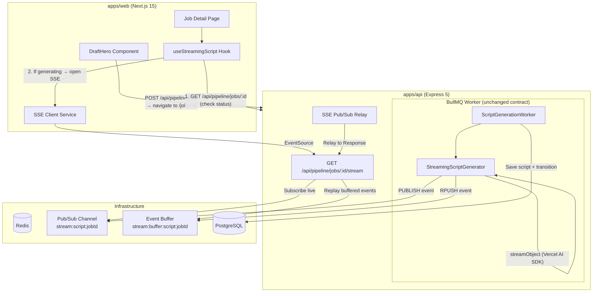
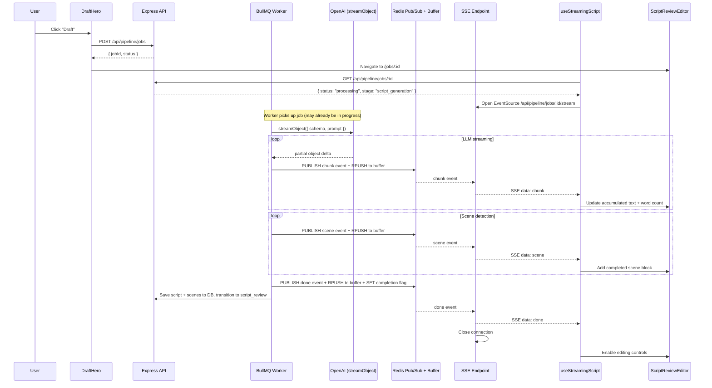
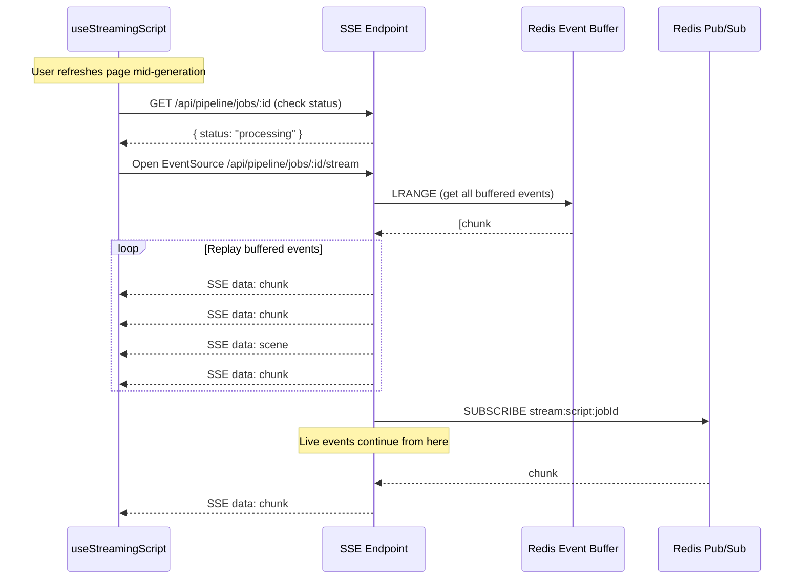

# Design Document: Streaming Script Generation

## Overview

This feature replaces the batch "generate then show" script flow with a real-time streaming experience. The core insight is that the BullMQ worker pipeline remains untouched as the backend's source of truth — SSE is purely a "window" into what's happening. The architecture introduces three new layers:

1. A **Streaming Script Generator** (`streamObject` from Vercel AI SDK) that replaces `generateObject` inside the existing BullMQ worker, emitting incremental `Script_Stream_Events` to Redis Pub/Sub and a Redis list buffer as the LLM produces structured output.
2. A **shared SSE relay infrastructure** on the backend (`apps/api/src/shared/`) that subscribes to Redis Pub/Sub channels and streams events to connected clients, with reconnection catch-up via the Redis list buffer.
3. A **shared SSE client + hook pattern** on the frontend (`apps/web/src/shared/`) that consumes the event stream and exposes accumulated state to React components.

The design is intentionally generic: the SSE endpoint, client, and buffer logic are parameterized by event schema so that future pipeline stages (direction generation, code generation) can adopt the same pattern by defining their own event types.

### Key Design Decisions

1. **`streamObject` with `fullStream`**: The Vercel AI SDK's `streamObject` returns a `fullStream` async iterable that yields partial objects, text deltas, and finish events. We consume `partialObjectStream` to detect when new scene array elements become complete, emitting `scene` events. Text deltas from the `script` field become `chunk` events.
2. **Redis Pub/Sub + Redis List dual-write**: Every event is both `PUBLISH`ed (for live SSE clients) and `RPUSH`ed to a Redis list (for reconnection catch-up). The list has a configurable TTL (default 1 hour). This avoids the complexity of Redis Streams while meeting the requirements.
3. **Sequence numbers for dedup**: Each event gets a monotonically increasing sequence number. When the SSE endpoint replays buffered events then subscribes to Pub/Sub, the client uses sequence numbers to discard duplicates during the transition window.
4. **Worker independence**: The worker publishes events regardless of whether any SSE clients are listening. If no one is subscribed, events are simply not consumed from Pub/Sub — the Redis list buffer and final DB persistence still happen.
5. **DB as ultimate fallback**: If the buffer TTL has expired and the job is already complete, the SSE endpoint synthesizes a `done` event from the database record. The frontend hook checks job status first and skips SSE entirely if the job is already in `script_review` or later.
6. **No changes to the existing `ScriptGenerator` interface**: The new `StreamingScriptGenerator` implements a new `StreamingScriptGenerator` interface. The existing `ScriptGenerationWorker` is updated to use the streaming variant, but the worker's contract (process a BullMQ job, persist to DB, transition status) remains identical.

## Architecture

### System Architecture Diagram



### Event Flow Sequence



### Reconnection Flow



## Components and Interfaces

### Shared Backend: SSE Infrastructure (`apps/api/src/shared/`)

```typescript
// shared/infrastructure/streaming/stream-event-publisher.ts
interface StreamEventPublisher {
  publish(channel: string, event: { seq: number; [key: string]: unknown }): Promise<void>;
  buffer(bufferKey: string, event: { seq: number; [key: string]: unknown }): Promise<void>;
  markComplete(bufferKey: string, ttlSeconds: number): Promise<void>;
}

// shared/infrastructure/streaming/stream-event-subscriber.ts
interface StreamEventSubscriber {
  subscribe(channel: string, onMessage: (event: string) => void): Promise<void>;
  unsubscribe(channel: string): Promise<void>;
}

// shared/infrastructure/streaming/stream-event-buffer.ts
interface StreamEventBuffer {
  getAll(bufferKey: string): Promise<string[]>;
  isComplete(bufferKey: string): Promise<boolean>;
}

// shared/infrastructure/streaming/sse-response-helper.ts
// Utility to set SSE headers, write events, send heartbeats, handle cleanup
interface SSEResponseHelper {
  initSSE(res: Response): void;
  sendEvent(res: Response, event: { type: string; data: unknown; id?: string }): void;
  sendHeartbeat(res: Response): void;
}
```

### Pipeline: Streaming Script Generator

```typescript
// pipeline/application/interfaces/streaming-script-generator.ts
interface StreamingScriptGenerator {
  generateStream(params: {
    topic: string;
    format: VideoFormat;
    onChunk: (text: string) => void;
    onScene: (scene: SceneBoundary) => void;
    onDone: (result: ScriptGenerationResult) => void;
    onError: (error: PipelineError) => void;
  }): Promise<Result<ScriptGenerationResult, PipelineError>>;
}
```

### Pipeline: Stream Event Types (Shared Package)

```typescript
// @video-ai/shared — script-stream-event.schema.ts
import { z } from "zod";

const chunkEventSchema = z.object({
  type: z.literal("chunk"),
  seq: z.number().int().nonnegative(),
  data: z.object({ text: z.string() }),
});

const sceneEventSchema = z.object({
  type: z.literal("scene"),
  seq: z.number().int().nonnegative(),
  data: z.object({
    id: z.number(),
    name: z.string(),
    type: z.enum(["Hook", "Analogy", "Bridge", "Architecture", "Spotlight", "Comparison", "Power", "CTA"]),
    text: z.string(),
  }),
});

const doneEventSchema = z.object({
  type: z.literal("done"),
  seq: z.number().int().nonnegative(),
  data: z.object({
    script: z.string(),
    scenes: z.array(sceneBoundarySchema),
  }),
});

const errorEventSchema = z.object({
  type: z.literal("error"),
  seq: z.number().int().nonnegative(),
  data: z.object({
    code: z.string(),
    message: z.string(),
  }),
});

const scriptStreamEventSchema = z.discriminatedUnion("type", [
  chunkEventSchema,
  sceneEventSchema,
  doneEventSchema,
  errorEventSchema,
]);

type ScriptStreamEvent = z.infer<typeof scriptStreamEventSchema>;
```

### Shared Frontend: SSE Client (`apps/web/src/shared/`)

```typescript
// shared/services/sse-client.ts
interface SSEClientConfig<T> {
  url: string;
  parseEvent: (data: string) => T;
  maxRetries?: number;       // default 3
  retryDelayMs?: number;     // base delay, default 1000 (exponential backoff)
}

interface SSEClient<T> {
  connect(): AsyncIterable<T>;
  close(): void;
}
```

### Pipeline Frontend: useStreamingScript Hook

```typescript
// features/pipeline/hooks/use-streaming-script.ts
type StreamingStatus = "loading" | "streaming" | "complete" | "error";

interface UseStreamingScriptResult {
  script: string;
  scenes: SceneBoundary[];
  status: StreamingStatus;
  error: string | null;
}

function useStreamingScript(params: {
  jobId: string;
  repository: PipelineRepository;
  apiBaseUrl: string;
}): UseStreamingScriptResult;
```

### Updated REST API Endpoints

| Method | Path | Description | Response |
|--------|------|-------------|----------|
| `GET` | `/api/pipeline/jobs/:id/stream` | SSE stream relay for script generation events | `text/event-stream` |

All existing endpoints remain unchanged.

### SSE Endpoint Behavior Matrix

| Job Status | Buffer Exists? | Buffer Complete? | Behavior |
|---|---|---|---|
| `processing` (script_generation) | Yes | No | Replay buffer → subscribe Pub/Sub for live events |
| `processing` (script_generation) | No | — | Subscribe Pub/Sub only (worker just started) |
| `script_review` or later | Yes | Yes | Replay `done` event from buffer → close |
| `script_review` or later | No (expired) | — | Fetch from DB → synthesize `done` event → close |
| `failed` | — | — | Return `error` event → close |

### Frontend Component Changes

The `ScriptReviewEditor` component itself requires no interface changes — it already accepts `script`, `scenes`, and `isLoading` props. The integration happens in the **Job Detail Page** (`/jobs/[id]/page.tsx`), which will:

1. Use `useStreamingScript` instead of `usePipelineJob` when the job is in `script_generation` stage.
2. Pass accumulated `script` and `scenes` from the hook to `ScriptReviewEditor`.
3. Disable action buttons while `status === "streaming"`.
4. Show a typing indicator on the last in-progress scene.
5. Fall back to the existing DB-loaded flow when the job is already complete.

## Data Models

### Redis Keys

| Key Pattern | Type | TTL | Description |
|---|---|---|---|
| `stream:script:<jobId>` | Pub/Sub channel | N/A (ephemeral) | Live event broadcast channel |
| `stream:buffer:script:<jobId>` | List | 1 hour (configurable) | Ordered event buffer for reconnection |
| `stream:complete:script:<jobId>` | String (`"1"`) | 1 hour (configurable) | Completion flag for the buffer |

### Script Stream Event Schema

Defined in `@video-ai/shared` as Zod schemas (see Components section above). The discriminated union covers four event types:

- `chunk` — incremental text delta from the LLM (`{ type: "chunk", seq: number, data: { text: string } }`)
- `scene` — a fully parsed scene block (`{ type: "scene", seq: number, data: SceneBoundary }`)
- `done` — final validated result (`{ type: "done", seq: number, data: { script: string, scenes: SceneBoundary[] } }`)
- `error` — failure details (`{ type: "error", seq: number, data: { code: string, message: string } }`)

### SSE Wire Format

Events are sent as standard SSE with `event:` and `data:` fields:

```
event: chunk
id: 1
data: {"type":"chunk","seq":1,"data":{"text":"The quantum world "}}

event: chunk
id: 2
data: {"type":"chunk","seq":2,"data":{"text":"is a strange place "}}

event: scene
id: 3
data: {"type":"scene","seq":3,"data":{"id":1,"name":"The Hook","type":"Hook","text":"The quantum world is a strange place..."}}

event: done
id: 15
data: {"type":"done","seq":15,"data":{"script":"...","scenes":[...]}}
```

### No Database Schema Changes

The existing `PipelineJob` Prisma model already stores `generatedScript`, `generatedScenes`, `status`, and `stage`. The streaming feature adds no new database columns — it only adds transient Redis keys that expire after 1 hour.


## Correctness Properties

*A property is a characteristic or behavior that should hold true across all valid executions of a system — essentially, a formal statement about what the system should do. Properties serve as the bridge between human-readable specifications and machine-verifiable correctness guarantees.*

### Property 1: Script stream event serialization round-trip

*For any* valid `ScriptStreamEvent` (chunk, scene, done, or error variant), serializing the event to a JSON string via `JSON.stringify` and then parsing it back with the `scriptStreamEventSchema` Zod schema SHALL produce an object deeply equal to the original event.

**Validates: Requirements 7.2, 7.3, 7.4, 7.5, 7.6**

### Property 2: Event buffer ordering and completeness

*For any* sequence of `ScriptStreamEvents` emitted by the `StreamEventPublisher`, the Redis event buffer SHALL contain every emitted event in the exact order of emission, with no events missing and no events reordered.

**Validates: Requirements 3.1, 8.3**

### Property 3: Scene detection from partial object stream

*For any* valid structured script response containing N scene blocks, the scene detection logic SHALL emit exactly N `scene` events, each containing a complete `SceneBoundary` structure matching the corresponding scene block from the LLM output, in the order they appear in the response.

**Validates: Requirements 3.2**

### Property 4: Chunk text accumulation

*For any* sequence of `chunk` events with text deltas, concatenating all `data.text` values in order of their sequence numbers SHALL produce a string equal to the complete script text from the final `done` event.

**Validates: Requirements 5.4**

### Property 5: Sequence number monotonicity

*For any* stream of `ScriptStreamEvents` emitted for a single job, the `seq` field SHALL be strictly monotonically increasing (each event's `seq` is exactly one greater than the previous event's `seq`), starting from 1.

**Validates: Requirements 9.2**

### Property 6: SSE client event parsing

*For any* valid SSE-framed message containing a JSON-serialized `ScriptStreamEvent`, the `SSEClient` parser SHALL produce a typed event object that is deeply equal to the original event before SSE framing.

**Validates: Requirements 4.2**

## Error Handling

### Backend Errors

| Error Scenario | Behavior | Event Emitted |
|---|---|---|
| LLM call fails or times out | Worker emits error event to Pub/Sub + buffer, marks job as failed in DB | `{ type: "error", data: { code: "script_generation_failed", message: "..." } }` |
| Redis Pub/Sub publish fails | Worker logs warning but continues generation; buffer write is attempted independently | None (degraded — clients won't get live events but buffer may still work) |
| Redis buffer write fails | Worker logs warning but continues; Pub/Sub publish is attempted independently | Live events still flow via Pub/Sub |
| Job not found on SSE connect | SSE endpoint returns 404 JSON response (not SSE) | N/A — standard HTTP error |
| Invalid job ID format | SSE endpoint returns 400 JSON response | N/A — standard HTTP error |
| Worker crashes mid-generation | BullMQ retry mechanism kicks in (configured attempts); if all retries exhausted, job marked failed | Error event on final failure |

### Frontend Errors

| Error Scenario | Behavior |
|---|---|
| SSE connection drops | SSE client retries up to 3 times with exponential backoff (1s, 2s, 4s) |
| All SSE retries exhausted | Hook sets `status: "error"`, page shows error message with "Retry" button |
| Initial job status fetch fails | Hook sets `status: "error"`, page shows error message |
| Malformed SSE event received | SSE client logs warning, skips the event, continues listening |
| Component unmounts during streaming | Hook calls `SSEClient.close()`, connection is cleaned up |

### Graceful Degradation

The system degrades gracefully because the DB is the ultimate source of truth:
- If SSE never connects → user can refresh, hook checks job status, loads from DB if complete
- If Redis Pub/Sub is down → worker still completes and saves to DB; user refreshes to see result
- If buffer expires before reconnect → SSE endpoint falls back to DB for completed jobs
- If worker fails → BullMQ retries; if all retries fail, job is marked failed in DB

## Testing Strategy

### Unit Tests

Unit tests cover specific examples, edge cases, and error conditions:

- **SSE Response Helper**: Verify correct headers (`Content-Type`, `Cache-Control`, `Connection`), event formatting, heartbeat comments
- **Stream Event Publisher**: Verify dual-write to Pub/Sub and buffer, completion flag setting, TTL configuration
- **Stream Event Buffer**: Verify `getAll` returns events in order, `isComplete` checks flag correctly
- **SSE Endpoint Handler**: Test each cell in the behavior matrix (processing/complete × buffer exists/expired)
- **Streaming Script Generator**: Test scene detection logic, error event emission on LLM failure, done event with validated output
- **SSE Client**: Test connection lifecycle, retry logic with exponential backoff, cleanup on dispose
- **useStreamingScript Hook**: Test status transitions (loading → streaming → complete), error path, unmount cleanup, fallback to DB for completed jobs
- **Script Review Page Integration**: Test button disable/enable based on streaming status, typing indicator, error + retry UI

### Property-Based Tests

Property-based tests verify universal properties across all inputs using [fast-check](https://github.com/dubzzz/fast-check) (the standard PBT library for TypeScript/Jest):

- Each property test runs a minimum of **100 iterations**
- Each test is tagged with a comment referencing the design property:
  - `Feature: streaming-script-generation, Property 1: Script stream event serialization round-trip`
  - `Feature: streaming-script-generation, Property 2: Event buffer ordering and completeness`
  - `Feature: streaming-script-generation, Property 3: Scene detection from partial object stream`
  - `Feature: streaming-script-generation, Property 4: Chunk text accumulation`
  - `Feature: streaming-script-generation, Property 5: Sequence number monotonicity`
  - `Feature: streaming-script-generation, Property 6: SSE client event parsing`

### Integration Tests

Integration tests verify the end-to-end flow with real Redis (via Docker Compose):

- **Pub/Sub relay**: Publish events on one Redis client, verify SSE endpoint relays them to a connected HTTP client
- **Reconnection catch-up**: Populate buffer, connect mid-stream, verify buffered events are replayed before live events
- **Worker independence**: Run worker with no SSE clients, verify job completes and DB is updated
- **DB fallback**: Connect to SSE endpoint for a completed job with expired buffer, verify done event is synthesized from DB
