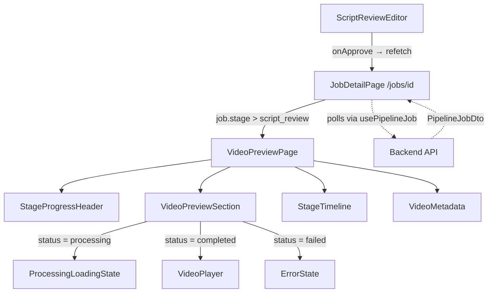
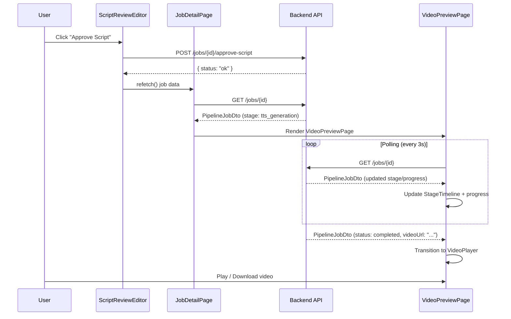
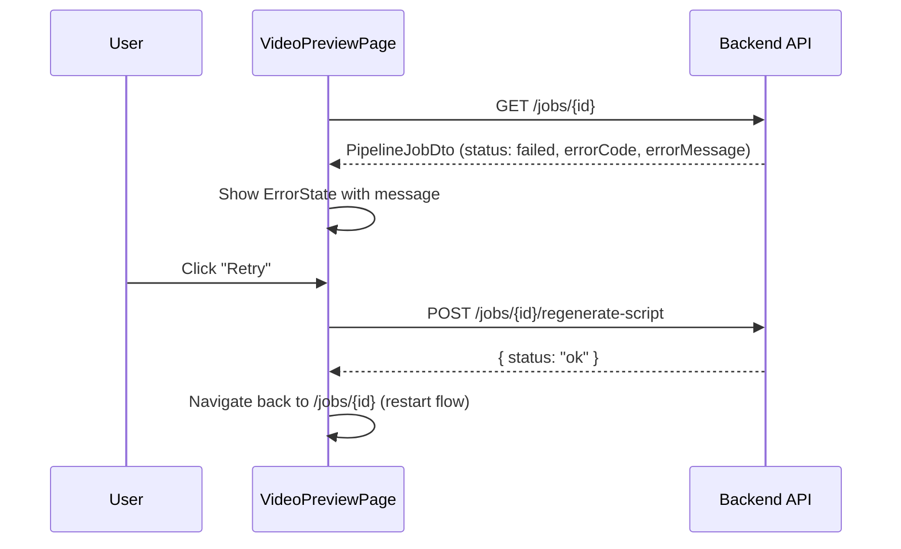

# Design Document: Video Preview Page

## Overview

After a user approves their script in the Script Review Editor, the pipeline begins generating a video through multiple backend stages (TTS, transcription, timestamp mapping, direction generation, code generation, rendering). Currently, the user is left on the same job detail page watching a generic `JobStatusTracker` progress bar. This feature introduces a dedicated Video Preview Page that the user is redirected to immediately after script approval. The page presents a rich, purpose-built experience: a loading/processing state with stage-aware progress while the video is being generated, transitioning seamlessly into a full video preview player once the video is ready.

The page lives at the existing `/jobs/[id]` route but replaces the current post-approval UI with a new `VideoPreviewPage` component that is rendered once the job moves past the `script_review` stage.

## Architecture



## Sequence Diagrams

### Main Flow: Script Approval → Video Preview



### Error Recovery Flow



## Components and Interfaces

### Component 1: VideoPreviewPage

**Purpose**: Top-level container rendered by `JobDetailPage` when the job has moved past `script_review`. Orchestrates the layout of all sub-components.

```typescript
interface VideoPreviewPageProps {
  job: PipelineJobDto;
  onRetry: () => void;
}
```

**Responsibilities**:
- Determine current visual state (processing, completed, failed) from `job.status` and `job.stage`
- Compose the sub-components into a cohesive layout
- Pass relevant slices of job data to each child

### Component 2: StageProgressHeader

**Purpose**: Displays the current pipeline stage as a prominent heading with an animated progress indicator.

```typescript
interface StageProgressHeaderProps {
  stage: PipelineStage;
  status: PipelineStatus;
  progressPercent: number;
}
```

**Responsibilities**:
- Map each `PipelineStage` to a user-friendly label and description (e.g., "Generating voiceover…", "Rendering your video…")
- Show an animated progress bar or spinner
- Indicate completion with a success state

### Component 3: VideoPreviewSection

**Purpose**: The central area that either shows a loading skeleton, the video player, or an error state.

```typescript
interface VideoPreviewSectionProps {
  status: PipelineStatus;
  videoUrl?: string;
  format: VideoFormat;
  errorMessage?: string;
  onRetry: () => void;
}
```

**Responsibilities**:
- Render a skeleton/shimmer placeholder in the correct aspect ratio (9:16 or 16:9) while processing
- Render an HTML5 `<video>` player with controls when `videoUrl` is available
- Render an error card with retry action when `status === "failed"`

### Component 4: StageTimeline

**Purpose**: A vertical or horizontal timeline showing all pipeline stages with their completion status — a more visual replacement for the current pill-based `JobStatusTracker`.

```typescript
interface StageTimelineProps {
  stage: PipelineStage;
  status: PipelineStatus;
}
```

**Responsibilities**:
- Render each stage as a node in a timeline
- Visually distinguish completed, active, pending, and failed stages
- Animate transitions between stages

### Component 5: VideoMetadata

**Purpose**: Displays metadata about the video (topic, format, theme, duration) below or beside the player.

```typescript
interface VideoMetadataProps {
  topic: string;
  format: VideoFormat;
  themeId: string;
  createdAt: string;
}
```

**Responsibilities**:
- Show video topic, format badge, theme name, and creation date
- Provide a download button when the video is ready

## Data Models

### Existing Model: PipelineJobDto (no changes needed)

The existing `PipelineJobDto` from `@video-ai/shared` already contains all fields required by the Video Preview Page:

```typescript
interface PipelineJobDto {
  id: string;
  topic: string;
  format: VideoFormat;          // "reel" | "short" | "longform"
  themeId: string;
  status: PipelineStatus;       // "pending" | "processing" | "awaiting_script_review" | "completed" | "failed"
  stage: PipelineStage;         // "tts_generation" | ... | "rendering" | "done"
  progressPercent: number;      // 0–100
  errorCode?: string;
  errorMessage?: string;
  videoUrl?: string;            // Available when status === "completed"
  createdAt: string;
  updatedAt: string;
}
```

**Validation Rules**:
- `videoUrl` is only present when `status === "completed"`
- `errorCode` and `errorMessage` are only present when `status === "failed"`
- `progressPercent` is between 0 and 100 inclusive

### New Model: StageDisplayInfo (frontend-only mapping)

```typescript
interface StageDisplayInfo {
  stage: PipelineStage;
  label: string;           // e.g. "Voiceover"
  description: string;     // e.g. "Generating voiceover audio…"
  icon: LucideIcon;        // Icon component for the stage
}
```

**Validation Rules**:
- Every `PipelineStage` value must have a corresponding `StageDisplayInfo` entry
- Labels should be short (1-2 words), descriptions should be user-friendly sentences

## Error Handling

### Error Scenario 1: Pipeline Stage Failure

**Condition**: Backend returns `PipelineJobDto` with `status === "failed"` and an `errorCode`/`errorMessage`
**Response**: `VideoPreviewSection` renders an `ErrorState` card showing the error message and a "Retry" button
**Recovery**: User clicks "Retry" which calls `regenerateScript` and navigates back to restart the pipeline

### Error Scenario 2: Polling Network Error

**Condition**: `usePipelineJob` hook fails to fetch job status due to network issues
**Response**: The hook's `error` state is set; the page shows a transient error banner without losing the current progress display
**Recovery**: Polling automatically retries on the next interval (3s). A manual "Refresh" button is also available.

### Error Scenario 3: Missing Video URL on Completion

**Condition**: Job reaches `status === "completed"` but `videoUrl` is undefined
**Response**: Show a fallback message: "Video processing complete but the file is not yet available"
**Recovery**: Continue polling briefly; if `videoUrl` doesn't appear within a few more polls, show a "Contact Support" option

## Testing Strategy

### Unit Testing Approach

- Test each component in isolation with mocked `PipelineJobDto` data at various stages
- Verify `VideoPreviewSection` renders the correct sub-state (skeleton, player, error) based on `status`
- Verify `StageTimeline` correctly marks stages as completed/active/pending/failed
- Verify `StageProgressHeader` maps stages to correct labels and descriptions
- Test the routing logic in `JobDetailPage` to ensure `VideoPreviewPage` is rendered for post-approval stages

### Property-Based Testing Approach

**Property Test Library**: fast-check

- For any valid `PipelineStage` and `PipelineStatus` combination, `StageTimeline` should render without errors
- For any `progressPercent` in [0, 100], the progress bar width should be proportional
- The stage display mapping function should return a valid `StageDisplayInfo` for every `PipelineStage` enum value

### Integration Testing Approach

- Test the full flow: mock API returning progressive stage updates, verify the page transitions from processing → completed with video player
- Test error flow: mock API returning failed status, verify error state renders and retry triggers navigation

## Correctness Properties

*A property is a characteristic or behavior that should hold true across all valid executions of a system — essentially, a formal statement about what the system should do. Properties serve as the bridge between human-readable specifications and machine-verifiable correctness guarantees.*

### Property 1: Stage display mapping completeness

*For any* PipelineStage enum value, the stage display mapping function SHALL return a valid StageDisplayInfo with a non-empty label and a non-empty description.

**Validates: Requirements 2.1, 2.4**

### Property 2: Progress bar proportionality with clamping

*For any* numeric `progressPercent` value (including values below 0 or above 100), the rendered progress bar width SHALL be proportional to the clamped value within [0, 100].

**Validates: Requirements 2.2, 9.1, 9.2**

### Property 3: Timeline stage state correctness

*For any* valid PipelineStage and PipelineStatus combination, the StageTimeline SHALL assign the correct visual state to each stage node: stages before the current stage are marked completed, the current stage is marked active (or failed if status is `failed`), and stages after the current stage are marked pending.

**Validates: Requirements 3.2, 3.4**

### Property 4: Routing decision based on pipeline stage

*For any* PipelineJobDto where the stage is past `script_review`, the JobDetailPage routing logic SHALL select the VideoPreviewPage for rendering. For any PipelineJobDto where the stage is at or before `script_review`, the VideoPreviewPage SHALL NOT be rendered.

**Validates: Requirement 1.1**

### Property 5: Skeleton aspect ratio matches video format

*For any* VideoFormat value, when the job status is `processing`, the VideoPreviewSection skeleton placeholder SHALL use the aspect ratio corresponding to that format (9:16 for reel, 16:9 for longform).

**Validates: Requirement 4.1**

### Property 6: Error message display on failure

*For any* PipelineJobDto with `status` equal to `failed` and any non-empty `errorMessage` string, the VideoPreviewSection SHALL render an error card containing that exact error message and a "Retry" button.

**Validates: Requirements 4.3, 7.1**

### Property 7: Metadata display completeness

*For any* valid combination of topic, format, themeId, and createdAt values, the VideoMetadata component SHALL render all four pieces of information in its output.

**Validates: Requirement 5.1**

## Dependencies

- `@video-ai/shared` — existing shared types (`PipelineJobDto`, `PipelineStage`, `PipelineStatus`, `VideoFormat`)
- `lucide-react` — icons for stage indicators and actions
- `next/navigation` — `useRouter` for post-approval redirect
- `usePipelineJob` hook — existing polling hook, reused as-is
- Tailwind CSS 4 — styling consistent with existing design system (surface tokens, ambient shadows)
- No new backend API endpoints required — the existing `GET /api/pipeline/jobs/{id}` provides all needed data
