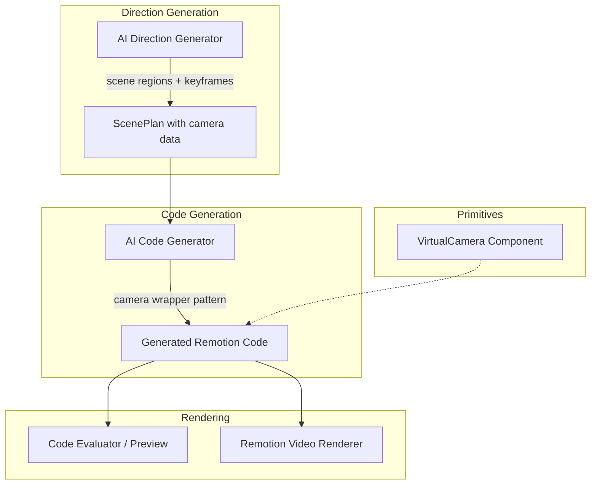

# Design Document: Virtual Camera System

## Overview

The Virtual Camera System transforms the video generation pipeline from isolated, hard-cut scene transitions into a continuous cinematic experience. Instead of rendering each scene in its own `<Sequence>` block, all scene content is placed simultaneously on a large World Canvas, and a virtual camera pans/zooms across it to reveal content — creating the illusion of one continuous shot.

The system touches three main pipeline stages:
1. **Direction Generation** — the AI now outputs spatial coordinates (scene regions) and camera keyframes alongside animation directions
2. **Code Generation** — the AI produces a camera-wrapper pattern instead of isolated Sequences, using a new `VirtualCamera` primitive
3. **Schema/Types** — `ScenePlan` and `SceneDirection` gain optional camera fields, maintaining backward compatibility

The design preserves full backward compatibility: when camera data is absent, the existing Sequence-based rendering continues to work unchanged.

## Architecture



The pipeline flow remains linear. The Direction Generator now performs an additional spatial planning step before generating per-scene directions. It assigns each scene a region on the World Canvas and computes camera keyframes. The Code Generator detects the presence of camera data in the ScenePlan and switches from the Sequence pattern to the camera-wrapper pattern, using the `VirtualCamera` primitive.

### Key Design Decisions

1. **Camera data is optional on ScenePlan** — This ensures zero breaking changes. Existing pipelines without camera data continue rendering with isolated Sequences.
2. **VirtualCamera is a primitive** — Rather than having the LLM write camera interpolation logic from scratch each time, we provide a battle-tested `VirtualCamera` component in the primitives library. The LLM composes it like any other primitive.
3. **All scenes render simultaneously** — The World Canvas renders all scene content at once. The camera transform reveals the relevant portion. This creates the "one continuous world" effect.
4. **Visibility culling for performance** — For videos with >8 scenes, scenes far from the camera are culled (opacity: 0) to prevent browser rendering issues.
5. **Spring-based easing by default** — Camera movements use spring physics (damping: 14, stiffness: 120) for natural-feeling motion, with linear as a fallback option.

## Components and Interfaces

### 1. ScenePlan Schema Extension (`pipeline.types.ts`)

New optional fields on `ScenePlan`:
- `worldCanvas?: { width: number; height: number }` — total canvas dimensions
- `cameraKeyframes?: CameraKeyframe[]` — ordered array of camera positions

New optional field on `SceneDirection`:
- `region?: { x: number; y: number; width: number; height: number }` — scene's position on the World Canvas

New type:
- `CameraKeyframe` — `{ frame, x, y, scale, easing, movementType }`

### 2. Direction Generator Enhancement (`ai-direction-generator.ts`)

The system prompt gains a new section instructing the LLM to:
- Plan a World Canvas layout with non-overlapping scene regions
- Output a `region` field per scene
- Output `cameraKeyframes` for the full video
- Choose appropriate `movementType` for each transition

The direction generator processes scenes sequentially (as it does today), but now passes the previous scene's region coordinates to enable spatial continuity planning.

A post-processing step aggregates per-scene camera data into the final `ScenePlan.cameraKeyframes` array and computes `ScenePlan.worldCanvas` dimensions.

### 3. Code Generator Enhancement (`ai-code-generator.ts`)

The system prompt gains:
- Instructions to detect `scenePlan.cameraKeyframes` presence
- A camera-wrapper rendering pattern (using `VirtualCamera` primitive)
- Fallback instructions: if no camera data, use existing Sequence pattern

The code generator's prompt dynamically switches between two templates based on whether camera data exists.

### 4. VirtualCamera Primitive (`remotion-primitives.ts`)

A new `VirtualCamera` function component added to the primitives library:
- Accepts `keyframes` (array), `children`, and `frame` (current frame number)
- Interpolates between the two nearest keyframes to compute current x, y, scale
- Applies `transform: translate(-x, -y) scale(scale)` with `transformOrigin: '0 0'`
- Supports `easing: 'spring'` and `easing: 'linear'`
- Uses `will-change: transform` for GPU acceleration

### 5. Code Generation Worker (`code-generation.worker.ts`)

Minor change: when building the `ScenePlan` object, include `worldCanvas` and `cameraKeyframes` from the scene directions if present. No structural changes to the worker flow.

### 6. Code Evaluator (client-side, `code-evaluator.ts`)

No changes needed. The `VirtualCamera` primitive uses only the globals already available in the evaluator sandbox (React, interpolate, spring). The primitive is prepended to generated code just like existing primitives.

## Data Models

### CameraKeyframe

```typescript
interface CameraKeyframe {
  frame: number;          // Frame number where camera arrives at this position
  x: number;             // X position on World Canvas
  y: number;             // Y position on World Canvas
  scale: number;         // Zoom level (1 = 100%, >1 = zoomed in, <1 = zoomed out)
  easing: 'spring' | 'linear';  // Interpolation method to reach this keyframe
  movementType: CameraMovementType;  // Semantic type of the movement
}

type CameraMovementType = 'pan' | 'zoom_in' | 'zoom_out' | 'pull_back' | 'track';
```

### SceneRegion

```typescript
interface SceneRegion {
  x: number;       // Left edge on World Canvas
  y: number;       // Top edge on World Canvas
  width: number;   // Region width (typically matches viewport width)
  height: number;  // Region height (typically matches viewport height)
}
```

### Extended ScenePlan (additions)

```typescript
interface ScenePlan {
  // ... existing fields ...
  worldCanvas?: { width: number; height: number };
  cameraKeyframes?: CameraKeyframe[];
}
```

### Extended SceneDirection (additions)

```typescript
interface SceneDirection {
  // ... existing fields ...
  region?: SceneRegion;
}
```

### VirtualCamera Props

```typescript
interface VirtualCameraProps {
  keyframes: CameraKeyframe[];
  frame: number;
  children: React.ReactNode;
}
```


## Correctness Properties

*A property is a characteristic or behavior that should hold true across all valid executions of a system — essentially, a formal statement about what the system should do. Properties serve as the bridge between human-readable specifications and machine-verifiable correctness guarantees.*

### Property 1: Scene regions do not overlap and maintain minimum gap

*For any* set of scene regions produced by the spatial layout algorithm, no two regions shall overlap, and the minimum distance between any two adjacent region edges shall be >= 100px.

**Validates: Requirements 1.2**

### Property 2: World canvas bounds encompass all scene regions

*For any* set of scene regions, the computed world canvas width shall be >= max(region.x + region.width) for all regions, and the world canvas height shall be >= max(region.y + region.height) for all regions.

**Validates: Requirements 1.3**

### Property 3: Camera keyframe timing aligns with scene boundaries

*For any* scene in a ScenePlan with camera data, there shall exist at least one camera keyframe with a frame value within [scene.startFrame, scene.endFrame].

**Validates: Requirements 2.1, 2.5**

### Property 4: Camera framing fills 80-95% of viewport

*For any* scene region and its corresponding arrival camera keyframe, the region scaled by the keyframe's scale factor shall fill between 80% and 95% of the viewport dimensions.

**Validates: Requirements 2.2**

### Property 5: Camera keyframes are ordered by frame number

*For any* cameraKeyframes array in a ScenePlan, keyframes[i].frame <= keyframes[i+1].frame for all valid indices i.

**Validates: Requirements 6.2**

### Property 6: Camera interpolation produces values between surrounding keyframes

*For any* frame t between two consecutive keyframes A (at frame fA) and B (at frame fB), the computed camera x, y, and scale shall each be between the corresponding values of A and B (inclusive).

**Validates: Requirements 3.1, 9.2**

### Property 7: Camera arrives exactly at keyframe position on keyframe frame

*For any* camera keyframe K, evaluating the VirtualCamera interpolation at frame K.frame shall produce position (K.x, K.y) and scale K.scale exactly.

**Validates: Requirements 3.2**

### Property 8: Movement type constrains scale direction

*For any* pair of consecutive keyframes (source, target): if target.movementType is "pan", then target.scale == source.scale; if target.movementType is "zoom_in", then target.scale > source.scale; if target.movementType is "zoom_out" or "pull_back", then target.scale < source.scale.

**Validates: Requirements 3.3, 3.4, 3.5**

### Property 9: VirtualCamera transform string is correctly formatted

*For any* computed camera state (x, y, scale), the VirtualCamera component shall produce a transform style string of the form `translate(-${x}px, -${y}px) scale(${scale})` with transformOrigin set to '0 0'.

**Validates: Requirements 9.3**

### Property 10: Easing method selection matches keyframe specification

*For any* two consecutive keyframes where the target specifies easing 'spring', the interpolation shall use spring physics (producing a non-linear curve). For easing 'linear', the interpolation shall produce linearly proportional values between source and target.

**Validates: Requirements 9.4**

### Property 11: Backward-compatible fallback when camera data is absent

*For any* valid ScenePlan that does not contain cameraKeyframes or region fields, the system shall produce valid rendered output using the existing Sequence-based pattern without errors.

**Validates: Requirements 6.5, 10.1, 10.2, 10.3**

## Error Handling

### Direction Generator Failures

- **Invalid camera keyframes from LLM**: If the direction generator's LLM output cannot be parsed into valid camera keyframes (missing fields, invalid coordinates, non-numeric values), the system falls back to generating directions without camera data. A warning is logged with the parse failure details. The pipeline continues with Sequence-based rendering.
- **Region overlap detected**: If post-processing detects overlapping regions, the system attempts auto-correction by shifting regions apart. If auto-correction fails, camera data is discarded and the pipeline falls back to slot-based layout.
- **World canvas exceeds maximum dimensions**: If computed world canvas exceeds 16000px in either dimension (browser rendering limit), the system logs a warning and caps dimensions, potentially reducing inter-scene gaps.

### Code Generator Failures

- **VirtualCamera primitive errors**: If the generated code using VirtualCamera fails validation (layout validator), the code generator retries with the existing Sequence pattern as a fallback hint in the retry prompt.
- **Missing keyframe data at runtime**: The VirtualCamera primitive handles edge cases gracefully:
  - Empty keyframes array → camera stays at (0, 0, scale: 1)
  - Frame before first keyframe → uses first keyframe's position
  - Frame after last keyframe → uses last keyframe's position
  - Single keyframe → camera stays at that position for all frames

### Pipeline-Level Fallback

The code generation worker checks for camera data presence before building the ScenePlan. If `sceneDirections` lack `region` fields or the aggregated keyframes are invalid, the worker builds a standard ScenePlan without camera fields, triggering the Sequence-based code generation path.

## Testing Strategy

### Property-Based Tests (fast-check)

Property-based testing is appropriate for this feature because the core logic involves:
- Pure interpolation functions with clear input/output behavior
- Spatial constraint validation (non-overlap, bounds checking)
- Data structure invariants (ordering, completeness)

**Library**: fast-check (already available in the project's test infrastructure via Jest)

**Configuration**: Minimum 100 iterations per property test.

**Tag format**: `Feature: virtual-camera-system, Property {number}: {property_text}`

Each correctness property (1-11) maps to a single property-based test:

1. **Region non-overlap** — Generate random scene counts (2-12) and region placements, verify the layout algorithm produces non-overlapping regions with 100px gaps.
2. **World canvas bounds** — Generate random regions, verify computed canvas dimensions encompass all.
3. **Keyframe-scene alignment** — Generate random scene plans with keyframes, verify each scene has a keyframe in its frame range.
4. **Viewport framing** — Generate random regions and keyframes, verify 80-95% fill ratio.
5. **Keyframe ordering** — Generate random keyframe arrays, verify frame values are monotonically non-decreasing.
6. **Interpolation bounds** — Generate random keyframe pairs and intermediate frames, verify interpolated values are between endpoints.
7. **Keyframe exactness** — Generate random keyframes, evaluate at exact keyframe frames, verify exact position match.
8. **Movement type scale constraints** — Generate random keyframe pairs with movement types, verify scale direction matches type.
9. **Transform string format** — Generate random (x, y, scale) values, verify output transform string format.
10. **Easing selection** — Generate random keyframe pairs with different easings, verify spring produces non-linear output and linear produces proportional output.
11. **Backward compatibility** — Generate random ScenePlans without camera fields, verify they render without errors using Sequence pattern.

### Unit Tests (example-based)

- Hook scene positioned at origin (0, 0)
- First keyframe at frame 0
- Default spring easing config (damping: 14, stiffness: 120)
- VirtualCamera with empty keyframes returns identity transform
- VirtualCamera with single keyframe stays at that position
- `will-change: transform` applied to camera wrapper
- `transform-origin: 0 0` applied when canvas > 8000px
- Previous scene region included in direction prompt when available

### Integration Tests

- Direction generator produces valid camera data for a multi-scene video
- Code generator produces VirtualCamera-based code when camera data is present
- Code generator produces Sequence-based code when camera data is absent
- Generated camera code evaluates successfully in the client-side code evaluator sandbox
- Full pipeline: direction generation → code generation → preview renders without errors
- System prompt contains VirtualCamera documentation and usage examples
