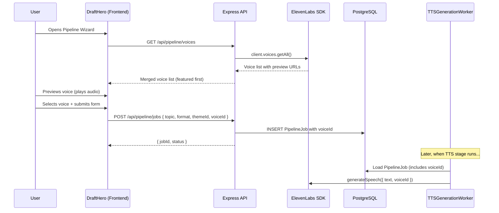

# Design Document: Voice Selector with Audio Preview

## Overview

This feature adds a voice selector with audio preview to the Pipeline Wizard (Draft Hero), allowing users to browse ElevenLabs voices, hear a preview clip, and choose a voice before creating a pipeline job. The selected `voiceId` flows through the entire pipeline — from the frontend form, through the shared Zod schema, into the PostgreSQL `PipelineJob` record, and finally to the `TTSGenerationWorker` which passes it to the ElevenLabs API.

The design follows the existing Clean Architecture patterns: a shared voice registry in `@video-ai/shared`, a new `GET /api/pipeline/voices` endpoint, a `VoiceSelector` UI component in the frontend pipeline feature, and targeted modifications to the domain entity, Prisma schema, use cases, and TTS worker.

### Key Design Decisions

1. **Static voice registry in `@video-ai/shared`** — The five featured voices are defined as a constant array, importable by both frontend and backend. This avoids a database table for data that changes rarely and keeps frontend/backend in sync without an API call.

2. **Per-job voiceId instead of global default** — The `TTSGenerationWorker` currently receives a global `voiceId` via constructor. This design shifts to reading `voiceId` from each `PipelineJob` entity, making voice selection per-job. The constructor-level `voiceId` becomes the fallback default only.

3. **ElevenLabs SDK for voice listing** — The backend calls `client.voices.getAll()` to fetch the full voice catalog with preview URLs, merges with the featured registry to set `featured: true` flags, and returns the combined list. On failure, the endpoint falls back to the static registry (without preview URLs).

4. **Single `<audio>` element pattern** — The frontend uses one shared `HTMLAudioElement` instance to play previews. Clicking a different voice's preview button stops the current playback and starts the new one, avoiding overlapping audio.

## Architecture

### Data Flow



### Layer Responsibilities

| Layer              | Package/App        | Changes                                                                                                                      |
| ------------------ | ------------------ | ---------------------------------------------------------------------------------------------------------------------------- |
| **Shared**         | `@video-ai/shared` | Voice registry constant, updated `createPipelineJobSchema`, `VoiceEntry` type, updated `PipelineJobDto`                      |
| **Domain**         | `apps/api`         | `PipelineJob` entity gains `voiceId` property                                                                                |
| **Application**    | `apps/api`         | `CreatePipelineJobUseCase` passes `voiceId`, new `ListVoicesUseCase`                                                         |
| **Infrastructure** | `apps/api`         | Prisma migration adds `voiceId` column, `ElevenLabsVoiceService` wraps SDK, mapper updated, TTS worker reads per-job voiceId |
| **Presentation**   | `apps/api`         | New voices route, controller method, DTO mapping includes `voiceId`                                                          |
| **Frontend**       | `apps/web`         | `VoiceSelector` component, `useVoicePreview` hook, updated `DraftHero`/`PipelineWizard`, repository method                   |

## Components and Interfaces

### 1. Voice Registry (`@video-ai/shared`)

**File:** `packages/shared/src/voices/voice-registry.ts`

```typescript
export interface FeaturedVoice {
  voiceId: string;
  name: string;
  category: "fast-energetic" | "natural-human";
  gender: "male" | "female";
  description: string;
}

export const FEATURED_VOICES: readonly FeaturedVoice[] = [
  {
    voiceId: "uxKr2vlA4hYgXZR1oPRT",
    name: "Natasha — Valley Girl",
    category: "fast-energetic",
    gender: "female",
    description: "Energetic, attention-grabbing, fast-paced",
  },
  {
    voiceId: "<aaron-voice-id>",
    name: "Aaron — AI and Tech News",
    category: "fast-energetic",
    gender: "male",
    description: "Clear, natural, good pace",
  },
  {
    voiceId: "TxGEqnHWrfWFTfGW9XjX",
    name: "Josh",
    category: "natural-human",
    gender: "male",
    description: "Clear, authoritative, documentary style",
  },
  {
    voiceId: "pNInz6obpgDQGcFmaJgB",
    name: "Adam",
    category: "natural-human",
    gender: "male",
    description: "Deep, warm, emotionally resonant",
  },
  {
    voiceId: "<bella-voice-id>",
    name: "Bella",
    category: "natural-human",
    gender: "female",
    description: "Stable, calm, natural narration",
  },
] as const;

export const FEATURED_VOICE_IDS = new Set(
  FEATURED_VOICES.map((v) => v.voiceId),
);

export const DEFAULT_VOICE_ID = "uxKr2vlA4hYgXZR1oPRT"; // Natasha
```

> **Note:** Aaron and Bella voice IDs need to be resolved from the ElevenLabs API at development time and hardcoded. The requirements specify them by name but not by ID.

### 2. Voice API Types (`@video-ai/shared`)

**File:** `packages/shared/src/types/voice.types.ts`

```typescript
export interface VoiceEntry {
  voiceId: string;
  name: string;
  description: string;
  previewUrl: string | null;
  gender: "male" | "female" | "unknown";
  featured: boolean;
  category: string | null;
}

export interface ListVoicesResponse {
  voices: VoiceEntry[];
}
```

### 3. Updated Shared Schema

**File:** `packages/shared/src/schemas/pipeline.schema.ts` (modified)

```typescript
export const createPipelineJobSchema = z.object({
  topic: z.string().min(3).max(500),
  format: z.enum(["reel", "short", "longform"]),
  themeId: z.string().min(1),
  voiceId: z.string().min(1).optional(),
});
```

### 4. ElevenLabs Voice Service (Backend)

**File:** `apps/api/src/pipeline/application/interfaces/voice-service.ts`

```typescript
import type { VoiceEntry } from "@video-ai/shared";
import type { Result } from "@/shared/domain/result.js";

export interface VoiceService {
  listVoices(): Promise<Result<VoiceEntry[], Error>>;
}
```

**File:** `apps/api/src/pipeline/infrastructure/services/elevenlabs-voice-service.ts`

This service wraps the ElevenLabs SDK `client.voices.getAll()` call. It:

1. Fetches all voices from ElevenLabs
2. Maps each voice to a `VoiceEntry`, setting `featured: true` and `category` for voices whose ID is in `FEATURED_VOICE_IDS`
3. Sorts featured voices first (in registry order), then non-featured alphabetically
4. On SDK failure, returns the five `FEATURED_VOICES` as a fallback (with `previewUrl: null`)

### 5. List Voices Use Case

**File:** `apps/api/src/pipeline/application/use-cases/list-voices.use-case.ts`

```typescript
export class ListVoicesUseCase implements UseCase<
  void,
  Result<ListVoicesResponse, Error>
> {
  constructor(private readonly voiceService: VoiceService) {}

  async execute(): Promise<Result<ListVoicesResponse, Error>> {
    const result = await this.voiceService.listVoices();
    if (result.isFailure) {
      return Result.fail(result.getError());
    }
    return Result.ok({ voices: result.getValue() });
  }
}
```

### 6. Pipeline Controller (Updated)

Add a `listVoices` method to `PipelineController`:

```typescript
async listVoices(_req: HttpRequest, res: HttpResponse): Promise<void> {
  try {
    const result = await this.listVoicesUseCase.execute();
    if (result.isFailure) {
      res.serverError({ error: "voice_fetch_failed", message: result.getError().message });
      return;
    }
    res.ok(result.getValue());
  } catch {
    res.serverError({ error: "internal_error", message: "Internal server error" });
  }
}
```

### 7. Pipeline Routes (Updated)

Add to `pipeline.routes.ts`:

```typescript
router.get("/voices", async (req: Request, res: Response) => {
  const httpReq = HttpRequest.fromExpress(req);
  const httpRes = HttpResponse.fromExpress(res);
  await controller.listVoices(httpReq, httpRes);
});
```

### 8. Domain Entity Update

**File:** `apps/api/src/pipeline/domain/entities/pipeline-job.ts` (modified)

Add `voiceId: string | null` to `PipelineJobProps`, the `create()` factory, `reconstitute()`, and expose a `voiceId` getter. The `create()` method accepts an optional `voiceId` parameter, defaulting to `null`.

### 9. Prisma Schema Migration

```prisma
model PipelineJob {
  // ... existing fields ...
  voiceId String? // nullable, null = use default voice
  // ...
}
```

Migration: `npx prisma migrate dev --name add-voice-id-to-pipeline-job`

### 10. Mapper & Repository Updates

`PipelineJobMapper.toDomain()` reads `record.voiceId` and passes it to `reconstitute()`.
`PipelineJobMapper.toPersistence()` writes `job.voiceId`.

### 11. TTS Worker Update

**File:** `apps/api/src/pipeline/infrastructure/queue/workers/tts-generation.worker.ts` (modified)

```typescript
// Before: uses this.voiceId (constructor-injected global)
// After: reads from the PipelineJob entity, falls back to constructor default

const voiceId = pipelineJob.voiceId ?? this.voiceId;

const result = await this.ttsService.generateSpeech({
  text: approvedScript,
  voiceId,
});
```

The constructor-level `voiceId` remains as the system-wide fallback (from `ELEVENLABS_VOICE_ID` env var), but per-job selection takes priority.

### 12. Frontend: VoiceSelector Component

**File:** `apps/web/src/features/pipeline/components/voice-selector.tsx`

A new component that:

- Fetches voices from `GET /api/pipeline/voices` on mount
- Displays featured voices in a "Recommended" section, grouped by category ("Fast & Energetic", "Natural & Human-like")
- Shows each voice with name, description, and a play/stop preview button
- Highlights the selected voice with a visual indicator
- Defaults to Natasha (`uxKr2vlA4hYgXZR1oPRT`) as pre-selected
- Supports keyboard navigation and ARIA labels

### 13. Frontend: useVoicePreview Hook

**File:** `apps/web/src/features/pipeline/hooks/use-voice-preview.ts`

Manages a single `HTMLAudioElement` instance:

- `play(previewUrl)` — stops any current playback, loads the new URL, plays
- `stop()` — pauses and resets
- Tracks `playingVoiceId` state for UI feedback
- Handles `ended` and `error` events to reset state
- Hides preview button when `previewUrl` is null
- Shows inline error indicator on playback failure

### 14. Frontend: Pipeline Repository Update

Add to `PipelineRepository` interface and `HttpPipelineRepository`:

```typescript
// Interface
listVoices(): Promise<ListVoicesResponse>;

// Implementation
listVoices(): Promise<ListVoicesResponse> {
  return this.http.get<ListVoicesResponse>({ path: `${BASE}/voices` });
}
```

### 15. Frontend: DraftHero / PipelineWizard Update

Both components gain a `voiceId` state field (defaulting to `DEFAULT_VOICE_ID`). The `VoiceSelector` is rendered between the theme picker and the submit button. On submit, `voiceId` is included in the `createJob` payload.

### 16. DTO Update

`PipelineJobDto` in `@video-ai/shared` gains an optional `voiceId?: string` field. The `mapToDto` function in `GetJobStatusUseCase` includes `voiceId` when present.

## Data Models

### Prisma Schema Change

```prisma
model PipelineJob {
  id        String   @id @default(uuid())
  createdAt DateTime @default(now())
  updatedAt DateTime @updatedAt

  topic   String      @db.VarChar(500)
  format  VideoFormat
  themeId String
  voiceId String?     // NEW — nullable, null means default voice

  status PipelineStatus @default(pending)
  stage  PipelineStage  @default(script_generation)

  errorCode    String?
  errorMessage String?

  generatedScript String? @db.Text
  approvedScript  String? @db.Text
  generatedScenes Json?
  approvedScenes  Json?
  audioPath       String?
  transcript      Json?
  scenePlan       Json?
  sceneDirections Json?
  generatedCode   String? @db.Text
  codePath        String?
  videoPath       String?

  progressPercent Int @default(0)

  @@index([status])
  @@index([createdAt(sort: Desc)])
}
```

### Domain Entity Change

```typescript
interface PipelineJobProps {
  // ... existing fields ...
  voiceId: string | null; // NEW
}
```

### Shared Types Change

```typescript
// PipelineJobDto gains:
export interface PipelineJobDto {
  // ... existing fields ...
  voiceId?: string; // NEW — optional in DTO
}
```

### Voice API Response Shape

```typescript
// GET /api/pipeline/voices
{
  "voices": [
    {
      "voiceId": "uxKr2vlA4hYgXZR1oPRT",
      "name": "Natasha — Valley Girl",
      "description": "Energetic, attention-grabbing, fast-paced",
      "previewUrl": "https://storage.elevenlabs.io/...",
      "gender": "female",
      "featured": true,
      "category": "fast-energetic"
    },
    // ... more voices
  ]
}
```

### Zod Schema Change

```typescript
// createPipelineJobSchema gains optional voiceId:
{
  topic: z.string().min(3).max(500),
  format: z.enum(["reel", "short", "longform"]),
  themeId: z.string().min(1),
  voiceId: z.string().min(1).optional(), // NEW
}
```

## Correctness Properties

_A property is a characteristic or behavior that should hold true across all valid executions of a system — essentially, a formal statement about what the system should do. Properties serve as the bridge between human-readable specifications and machine-verifiable correctness guarantees._

### Property 1: Voice mapping produces required fields

_For any_ ElevenLabs voice object returned by the SDK, mapping it to a `VoiceEntry` SHALL produce an object containing a non-empty `voiceId`, non-empty `name`, a `description` string, and a `previewUrl` (string or null).

**Validates: Requirements 2.2**

### Property 2: Featured flag correctness

_For any_ list of voices returned by the ElevenLabs SDK, after merging with the featured registry, a voice entry SHALL have `featured: true` if and only if its `voiceId` is in the `FEATURED_VOICE_IDS` set.

**Validates: Requirements 2.3**

### Property 3: Featured-first sort invariant

_For any_ merged voice list produced by the voice service, there SHALL be no index `i < j` where `voices[i].featured === false` and `voices[j].featured === true`. That is, all featured voices appear before all non-featured voices.

**Validates: Requirements 2.4**

### Property 4: Voice entry renders name and description

_For any_ `VoiceEntry` with a non-empty `name` and `description`, rendering it in the `VoiceSelector` component SHALL produce output containing both the voice name and description text.

**Validates: Requirements 3.2**

### Property 5: Preview button hidden for null previewUrl

_For any_ `VoiceEntry` where `previewUrl` is null, the rendered voice entry SHALL NOT contain a preview/play button element.

**Validates: Requirements 4.4**

### Property 6: Schema accepts valid payloads with optional voiceId

_For any_ valid `topic` (3–500 chars), valid `format` ("reel" | "short" | "longform"), valid `themeId` (non-empty string), and optional `voiceId` (non-empty string or omitted), the `createPipelineJobSchema` SHALL pass validation without error.

**Validates: Requirements 5.1, 5.2**

### Property 7: Schema rejects empty voiceId

_For any_ otherwise-valid pipeline job payload where `voiceId` is set to an empty string `""`, the `createPipelineJobSchema` SHALL reject the payload with a validation error.

**Validates: Requirements 5.3**

### Property 8: PipelineJob voiceId round-trip

_For any_ `voiceId` value (either a non-empty string or null), creating a `PipelineJob` with that `voiceId` and then reading the `voiceId` getter SHALL return the same value that was provided.

**Validates: Requirements 7.2, 7.4**

### Property 9: TTS worker uses per-job voiceId

_For any_ `PipelineJob` with a non-null `voiceId`, when the `TTSGenerationWorker` processes that job, it SHALL pass the job's `voiceId` (not the constructor default) to `ttsService.generateSpeech()`.

**Validates: Requirements 8.2**

### Property 10: DTO mapping preserves voiceId

_For any_ `PipelineJob` entity, mapping it to a `PipelineJobDto` SHALL include `voiceId` equal to the entity's `voiceId` when non-null, and SHALL omit `voiceId` (or set it to undefined) when the entity's `voiceId` is null.

**Validates: Requirements 9.1, 9.2, 9.3**

## Error Handling

| Scenario                                | Handling                                                                                                                            | User Impact                                                                     |
| --------------------------------------- | ----------------------------------------------------------------------------------------------------------------------------------- | ------------------------------------------------------------------------------- |
| ElevenLabs `voices.getAll()` fails      | `ElevenLabsVoiceService` catches the error and returns the 5 featured voices from the static registry with `previewUrl: null`       | User sees featured voices but cannot preview them                               |
| Audio preview fails to load/play        | `useVoicePreview` hook catches the `error` event on `HTMLAudioElement`, sets an error state for that voice, resets `playingVoiceId` | Brief inline error indicator on the voice entry; other voices remain functional |
| `voiceId` is an empty string in request | `createPipelineJobSchema` rejects with Zod validation error                                                                         | 400 Bad Request returned to frontend; form shows validation error               |
| `voiceId` omitted from request          | Schema passes; `PipelineJob` stores `null`; TTS worker uses default voice                                                           | Transparent fallback — user gets Rachel voice                                   |
| Voice ID doesn't exist in ElevenLabs    | `ElevenLabsTTSService.generateSpeech()` returns `Result.fail()` with `tts_generation_failed`                                        | Job fails at TTS stage; error shown in job status tracker                       |
| Network error fetching voices list      | Frontend `fetch` fails; `VoiceSelector` shows featured voices from the shared registry as fallback                                  | User can still select from featured voices, no previews available               |

## Testing Strategy

### Unit Tests

Unit tests cover specific examples, edge cases, and integration points:

- **Voice Registry**: Verify 5 entries, correct order, correct fields, correct categories
- **Schema Validation**: Verify `voiceId` optional, empty string rejected, valid string accepted
- **Domain Entity**: Verify `PipelineJob.create()` with/without voiceId, getter behavior
- **Mapper**: Verify `toDomain`/`toPersistence` round-trip with voiceId field
- **DTO Mapping**: Verify `mapToDto` includes/omits voiceId correctly
- **TTS Worker**: Verify per-job voiceId used, null falls back to default
- **Voice Service Fallback**: Verify SDK failure returns static registry
- **VoiceSelector Component**: Verify rendering, selection, default selection, accessibility
- **useVoicePreview Hook**: Verify play/stop/switch/error/ended behavior

### Property-Based Tests

Property-based tests verify universal properties across generated inputs. Use `fast-check` (already compatible with Jest in this project's stack).

**Configuration:**

- Minimum 100 iterations per property test
- Each test tagged with: **Feature: voice-selector-preview, Property {number}: {property_text}**

| Property    | Test Description                                                         | Generator Strategy                                                                |
| ----------- | ------------------------------------------------------------------------ | --------------------------------------------------------------------------------- |
| Property 1  | Map random ElevenLabs voice objects → verify required fields             | Generate objects with random `voice_id`, `name`, optional `preview_url`, `labels` |
| Property 2  | Merge random voice lists with featured registry → verify `featured` flag | Generate voice lists with random IDs, some matching featured IDs                  |
| Property 3  | Sort merged voice lists → verify featured-first invariant                | Generate mixed featured/non-featured voice lists                                  |
| Property 4  | Render random VoiceEntry → verify name and description present           | Generate random non-empty name/description strings                                |
| Property 5  | Render VoiceEntry with null previewUrl → verify no play button           | Generate random VoiceEntry with `previewUrl: null`                                |
| Property 6  | Generate valid payloads with/without voiceId → verify schema passes      | Generate random topics (3-500 chars), formats, themeIds, optional voiceIds        |
| Property 7  | Generate payloads with empty voiceId → verify schema rejects             | Generate valid payloads, set voiceId to `""`                                      |
| Property 8  | Create PipelineJob with random voiceId → verify getter round-trip        | Generate random strings and null values                                           |
| Property 9  | Process job with random voiceId → verify TTS service receives it         | Generate random non-empty voiceId strings                                         |
| Property 10 | Map PipelineJob with random voiceId to DTO → verify preservation         | Generate random voiceId values (string or null)                                   |

### Integration Tests

- **GET /api/pipeline/voices**: End-to-end with mocked ElevenLabs SDK
- **POST /api/pipeline/jobs with voiceId**: Verify voiceId persisted to database
- **TTS Worker end-to-end**: Verify correct voiceId reaches ElevenLabs API call
- **Prisma migration**: Verify backward compatibility (existing records get null voiceId)
