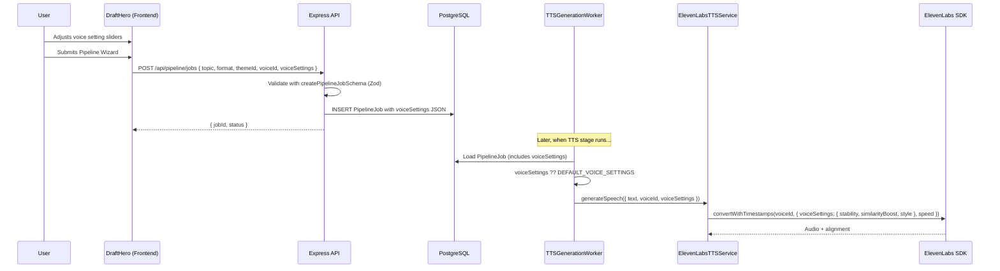

# Design Document: Voice Settings Controls

## Overview

This feature exposes the four ElevenLabs voice tuning parameters — Speed, Stability, Similarity Boost, and Style — as slider controls in the Pipeline Wizard. Currently, the `ElevenLabsTTSService` hardcodes `stability: 0.5` and `similarityBoost: 0.75` in the `convertWithTimestamps()` call, with no user control over speed or style. This design adds an optional `voiceSettings` object that flows through every layer of the Clean Architecture pipeline:

1. **Frontend** — A `VoiceSettingsControls` component renders four sliders below the voice selector. State is managed in `DraftHero`/`PipelineWizard` and included in the job creation payload.
2. **Shared** — A `voiceSettingsSchema` Zod object validates all four fields with range constraints. A `VoiceSettings` type and `DEFAULT_VOICE_SETTINGS` constant are exported from `@video-ai/shared`.
3. **Backend** — The `createPipelineJobSchema` gains an optional `voiceSettings` field. The `PipelineJob` domain entity, Prisma model, mapper, and DTO all carry the nullable `voiceSettings` JSON.
4. **TTS Worker** — Reads `voiceSettings` from the job (falling back to `DEFAULT_VOICE_SETTINGS` when null) and passes them to `ElevenLabsTTSService`.
5. **TTS Service** — Forwards `stability`, `similarityBoost`, and `style` inside the SDK's `voiceSettings` parameter, and `speed` as a top-level parameter (per ElevenLabs SDK API design).

### Key Design Decisions

1. **`voiceSettings` is optional and nullable** — Omitting it from the request stores `null` in the database. The TTS worker applies `DEFAULT_VOICE_SETTINGS` at read time, keeping existing jobs backward-compatible without a data migration backfill.

2. **All-or-nothing object** — When `voiceSettings` is provided, all four fields are required. This avoids partial-settings ambiguity and simplifies validation. The frontend always sends the complete object.

3. **`speed` is a top-level ElevenLabs SDK parameter** — The ElevenLabs `convertWithTimestamps()` API accepts `speed` outside the `voiceSettings` object. Our internal `VoiceSettings` type groups all four values together for simplicity, and the `ElevenLabsTTSService` splits them at the SDK call boundary.

4. **Defaults live in `@video-ai/shared`** — Both frontend (slider initialization) and backend (TTS fallback) import `DEFAULT_VOICE_SETTINGS` from the shared package, ensuring a single source of truth.

5. **JSON column, not separate columns** — Voice settings are stored as a single `Json?` column in Prisma rather than four separate float columns. This matches the existing pattern for `transcript`, `scenePlan`, etc., and makes future setting additions non-breaking.

## Architecture

### Data Flow



### Layer Responsibilities

| Layer              | Package/App        | Changes                                                                                                                                                        |
| ------------------ | ------------------ | -------------------------------------------------------------------------------------------------------------------------------------------------------------- |
| **Shared**         | `@video-ai/shared` | `VoiceSettings` type, `DEFAULT_VOICE_SETTINGS` constant, `VOICE_SETTINGS_RANGES` constant, `voiceSettingsSchema` Zod schema, updated `createPipelineJobSchema` |
| **Domain**         | `apps/api`         | `PipelineJob` entity gains `voiceSettings` property (nullable)                                                                                                 |
| **Application**    | `apps/api`         | `CreatePipelineJobUseCase` passes `voiceSettings`, `GetJobStatusUseCase` maps `voiceSettings` to DTO                                                           |
| **Infrastructure** | `apps/api`         | Prisma migration adds `voiceSettings Json?` column, mapper updated, TTS service accepts `voiceSettings`, TTS worker reads and forwards settings                |
| **Presentation**   | `apps/api`         | DTO includes optional `voiceSettings`                                                                                                                          |
| **Frontend**       | `apps/web`         | `VoiceSettingsControls` component, updated `DraftHero`/`PipelineWizard`, updated `CreateJobParams`/repository                                                  |

## Components and Interfaces

### 1. Voice Settings Types & Constants (`@video-ai/shared`)

**File:** `packages/shared/src/types/voice-settings.types.ts`

```typescript
export interface VoiceSettings {
  speed: number;
  stability: number;
  similarityBoost: number;
  style: number;
}

export interface VoiceSettingRange {
  min: number;
  max: number;
  step: number;
  default: number;
}

export const VOICE_SETTINGS_RANGES: Record<
  keyof VoiceSettings,
  VoiceSettingRange
> = {
  speed: { min: 0.7, max: 1.2, step: 0.1, default: 1.0 },
  stability: { min: 0.0, max: 1.0, step: 0.05, default: 0.5 },
  similarityBoost: { min: 0.0, max: 1.0, step: 0.05, default: 0.75 },
  style: { min: 0.0, max: 1.0, step: 0.05, default: 0.0 },
};

export const DEFAULT_VOICE_SETTINGS: VoiceSettings = {
  speed: 1.0,
  stability: 0.5,
  similarityBoost: 0.75,
  style: 0.0,
};
```

### 2. Voice Settings Zod Schema (`@video-ai/shared`)

**File:** `packages/shared/src/schemas/pipeline.schema.ts` (modified)

```typescript
export const voiceSettingsSchema = z.object({
  speed: z.number().min(0.7).max(1.2),
  stability: z.number().min(0).max(1),
  similarityBoost: z.number().min(0).max(1),
  style: z.number().min(0).max(1),
});

export const createPipelineJobSchema = z.object({
  topic: z.string().min(3).max(500),
  format: z.enum(["reel", "short", "longform"]),
  themeId: z.string().min(1),
  voiceId: z.string().min(1).optional(),
  voiceSettings: voiceSettingsSchema.optional(),
});
```

The `voiceSettings` field is optional at the top level. When provided, all four fields are required within the object (Zod's default behavior for `z.object()`).

### 3. Prisma Schema Update

**File:** `apps/api/prisma/schema.prisma` (modified)

```prisma
model PipelineJob {
  // ... existing fields ...
  voiceId       String?     // ElevenLabs voice ID
  voiceSettings Json?       // NEW — { speed, stability, similarityBoost, style }
  // ...
}
```

Migration: `npx prisma migrate dev --name add-voice-settings-to-pipeline-job`

The column is nullable. Existing rows get `null`, interpreted as default settings at read time.

### 4. Domain Entity Update

**File:** `apps/api/src/pipeline/domain/entities/pipeline-job.ts` (modified)

Add `voiceSettings` to `PipelineJobProps`:

```typescript
import type { VoiceSettings } from "@video-ai/shared";

interface PipelineJobProps {
  // ... existing fields ...
  voiceSettings: VoiceSettings | null;
}
```

- `create()` accepts optional `voiceSettings`, defaults to `null`
- `reconstitute()` accepts `voiceSettings`
- New getter: `get voiceSettings(): VoiceSettings | null`

### 5. Mapper Update

**File:** `apps/api/src/pipeline/infrastructure/mappers/pipeline-job.mapper.ts` (modified)

```typescript
// toDomain — parse JSON column
voiceSettings: (record.voiceSettings as VoiceSettings) ?? null,

// toPersistence — write JSON column
voiceSettings: job.voiceSettings !== null
  ? (job.voiceSettings as unknown as Prisma.JsonValue)
  : null,
```

### 6. Create Pipeline Job Use Case Update

**File:** `apps/api/src/pipeline/application/use-cases/create-pipeline-job.use-case.ts` (modified)

The use case already validates via `createPipelineJobSchema.safeParse(request)`. After the schema gains `voiceSettings`, the parsed data will include it when provided. Pass it to `PipelineJob.create()`:

```typescript
const job = PipelineJob.create({
  id: this.idGenerator.generate(),
  topic,
  format: formatResult.getValue(),
  themeId: themeIdResult.getValue(),
  voiceId,
  voiceSettings: parsed.data.voiceSettings ?? null,
});
```

### 7. TTS Service Interface Update

**File:** `apps/api/src/pipeline/application/interfaces/tts-service.ts` (modified)

```typescript
import type { VoiceSettings, WordTimestamp } from "@video-ai/shared";

export interface TTSService {
  generateSpeech(params: {
    text: string;
    voiceId: string;
    voiceSettings: VoiceSettings;
  }): Promise<
    Result<
      { audioPath: string; format: "mp3"; timestamps: WordTimestamp[] },
      PipelineError
    >
  >;
}
```

The `voiceSettings` parameter is required here — the TTS worker is responsible for applying the default before calling the service.

### 8. ElevenLabs TTS Service Update

**File:** `apps/api/src/pipeline/infrastructure/services/elevenlabs-tts-service.ts` (modified)

Replace the hardcoded `voiceSettings` in `convertWithTimestamps()`:

```typescript
async generateSpeech(params: {
  text: string;
  voiceId: string;
  voiceSettings: VoiceSettings;
}): Promise<Result<...>> {
  const voiceId = params.voiceId || this.defaultVoiceId;
  const { stability, similarityBoost, style } = params.voiceSettings;

  const response = await this.client.textToSpeech.convertWithTimestamps(
    voiceId,
    {
      text: params.text,
      modelId: this.modelId,
      voiceSettings: {
        stability,
        similarityBoost,
        style,
      },
      speed: params.voiceSettings.speed,
    },
  );
  // ... rest unchanged
}
```

Note: `speed` is a top-level parameter in the ElevenLabs SDK, not inside `voiceSettings`. The `style` field is passed inside `voiceSettings`.

### 9. TTS Worker Update

**File:** `apps/api/src/pipeline/infrastructure/queue/workers/tts-generation.worker.ts` (modified)

```typescript
import { DEFAULT_VOICE_SETTINGS } from "@video-ai/shared";

// In process():
const voiceId = pipelineJob.voiceId ?? this.voiceId;
const voiceSettings = pipelineJob.voiceSettings ?? DEFAULT_VOICE_SETTINGS;

const result = await this.ttsService.generateSpeech({
  text: approvedScript,
  voiceId,
  voiceSettings,
});
```

### 10. Get Job Status Use Case / DTO Update

**File:** `apps/api/src/pipeline/application/use-cases/get-job-status.use-case.ts` (modified)

Add `voiceSettings` to the DTO mapping:

```typescript
if (job.voiceSettings) {
  dto.voiceSettings = job.voiceSettings;
}
```

**File:** `packages/shared/src/types/pipeline.types.ts` (modified)

```typescript
export interface PipelineJobDto {
  // ... existing fields ...
  voiceSettings?: VoiceSettings;
}
```

### 11. Frontend: VoiceSettingsControls Component

**File:** `apps/web/src/features/pipeline/components/voice-settings-controls.tsx`

A new component rendering four range sliders:

```typescript
import type { VoiceSettings } from "@video-ai/shared";
import { VOICE_SETTINGS_RANGES } from "@video-ai/shared";

interface VoiceSettingsControlsProps {
  value: VoiceSettings;
  onChange: (settings: VoiceSettings) => void;
}
```

Each slider:

- Uses the HTML `<input type="range">` element
- Reads `min`, `max`, `step` from `VOICE_SETTINGS_RANGES`
- Displays the current numeric value next to the label
- Includes a brief description of what the setting controls
- Has `aria-label`, `aria-valuemin`, `aria-valuemax`, `aria-valuenow` attributes
- Supports keyboard control natively via the range input

Slider descriptions:

- **Speed** (0.7–1.2): "Controls speaking pace. Below 1.0 slows down, above 1.0 speeds up."
- **Stability** (0.0–1.0): "Higher values produce more consistent delivery. Lower values add expressiveness."
- **Similarity Boost** (0.0–1.0): "Controls how closely the output matches the original voice."
- **Style** (0.0–1.0): "Adds stylization and emotion. Higher values increase expressiveness."

### 12. Frontend: DraftHero & PipelineWizard Updates

Both components gain a `voiceSettings` state field initialized to `DEFAULT_VOICE_SETTINGS`. The `VoiceSettingsControls` component is rendered directly below the `VoiceSelector`. On submit, `voiceSettings` is included in the `createJob` payload.

**File:** `apps/web/src/features/pipeline/interfaces/pipeline-repository.ts` (modified)

```typescript
import type { VoiceSettings } from "@video-ai/shared";

export interface CreateJobParams {
  topic: string;
  format: VideoFormat;
  themeId: string;
  voiceId?: string;
  voiceSettings?: VoiceSettings;
}
```

### 13. Shared Package Exports

**File:** `packages/shared/src/index.ts` (modified)

Add exports:

```typescript
export type {
  VoiceSettings,
  VoiceSettingRange,
} from "./types/voice-settings.types.js";
export {
  VOICE_SETTINGS_RANGES,
  DEFAULT_VOICE_SETTINGS,
} from "./types/voice-settings.types.js";
export { voiceSettingsSchema } from "./schemas/pipeline.schema.js";
```

## Data Models

### Prisma Schema Change

```prisma
model PipelineJob {
  id        String   @id @default(uuid())
  createdAt DateTime @default(now())
  updatedAt DateTime @updatedAt

  topic         String      @db.VarChar(500)
  format        VideoFormat
  themeId       String
  voiceId       String?
  voiceSettings Json?       // NEW — nullable JSON { speed, stability, similarityBoost, style }

  status PipelineStatus @default(pending)
  stage  PipelineStage  @default(script_generation)

  errorCode    String?
  errorMessage String?

  // ... remaining fields unchanged ...

  progressPercent Int @default(0)

  @@index([status])
  @@index([createdAt(sort: Desc)])
}
```

### Domain Entity Props Change

```typescript
interface PipelineJobProps {
  // ... existing fields ...
  voiceSettings: VoiceSettings | null; // NEW
}
```

### VoiceSettings Type

```typescript
interface VoiceSettings {
  speed: number; // 0.7–1.2, default 1.0
  stability: number; // 0.0–1.0, default 0.5
  similarityBoost: number; // 0.0–1.0, default 0.75
  style: number; // 0.0–1.0, default 0.0
}
```

### DTO Change

```typescript
interface PipelineJobDto {
  // ... existing fields ...
  voiceSettings?: VoiceSettings; // NEW — optional, omitted when null
}
```

### Zod Schema Change

```typescript
// voiceSettingsSchema (new)
z.object({
  speed: z.number().min(0.7).max(1.2),
  stability: z.number().min(0).max(1),
  similarityBoost: z.number().min(0).max(1),
  style: z.number().min(0).max(1),
});

// createPipelineJobSchema (updated)
z.object({
  topic: z.string().min(3).max(500),
  format: z.enum(["reel", "short", "longform"]),
  themeId: z.string().min(1),
  voiceId: z.string().min(1).optional(),
  voiceSettings: voiceSettingsSchema.optional(), // NEW
});
```

## Correctness Properties

_A property is a characteristic or behavior that should hold true across all valid executions of a system — essentially, a formal statement about what the system should do. Properties serve as the bridge between human-readable specifications and machine-verifiable correctness guarantees._

### Property 1: Schema accepts valid voice settings

_For any_ `voiceSettings` object where `speed` is in [0.7, 1.2], `stability` is in [0.0, 1.0], `similarityBoost` is in [0.0, 1.0], and `style` is in [0.0, 1.0], and _for any_ valid base payload (topic 3–500 chars, valid format, non-empty themeId), the `createPipelineJobSchema` SHALL pass validation both when `voiceSettings` is included and when it is omitted.

**Validates: Requirements 2.1, 2.2, 2.3, 2.4, 2.5, 2.6**

### Property 2: Schema rejects out-of-range voice settings

_For any_ `voiceSettings` object where at least one field is outside its valid range (speed outside [0.7, 1.2], stability outside [0.0, 1.0], similarityBoost outside [0.0, 1.0], or style outside [0.0, 1.0]), the `createPipelineJobSchema` SHALL reject the payload with a validation error.

**Validates: Requirements 2.7**

### Property 3: Schema rejects incomplete voice settings

_For any_ `voiceSettings` object that is missing one or more of the four required fields (`speed`, `stability`, `similarityBoost`, `style`), the `createPipelineJobSchema` SHALL reject the payload with a validation error.

**Validates: Requirements 2.8**

### Property 4: PipelineJob entity voice settings round-trip

_For any_ valid `VoiceSettings` object (or null), creating a `PipelineJob` with that value and reading the `voiceSettings` getter SHALL return an equivalent value to what was provided.

**Validates: Requirements 4.1, 4.2, 4.3, 4.4, 5.2**

### Property 5: TTS worker forwards job voice settings to TTS service

_For any_ `PipelineJob` with non-null `voiceSettings`, when the `TTSGenerationWorker` processes that job, it SHALL pass the job's exact `voiceSettings` to `ttsService.generateSpeech()`.

**Validates: Requirements 6.2**

### Property 6: TTS service maps voice settings to ElevenLabs SDK parameters

_For any_ valid `VoiceSettings`, when `ElevenLabsTTSService.generateSpeech()` is called, it SHALL pass `stability`, `similarityBoost`, and `style` inside the SDK's `voiceSettings` parameter, and `speed` as a top-level `speed` parameter to `convertWithTimestamps()`.

**Validates: Requirements 7.1, 7.2, 7.3**

### Property 7: Voice settings controls display correct numeric values

_For any_ valid `VoiceSettings` object, rendering the `VoiceSettingsControls` component with that value SHALL display the numeric value of each setting matching the input.

**Validates: Requirements 8.2, 8.8**

### Property 8: DTO mapping preserves voice settings

_For any_ `PipelineJob` entity with non-null `voiceSettings`, mapping it to a `PipelineJobDto` SHALL include a `voiceSettings` field with values equal to the entity's stored settings. When `voiceSettings` is null, the DTO SHALL omit the field.

**Validates: Requirements 9.1, 9.2, 9.3**

## Error Handling

| Scenario                                            | Handling                                                                                       | User Impact                                                       |
| --------------------------------------------------- | ---------------------------------------------------------------------------------------------- | ----------------------------------------------------------------- |
| `voiceSettings` has a field out of range            | `createPipelineJobSchema` Zod validation rejects with field-specific error                     | 400 Bad Request; frontend form can display which field is invalid |
| `voiceSettings` is missing a required field         | Zod validation rejects — all four fields required when object is present                       | 400 Bad Request; clear error message about missing field          |
| `voiceSettings` omitted entirely                    | Schema passes; `PipelineJob` stores `null`; TTS worker uses `DEFAULT_VOICE_SETTINGS`           | Transparent fallback — user gets default voice tuning             |
| Slider value at boundary (e.g., speed = 0.7 or 1.2) | Zod `.min()` / `.max()` are inclusive — boundary values pass validation                        | No issue — boundary values are valid                              |
| Existing jobs with no `voiceSettings` column data   | Prisma returns `null` for the new `Json?` column; TTS worker applies defaults                  | Existing jobs continue to work identically to before              |
| Non-numeric value in `voiceSettings` field          | Zod `z.number()` rejects non-numeric types                                                     | 400 Bad Request with type error                                   |
| `voiceSettings` is an empty object `{}`             | Zod rejects — all four fields are required within the object                                   | 400 Bad Request with missing field errors                         |
| ElevenLabs SDK rejects voice settings values        | `ElevenLabsTTSService` catches the error, returns `Result.fail()` with `tts_generation_failed` | Job fails at TTS stage; error shown in job status tracker         |

## Testing Strategy

### Unit Tests

Unit tests cover specific examples, edge cases, and integration points:

- **Voice Settings Constants**: Verify `DEFAULT_VOICE_SETTINGS` has exact expected values; verify `VOICE_SETTINGS_RANGES` has correct min/max/step/default for each field
- **Schema Validation Examples**: Verify `voiceSettings` optional (omitted passes), empty object rejected, partial object rejected, boundary values accepted (speed=0.7, speed=1.2, stability=0.0, stability=1.0)
- **Domain Entity**: Verify `PipelineJob.create()` with/without voiceSettings, getter returns null when omitted
- **Mapper**: Verify `toDomain`/`toPersistence` handles voiceSettings JSON column correctly, null case
- **DTO Mapping**: Verify `mapToDto` includes voiceSettings when present, omits when null
- **TTS Worker**: Verify null voiceSettings falls back to `DEFAULT_VOICE_SETTINGS`; verify non-null settings passed through
- **TTS Service**: Verify `speed` passed as top-level param, `stability`/`similarityBoost`/`style` inside `voiceSettings`
- **VoiceSettingsControls Component**: Verify four sliders rendered with correct labels, descriptions, min/max/step attributes, ARIA labels, default initialization
- **PipelineWizard Integration**: Verify VoiceSettingsControls rendered below VoiceSelector, voiceSettings included in submit payload

### Property-Based Tests

Property-based tests verify universal properties across generated inputs. Use `fast-check` with Jest.

**Configuration:**

- Minimum 100 iterations per property test
- Each test tagged with: **Feature: voice-settings-controls, Property {number}: {property_text}**

| Property   | Test Description                                                                            | Generator Strategy                                                                                                                               |
| ---------- | ------------------------------------------------------------------------------------------- | ------------------------------------------------------------------------------------------------------------------------------------------------ |
| Property 1 | Generate valid voiceSettings + valid base payloads → verify schema passes                   | Generate speed in [0.7, 1.2], stability/similarityBoost/style in [0.0, 1.0], random topics (3–500 chars), random formats, random themeIds        |
| Property 2 | Generate voiceSettings with at least one out-of-range field → verify schema rejects         | Generate one field outside its range (e.g., speed < 0.7 or > 1.2), keep others valid                                                             |
| Property 3 | Generate voiceSettings objects missing random subsets of fields → verify schema rejects     | Generate objects with 1–3 fields randomly removed                                                                                                |
| Property 4 | Create PipelineJob with random voiceSettings (or null) → verify getter round-trip           | Generate random VoiceSettings objects and null values                                                                                            |
| Property 5 | Process job with random voiceSettings → verify TTS service receives exact settings          | Generate random valid VoiceSettings, mock TTS service, verify call args                                                                          |
| Property 6 | Call generateSpeech with random voiceSettings → verify SDK receives correct parameter split | Generate random valid VoiceSettings, mock ElevenLabs client, verify `voiceSettings` has stability/similarityBoost/style and `speed` is top-level |
| Property 7 | Render VoiceSettingsControls with random valid settings → verify displayed values match     | Generate random VoiceSettings within valid ranges, render component, check displayed text                                                        |
| Property 8 | Map PipelineJob with random voiceSettings to DTO → verify preservation or omission          | Generate random VoiceSettings and null, verify DTO field matches                                                                                 |

### Integration Tests

- **POST /api/pipeline/jobs with voiceSettings**: Verify voiceSettings persisted to database as JSON
- **POST /api/pipeline/jobs without voiceSettings**: Verify null stored, job created successfully
- **GET /api/pipeline/jobs/:id**: Verify voiceSettings returned in DTO when present
- **TTS Worker end-to-end**: Verify correct voiceSettings reach ElevenLabs API call (with mocked SDK)
- **Prisma migration**: Verify backward compatibility — existing records get null voiceSettings
