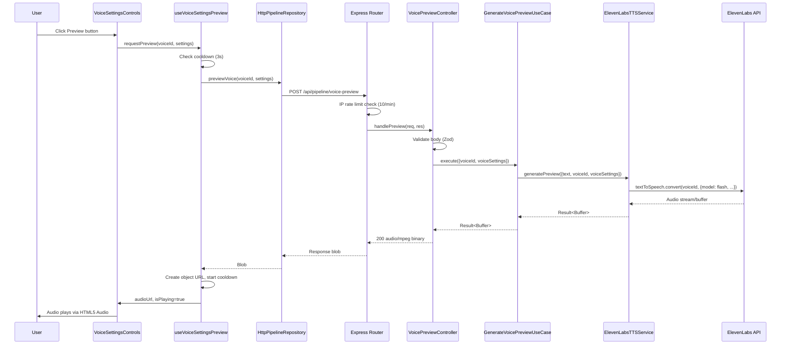

# Design Document: Voice Settings Preview

## Overview

This feature adds a real-time voice preview capability to the VoiceSettingsControls component. Users can click a "Preview" button to hear a short audio sample generated with their current voice settings (speed, stability, similarity boost, style) and selected voice, before committing to a full pipeline job.

The system introduces a new `POST /api/pipeline/voice-preview` endpoint that accepts voice settings, calls the ElevenLabs TTS API with the low-latency Flash model (`eleven_flash_v2_5`), and returns raw MP3 audio. The frontend plays this audio via the HTML5 Audio API. Rate limiting is enforced both client-side (3-second cooldown) and server-side (10 requests/minute per IP).

### Key Design Decisions

1. **Flash model for preview**: Using `eleven_flash_v2_5` instead of `eleven_multilingual_v2` to minimize latency. Preview is about quick feedback, not production quality.
2. **Binary audio response**: The endpoint returns raw MP3 bytes with `Content-Type: audio/mpeg` rather than JSON-wrapped base64. This avoids a ~33% payload increase and lets the frontend create an object URL directly from the blob.
3. **Separate preview method on TTSService**: Rather than creating a new service interface, we add a `generatePreview` method to the existing `TTSService` interface. Preview is a simpler operation (no timestamps, no object store upload).
4. **Client-side cooldown + server-side IP rate limit**: Dual-layer approach. Client-side cooldown provides instant UX feedback; server-side rate limiting protects the API quota from abuse.
5. **In-memory rate limiter**: A simple `Map<string, number[]>` for IP-based rate tracking. Sufficient for a single-server deployment; can be swapped for Redis-based tracking later.

## Architecture



### Layer Mapping (Clean Architecture)

| Layer | Component | Responsibility |
|---|---|---|
| **Domain** | `PipelineError` (existing) | Error types for TTS failures |
| **Application** | `TTSService` interface (extended) | `generatePreview` method contract |
| **Application** | `GenerateVoicePreviewUseCase` | Orchestrates preview generation |
| **Infrastructure** | `ElevenLabsTTSService` (extended) | Calls ElevenLabs Flash API |
| **Infrastructure** | `InMemoryRateLimiter` | IP-based sliding window rate limiter |
| **Presentation** | `VoicePreviewController` | HTTP request handling, validation |
| **Presentation** | `voicePreviewSchema` (shared) | Zod validation schema |
| **Presentation** | `voice-preview.routes.ts` | Express route registration |
| **Frontend** | `useVoiceSettingsPreview` hook | Preview state, cooldown, audio playback |
| **Frontend** | `VoiceSettingsControls` (updated) | Preview button UI |
| **Frontend** | `HttpPipelineRepository` (extended) | `previewVoice()` API call |

## Components and Interfaces

### Backend

#### 1. TTSService Interface Extension

```typescript
// apps/api/src/pipeline/application/interfaces/tts-service.ts
export interface TTSService {
  generateSpeech(params: {
    text: string;
    voiceId: string;
    voiceSettings: VoiceSettings;
  }): Promise<Result<{ audioPath: string; format: "mp3"; timestamps: WordTimestamp[] }, PipelineError>>;

  generatePreview(params: {
    text: string;
    voiceId: string;
    voiceSettings: VoiceSettings;
  }): Promise<Result<Buffer, PipelineError>>;
}
```

#### 2. GenerateVoicePreviewUseCase

```typescript
// apps/api/src/pipeline/application/use-cases/generate-voice-preview.use-case.ts
export class GenerateVoicePreviewUseCase implements UseCase<
  { voiceId?: string; voiceSettings: VoiceSettings },
  Result<Buffer, PipelineError>
> {
  private static readonly SAMPLE_TEXT = "Here is a preview of how your voice settings will sound in the final video.";

  constructor(private readonly ttsService: TTSService) {}

  async execute(request: {
    voiceId?: string;
    voiceSettings: VoiceSettings;
  }): Promise<Result<Buffer, PipelineError>> {
    return this.ttsService.generatePreview({
      text: GenerateVoicePreviewUseCase.SAMPLE_TEXT,
      voiceId: request.voiceId ?? "",  // empty string triggers default in service
      voiceSettings: request.voiceSettings,
    });
  }
}
```

#### 3. ElevenLabsTTSService.generatePreview

New method on the existing service. Uses `client.textToSpeech.convert()` (not `convertWithTimestamps`) with the Flash model. Returns raw audio buffer without uploading to object store.

#### 4. VoicePreviewController

```typescript
// apps/api/src/pipeline/presentation/controllers/voice-preview.controller.ts
export class VoicePreviewController {
  constructor(
    private readonly generateVoicePreviewUseCase: GenerateVoicePreviewUseCase
  ) {}

  async handlePreview(req: HttpRequest, res: Response): Promise<void> {
    // 1. Validate body with voicePreviewSchema
    // 2. Execute use case
    // 3. On success: res.set("Content-Type", "audio/mpeg").send(buffer)
    // 4. On failure: 502 with error message
  }
}
```

Note: The `handlePreview` method receives the raw Express `Response` (not `HttpResponse` wrapper) because it needs to send binary data, not JSON.

#### 5. InMemoryRateLimiter

```typescript
// apps/api/src/shared/infrastructure/rate-limiter/in-memory-rate-limiter.ts
export class InMemoryRateLimiter {
  private requests: Map<string, number[]> = new Map();

  constructor(
    private readonly maxRequests: number,
    private readonly windowMs: number
  ) {}

  isAllowed(key: string): { allowed: boolean; retryAfterMs?: number } { ... }
}
```

Sliding window approach: stores timestamps of recent requests per key, prunes expired entries on each check.

#### 6. Rate Limit Middleware

```typescript
// apps/api/src/shared/presentation/middleware/rate-limit.middleware.ts
export function createRateLimitMiddleware(limiter: InMemoryRateLimiter) {
  return (req: Request, res: Response, next: NextFunction) => {
    const ip = req.ip ?? req.socket.remoteAddress ?? "unknown";
    const result = limiter.isAllowed(ip);
    if (!result.allowed) {
      const retryAfterSec = Math.ceil((result.retryAfterMs ?? 0) / 1000);
      res.set("Retry-After", String(retryAfterSec));
      res.status(429).json({ error: "rate_limit_exceeded", message: "Too many preview requests. Try again later.", retryAfter: retryAfterSec });
      return;
    }
    next();
  };
}
```

### Frontend

#### 7. useVoiceSettingsPreview Hook

```typescript
// apps/web/src/features/pipeline/hooks/use-voice-settings-preview.ts
export interface UseVoiceSettingsPreviewResult {
  isLoading: boolean;
  isPlaying: boolean;
  error: string | null;
  cooldownRemaining: number;  // seconds remaining, 0 = ready
  requestPreview: (voiceId: string, settings: VoiceSettings) => void;
  stopPlayback: () => void;
}
```

Manages: fetch lifecycle, Audio object, object URL creation/revocation, 3-second cooldown timer, cleanup on unmount.

#### 8. PipelineRepository Extension

```typescript
// Added to PipelineRepository interface
previewVoice(params: { voiceId?: string; voiceSettings: VoiceSettings }): Promise<Blob>;
```

The `HttpPipelineRepository` implementation will use `fetch` directly (not the JSON-based `HttpClient`) since the response is binary audio data.

#### 9. VoiceSettingsControls Update

The component gains two new optional props:

```typescript
interface VoiceSettingsControlsProps {
  value: VoiceSettings;
  onChange: (settings: VoiceSettings) => void;
  voiceId?: string;          // for preview requests
  showPreview?: boolean;     // defaults to true
}
```

Renders a "Preview" button below the sliders. The button shows:
- Idle: speaker icon + "Preview"
- Loading: spinner + "Generating..."
- Playing: stop icon + "Stop"
- Cooldown: disabled + "Wait Xs"

### Shared Package

#### 10. Voice Preview Schema

```typescript
// packages/shared/src/schemas/pipeline.schema.ts (addition)
export const voicePreviewSchema = z.object({
  voiceId: z.string().optional(),
  voiceSettings: voiceSettingsSchema,
});
```

## Data Models

### Request/Response Shapes

**POST /api/pipeline/voice-preview**

Request body:
```json
{
  "voiceId": "21m00Tcm4TlvDq8ikWAM",  // optional
  "voiceSettings": {
    "speed": 1.0,
    "stability": 0.5,
    "similarityBoost": 0.75,
    "style": 0.0
  }
}
```

Success response:
- Status: `200`
- Content-Type: `audio/mpeg`
- Body: raw MP3 binary data

Error responses:
- `400`: `{ "error": "INVALID_INPUT", "message": "<validation error>" }`
- `429`: `{ "error": "rate_limit_exceeded", "message": "...", "retryAfter": 45 }` + `Retry-After` header
- `502`: `{ "error": "tts_generation_failed", "message": "..." }`

### State Shape (useVoiceSettingsPreview hook)

```typescript
{
  isLoading: boolean;       // fetch in progress
  isPlaying: boolean;       // audio currently playing
  error: string | null;     // last error message
  cooldownRemaining: number; // seconds until next request allowed (0 = ready)
}
```

No new database models are needed. This feature is stateless — no preview data is persisted.


## Correctness Properties

*A property is a characteristic or behavior that should hold true across all valid executions of a system — essentially, a formal statement about what the system should do. Properties serve as the bridge between human-readable specifications and machine-verifiable correctness guarantees.*

### Property 1: Valid voice settings produce a successful preview result

*For any* valid `VoiceSettings` object (where speed is in [0.7, 1.2], stability in [0, 1], similarityBoost in [0, 1], style in [0, 1]) and any non-empty voiceId string, when the TTS service mock returns a successful buffer, the `GenerateVoicePreviewUseCase` SHALL return a successful `Result` containing a `Buffer`.

**Validates: Requirements 1.1**

### Property 2: Voice preview schema validation correctness

*For any* object, the `voicePreviewSchema` SHALL accept it if and only if it has a `voiceSettings` field containing `speed` in [0.7, 1.2], `stability` in [0, 1], `similarityBoost` in [0, 1], and `style` in [0, 1] as numbers, with an optional `voiceId` string. All other objects SHALL be rejected.

**Validates: Requirements 1.3, 6.1, 6.2**

### Property 3: Rate limiter sliding window enforcement

*For any* sequence of request timestamps from the same IP, the `InMemoryRateLimiter` SHALL allow the request if and only if fewer than 10 requests from that IP occurred within the preceding 60-second window. The 11th+ request within any 60-second window SHALL be blocked, and previously blocked requests SHALL become allowed once older requests fall outside the window.

**Validates: Requirements 4.3, 4.4**

## Error Handling

| Scenario | Layer | Response |
|---|---|---|
| Invalid request body (schema validation fails) | Controller | `400` with `{ error: "INVALID_INPUT", message: "<first Zod error>" }` |
| ElevenLabs API call fails (network, auth, quota) | Use Case → Controller | `502` with `{ error: "tts_generation_failed", message: "..." }` |
| Rate limit exceeded (>10 req/min per IP) | Middleware | `429` with `Retry-After` header and `{ error: "rate_limit_exceeded", retryAfter: <seconds> }` |
| Audio playback fails in browser | Frontend hook | Sets `error` state; component shows inline error message |
| Fetch fails (network error) | Frontend hook | Sets `error` state with "Network error" message |
| Component unmounts during fetch/playback | Frontend hook | Aborts fetch via `AbortController`, pauses audio, revokes object URL |

### Error Recovery

- **Client-side**: Errors are displayed inline below the Preview button. The user can retry after the cooldown period. Errors auto-clear on the next successful preview.
- **Server-side**: Each request is independent. No state to recover. Failed TTS calls don't affect subsequent requests.

## Testing Strategy

### Property-Based Tests (fast-check)

Use `fast-check` as the PBT library. Each property test runs a minimum of 100 iterations.

| Property | What to Generate | What to Assert |
|---|---|---|
| Property 1: Valid settings → success | Random valid `VoiceSettings` within ranges, random voiceId strings | Use case returns `Result.ok` with a Buffer |
| Property 2: Schema validation | Random objects (both valid and invalid VoiceSettings shapes) | Schema accepts valid, rejects invalid |
| Property 3: Rate limiter window | Random sequences of timestamps, varying count and spacing | Allows ≤10 in window, blocks 11th+ |

Tag format: `Feature: voice-settings-preview, Property N: <property text>`

### Unit Tests (example-based)

- **GenerateVoicePreviewUseCase**: Default voiceId fallback (1.2), TTS failure → error result (1.4)
- **ElevenLabsTTSService.generatePreview**: Flash model used (1.5), returns buffer not path
- **VoicePreviewController**: Content-Type header set (1.6), 400 on invalid body (6.2), 502 on TTS failure (1.4)
- **useVoiceSettingsPreview hook**: Loading state during fetch (2.3), auto-play on success (2.4), stop+restart on re-click (2.5), playback end resets state (3.2), error display on playback failure (3.3), cleanup on unmount (3.4), cooldown timer (4.1, 4.2)
- **VoiceSettingsControls**: Preview button renders (2.1), sends correct params (2.2), voiceId prop propagation (5.1, 5.2), default voiceId fallback (5.3)

### Integration Tests

- End-to-end: POST `/api/pipeline/voice-preview` with valid body → 200 + audio/mpeg response (with mocked ElevenLabs client)
- Rate limit integration: 11 rapid requests → 10 succeed, 11th returns 429 with Retry-After header
